# DOFLogUtil 设计模式与打印流程

记录时间：2026-09-06  
模块：独立 Android Library `:DOFLog`（包名 `com.haha.log`）  
入口：`DOFLogUtil`  
启动：`HahaApplication.onCreate()` → `DOFLogUtil.init(this)`

配套流程图（PNG 可直接预览）：

| 图                  | PNG                                 | 源文件                                 |
|--------------------|-------------------------------------|-------------------------------------|
| DOFLog 模块分层        | [png](doflog-architecture.png)      | [mmd](doflog-architecture.mmd)      |
| DOFLog 类继承关系       | [png](doflog-class-diagram.png)     | [mmd](doflog-class-diagram.mmd)     |
| 门面模式               | [png](doflog-facade.png)            | [mmd](doflog-facade.mmd)            |
| 单例模式               | [png](doflog-singleton.png)         | [mmd](doflog-singleton.mmd)         |
| 策略模式               | [png](doflog-strategy.png)          | [mmd](doflog-strategy.mmd)          |
| 模板方法               | [png](doflog-template-method.png)   | [mmd](doflog-template-method.mmd)   |
| 观察者广播              | [png](doflog-pubsub.png)            | [mmd](doflog-pubsub.mmd)            |
| init 装配 Adapter    | [png](doflog-factory-init.png)      | [mmd](doflog-factory-init.mmd)      |
| 磁盘异步写入时序           | [png](doflog-producer-consumer.png) | [mmd](doflog-producer-consumer.mmd) |
| 崩溃处理链              | [png](doflog-crash-chain.png)       | [mmd](doflog-crash-chain.mmd)       |
| 进程名解析链             | [png](doflog-process-name.png)      | [mmd](doflog-process-name.mmd)      |
| 初始化流程              | [png](doflog-init-flow.png)         | [mmd](doflog-init-flow.mmd)         |
| d(tag, msg) 完整打印流程 | [png](doflog-d-call-flow.png)       | [mmd](doflog-d-call-flow.mmd)       |
| LogHelper 内容分发     | [png](doflog-helper-dispatch.png)   | [mmd](doflog-helper-dispatch.mmd)   |
| 格式化与栈回溯            | [png](doflog-format-flow.png)       | [mmd](doflog-format-flow.mmd)       |
| Logcat 通道          | [png](doflog-logcat-flow.png)       | [mmd](doflog-logcat-flow.mmd)       |
| 本地落盘               | [png](doflog-disk-write.png)        | [mmd](doflog-disk-write.mmd)        |
| 日志目录选择             | [png](doflog-path-resolve.png)      | [mmd](doflog-path-resolve.mmd)      |
| 崩溃日志时序             | [png](doflog-crash-sequence.png)    | [mmd](doflog-crash-sequence.mmd)    |
| 其它入口汇入流水线          | [png](doflog-entry-pipeline.png)    | [mmd](doflog-entry-pipeline.mmd)    |
| 日常打日志总时序           | [png](doflog-daily-sequence.png)    | [mmd](doflog-daily-sequence.mmd)    |

本文说明当前实现里用了哪些模式、一条日志从调用到 Logcat / 本地文件怎么走完。流程图已渲染为 PNG，Android
Studio Markdown 预览可直接看图；源文件是同名 `.mmd`。

---

## 1. 模块与分层

`DOFLog` 已从 `app` 抽成独立组件，`app` 通过 `implementation project(':DOFLog')` 引用，业务侧 import
仍是 `com.haha.log.DOFLogUtil`。

| 层  | 类                                 | 职责                                                   |
|----|-----------------------------------|------------------------------------------------------|
| 门面 | `DOFLogUtil`                      | 对外唯一入口：`v/d/i/w/e/a`、JSON/Map/List、init/enable/flush |
| 分发 | `LogHelper`                       | 保存 adapter 列表，按级别和内容类型广播                             |
| 通道 | `*LogAdapter`                     | 真正输出：Logcat / 小时文件 / 插件文件 / 崩溃                       |
| 策略 | `ILogFormat` / `AndroidLogFormat` | 把原始内容变成带时间、栈、进程、线程的字符串                               |
| 路径 | `LogFileUtil`                     | 解析并创建本地目录                                            |

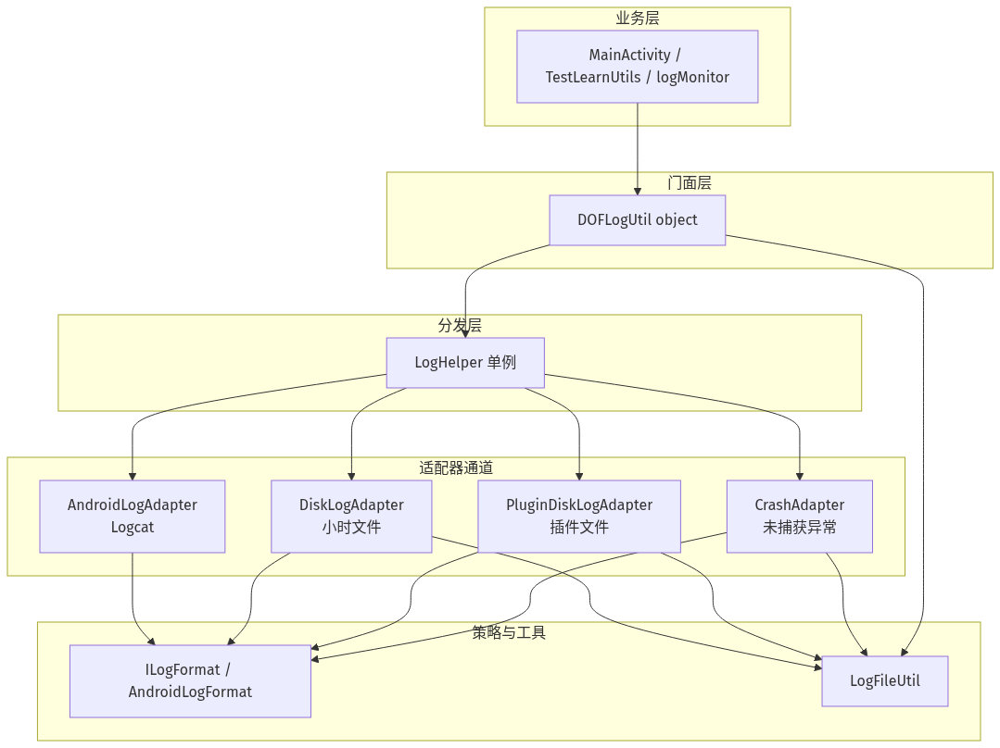

类继承关系：

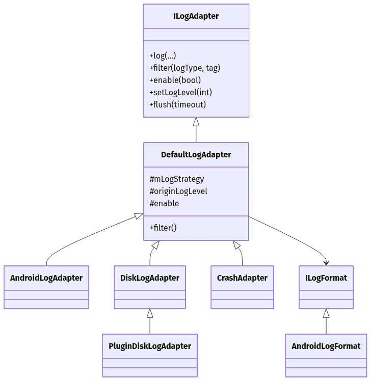

---

## 2. 设计模式逐一讲解

### 2.1 门面 Facade

`DOFLogUtil` 把后面整套复杂度藏起来。业务只写：

```kotlin
DOFLogUtil.d(TAG, "hostAddress = $hostAddress")
```

不必知道 `LogHelper`、adapter、`HandlerThread`、目录选择。所有 `d/i/e/...` 最终都是
`LogHelper.getInstance().xxx(...)`。

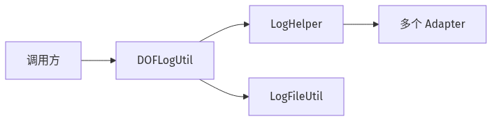

---

### 2.2 单例 Singleton

三处全局唯一：

1. `DOFLogUtil`：Kotlin `object`
2. `LogHelper`：私有构造 + `lazy(SYNCHRONIZED)`
3. `LogFileUtil`：`object`，缓存 `Application` Context

adapter 列表用 `CopyOnWriteArrayList`，避免 `init` 与打日志并发改列表。

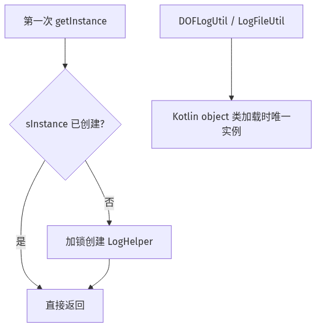

---

### 2.3 适配器 Adapter

`ILogAdapter` 定义统一接口：`log / filter / enable / setLogLevel / flush`。不同通道各自适配：

| Adapter                | 适配目标                                      |
|------------------------|-------------------------------------------|
| `AndroidLogAdapter`    | `android.util.Log.println`                |
| `DiskLogAdapter`       | 本地 txt 追加写                                |
| `PluginDiskLogAdapter` | 插件专用目录 + tag 过滤                           |
| `CrashAdapter`         | `UncaughtExceptionHandler` + `CrashUtils` |

`LogHelper` 只认 `ILogAdapter`，新增通道（例如历史上的 Xlog）不用改门面。

---

### 2.4 策略 Strategy

格式化与输出通道分离。`DefaultLogAdapter` 持有 `ILogFormat`，默认 `AndroidLogFormat`，可用
`setLogStrategy()` 替换。

同一条 `d(tag, msg)`：

- Logcat：策略格式化后 `Log.println`
- 磁盘：同一策略格式化后异步写文件

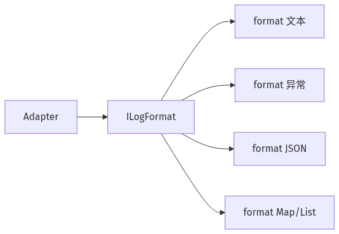

---

### 2.5 模板方法 Template Method

`DefaultLogAdapter` 给出骨架：

- `filter()`：`enable && logType >= originLogLevel`
- `enable()` / `setLogLevel()`
- `log(...)` 空实现

子类只覆盖「怎么输出」。`PluginDiskLogAdapter` 再扩展 `filter()`：先走父类，再限制 tag。

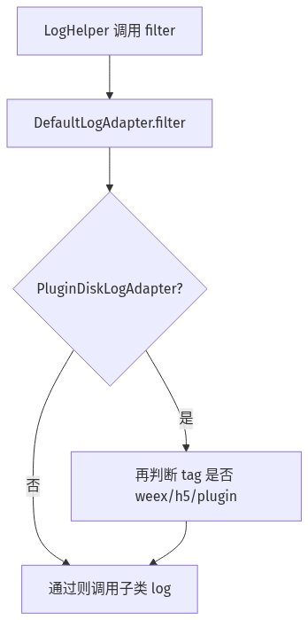

---

### 2.6 观察者 / 广播 Publish-Subscribe

`LogHelper.log()` 遍历 `mList`，符合条件的 adapter 各收一份。一条业务日志可以同时进 Logcat 和文件。单个
adapter 异常被 `try/catch` 吃掉，不影响其它通道。

`CrashAdapter` 的 `log()` 是空实现，它只在构造时装崩溃钩子。

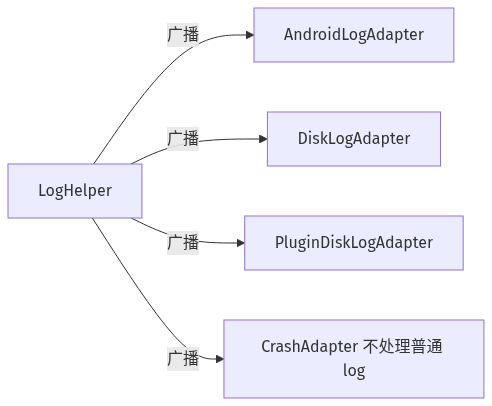

---

### 2.7 简单工厂 / 装配 Factory Assembly

`init(context, isDebug)` 按环境装配通道：

- Debug：Logcat + 文件 + 插件文件 + 崩溃
- Release：无 Logcat，文件和崩溃仍在

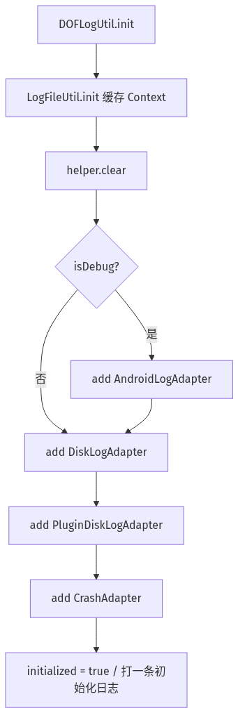

---

### 2.8 生产者-消费者 Producer-Consumer

`DiskLogAdapter` 不在调用线程写盘：

1. 调用线程：格式化 → `Handler.sendMessage`（生产）
2. `HandlerThread("DOFLog_write")`：`saveLogToFile`（消费）

避免主线程卡在 IO 上。`flush()` 往队列丢一个 `CountDownLatch`，等写线程处理完当前队列后再返回。

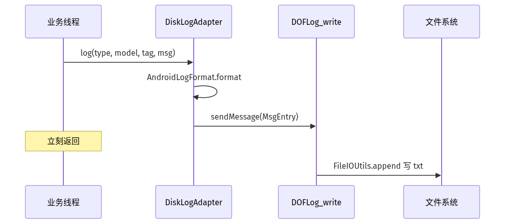

---

### 2.9 责任链 Chain of Responsibility

两处：

**崩溃处理链**：`CrashAdapter` 包一层 `UncaughtExceptionHandler`，先同步写文件，再交给原来的 handler（
`CrashUtils` / 系统）。


**进程名解析链**：API 28 `Application.getProcessName()` → `/proc/pid/cmdline` → AMS → 反射
`ActivityThread`。

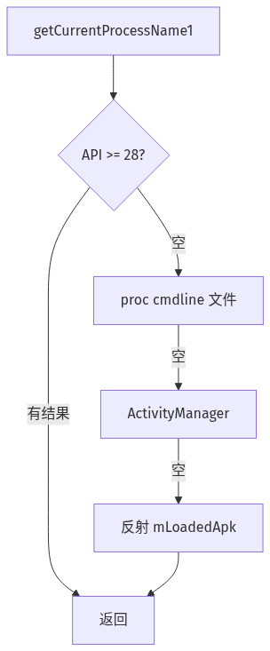

---

### 2.10 装饰 / 特化 Decorator-like

`PluginDiskLogAdapter` 复用磁盘写入，只加 tag 白名单：`weex_log` / `h5_log` / `plugin_log`。普通
`MainActivity` 日志不会进 `plugin_log/`。

---

### 2.11 模式如何叠在一起

> **门面**（`DOFLogUtil`）接收调用 → **单例分发器**（`LogHelper`）**广播**给多个 **适配器** → 每个适配器用
**策略** 格式化 → Logcat 同步打印，磁盘走 **生产者-消费者** 异步落盘 → 崩溃走 **责任链** 同步写文件。

---

## 3. 初始化流程

启动点：`HahaApplication.onCreate()` → `DOFLogUtil.init(this)`。

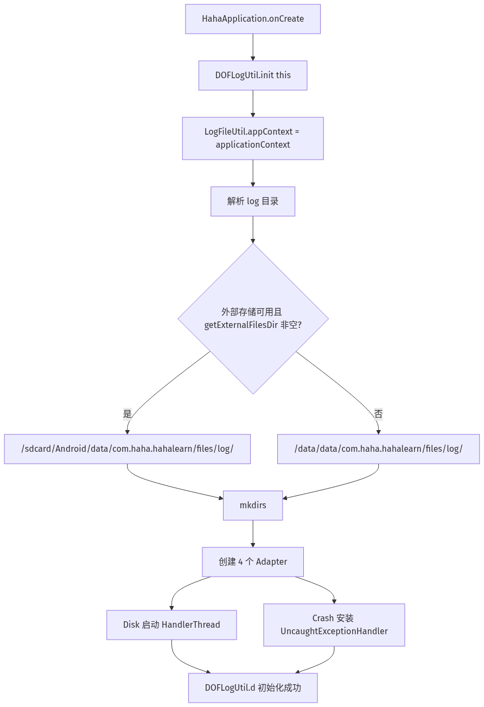

多进程时目录会变成 `log_<进程后缀>`，文件名 `log_<进程>_yyyyMMddHH.txt`。本项目未声明子进程，主进程一般是：

```text
/sdcard/Android/data/com.haha.hahalearn/files/log/log_yyyyMMddHH.txt
```

`getLogFolder()` 只负责目录：先取相对名 `log`（子进程则 `log_push`），再 `resolveDir` 拼绝对路径，最后
`ensureDir` 创建。

---

## 4. 一次 `d(tag, msg)` 的完整打印流程

以 `DOFLogUtil.d("MainActivity", "hostAddress = 1.2.3.4")` 为例。

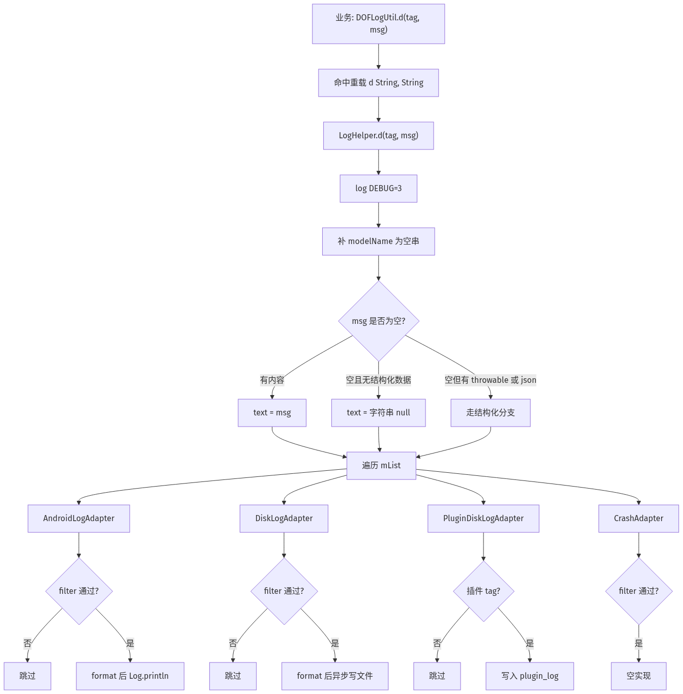

### 4.1 LogHelper 内容分发

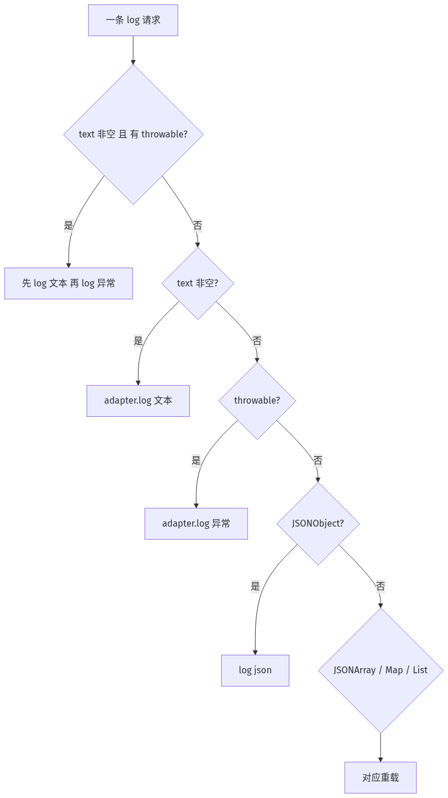

级别与 Android `Log` 对齐：`V=2 D=3 I=4 W=5 E=6 A=7`。默认门槛 `VERBOSE`，所以 `v()` 也会出。

---

## 5. 格式化流程

`AndroidLogFormat.format(modelName, tag, msg)` 拼出：

```text
[yyyyMMddHHmmss][modelName][tag][文件名][方法()][行号][进程名][线程名]:消息
```

栈回溯用 `Thread.currentThread().stackTrace`，跳过 `com.haha.log.*` 和带 `DOFLogUtil` 的类，尽量落到真正调用方（如
`MainActivity.kt`）。

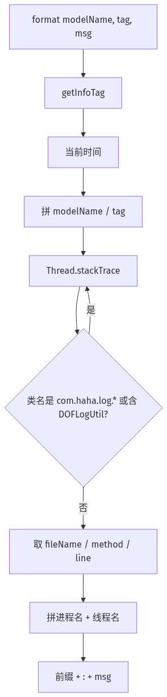

示例（主线程 `MainActivity.onCreate` 打 log）：

```text
[20260906025501][][MainActivity][MainActivity.kt][onCreate()][593][com.haha.hahalearn][main]:C++ = ...
```

异常走另一套：`Error Start` → cause 优先 → 逐帧栈 → `Error End`。  
JSON 用 `toString(2)` 缩进；Map/List 带起止分隔线。

`Thread.currentThread().stackTrace` 是当前线程调用栈快照，不是异常栈。前几帧是 JVM / 日志库自身，所以从
index 2 开始扫并过滤。

---

## 6. Logcat 通道

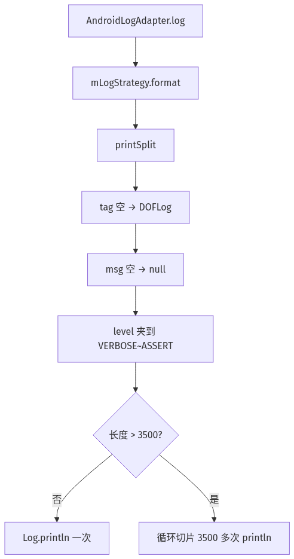

避免一条超长 JSON 被系统截断。Release 且 `isDebug=false` 时不会注册该 adapter。

---

## 7. 本地落盘

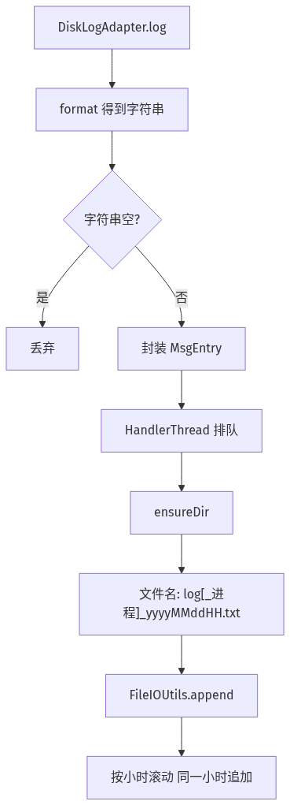

路径选择：

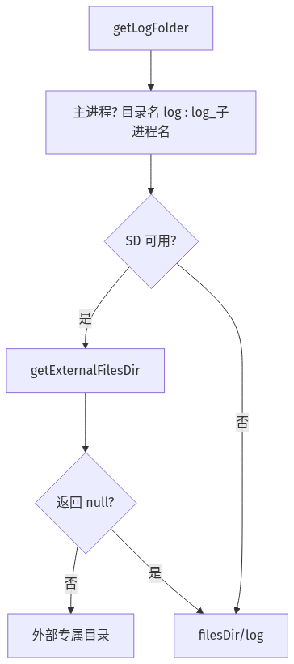

本项目典型路径（`applicationId = com.haha.hahalearn`）：

| 类型     | 路径                                                                     |
|--------|------------------------------------------------------------------------|
| 普通小时日志 | `/sdcard/Android/data/com.haha.hahalearn/files/log/log_yyyyMMddHH.txt` |
| 崩溃     | `.../files/log/crash/crash_<timestamp>.txt`                            |
| 插件     | `.../files/plugin_log/`                                                |
| 外部不可用时 | `/data/data/com.haha.hahalearn/files/log/`                             |

应用专属目录不需要 `WRITE_EXTERNAL_STORAGE`。可用 Device File Explorer 或 `adb pull` 取出。

---

## 8. 崩溃日志

`CrashAdapter` 不参与日常 `d/e`，只在构造时挂钩。必须同步写：进程马上要死，`HandlerThread` 来不及消费。

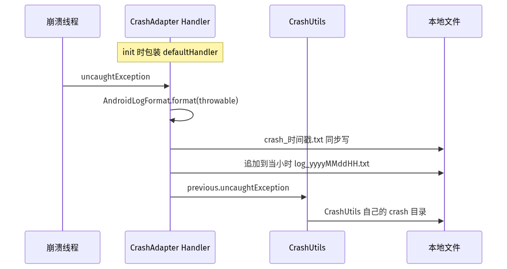

---

## 9. 其它入口如何汇入同一条流水线

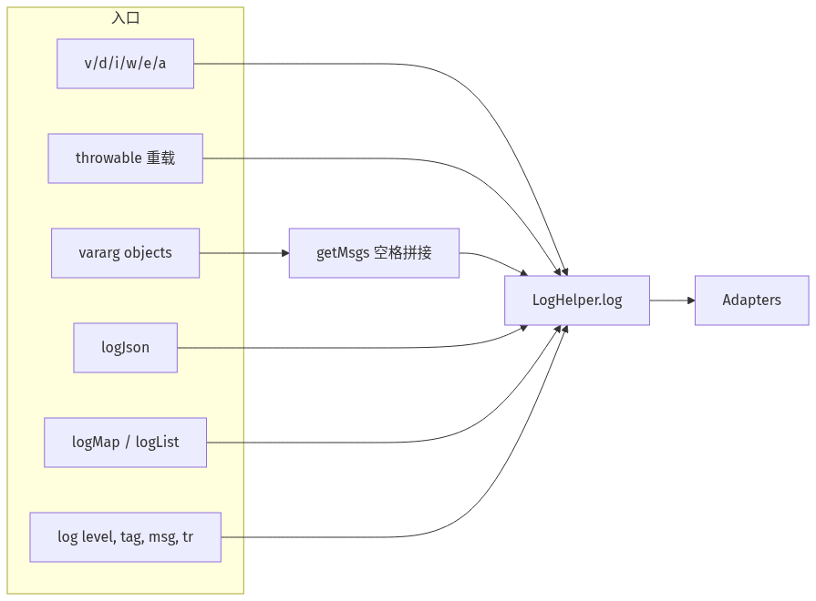

`logJson(String)` 会先判断 `[` / `{`，解析失败再 `e(tag, "invalid json...")`。

---

## 10. 日常打日志总时序

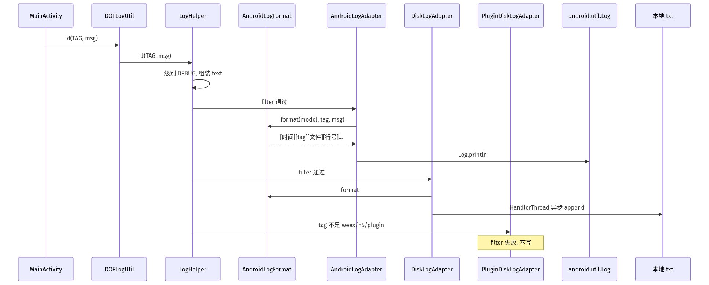

---

## 11. 本项目接入范围

已改为 `DOFLogUtil` 的范围（不是全工程）：

- 日志监控：`logMonitor`、`TimeMonitor`
- `MainActivity`
- `TestLearnUtils.test()` 拉起的测试类：`PluginTest`、`ServiceTest`、`HandlerTest`、`ThreadTest`、
  `CollectionTest`、`RetrofitTest`、`OkHttpTest`、`SocketTest`、`HttpsVersionTest`、`MqttTest`

初始化仍在 `HahaApplication`：`DOFLogUtil.init(this)`。

---

## 12. 关键源码位置

| 文件                                                                  | 说明               |
|---------------------------------------------------------------------|------------------|
| `DOFLog/src/main/java/com/haha/log/DOFLogUtil.kt`                   | 门面、init、各级重载     |
| `DOFLog/src/main/java/com/haha/log/LogHelper.kt`                    | 单例分发、filter、内容分支 |
| `DOFLog/src/main/java/com/haha/log/adapter/AndroidLogAdapter.kt`    | Logcat、超长拆分      |
| `DOFLog/src/main/java/com/haha/log/adapter/DiskLogAdapter.kt`       | 异步落盘、按小时滚动       |
| `DOFLog/src/main/java/com/haha/log/adapter/PluginDiskLogAdapter.kt` | 插件 tag 过滤        |
| `DOFLog/src/main/java/com/haha/log/adapter/CrashAdapter.kt`         | 未捕获异常同步写文件       |
| `DOFLog/src/main/java/com/haha/log/strategy/AndroidLogFormat.kt`    | 格式化、栈回溯、进程名      |
| `DOFLog/src/main/java/com/haha/log/utils/LogFileUtil.kt`            | 目录解析与创建          |
