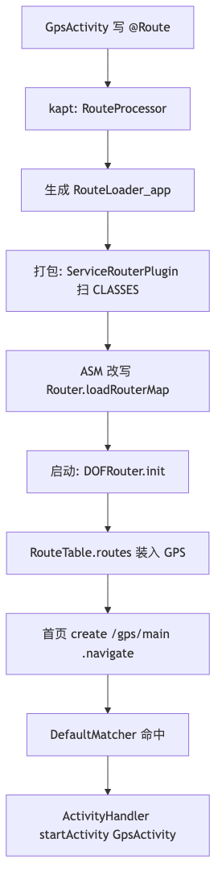
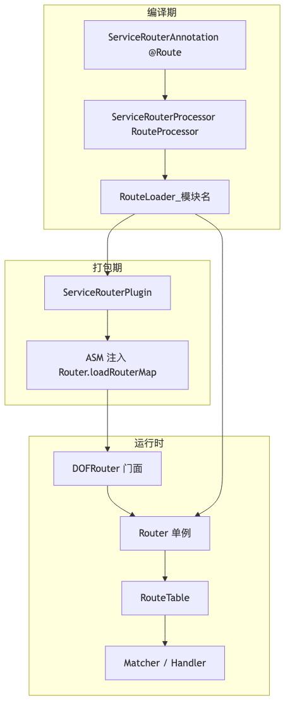
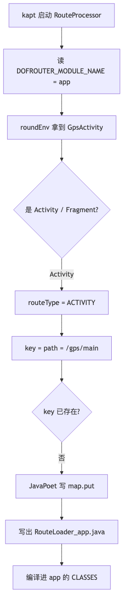
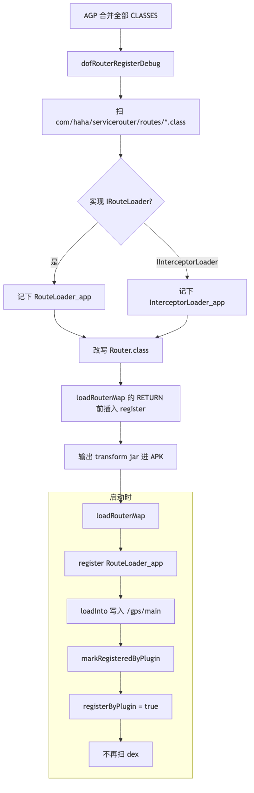
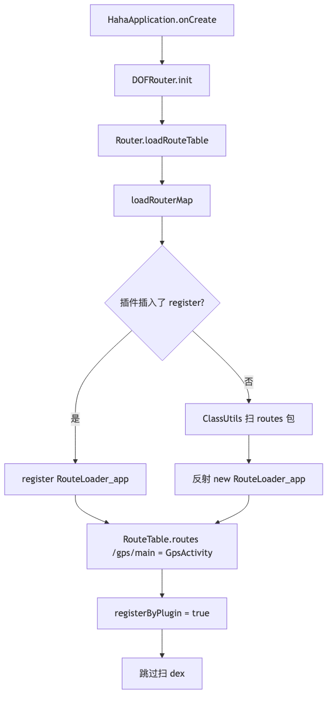
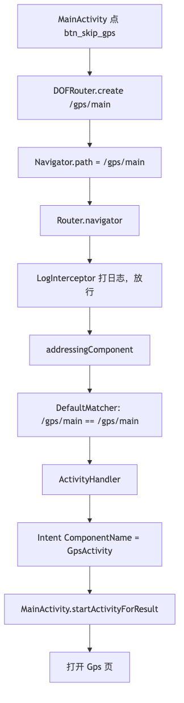

# dofrouter：DOFRouter 底层实现（从 `@Route` 到 `registerByPlugin`）

记录时间：2026-09-06  
对外入口：`DOFRouter`  
启动：`HahaApplication.onCreate()` → `initComponents()` → `DOFRouter.init(this)`  
示例页：`GpsActivity` 上 `@Route(path = RoutePath.GPS, name = "Gps")`  
首页跳转：`DOFRouter.create(RoutePath.GPS).navigate(this)`

> 本文按优化前的装表 / 寻址 / 拦截器模型写。2026-09-06 之后的回退标志、`RouteTable.find`、拦截器
> List、插件单次遍历与对照表，见 [dofrouter-optimization.md](dofrouter-optimization.md)。

配套流程图（PNG 可直接预览）：

| 图                      | PNG                                | 源文件                                |
|------------------------|------------------------------------|------------------------------------|
| 编译到跳转总览                | [png](dofrouter-overall.png)       | [mmd](dofrouter-overall.mmd)       |
| 模块分层                   | [png](dofrouter-architecture.png)  | [mmd](dofrouter-architecture.mmd)  |
| `@Route` GPS 的 APT     | [png](dofrouter-apt-gps.png)       | [mmd](dofrouter-apt-gps.mmd)       |
| 插件 ASM 注入              | [png](dofrouter-plugin-inject.png) | [mmd](dofrouter-plugin-inject.mmd) |
| `init` 装表              | [png](dofrouter-init-load.png)     | [mmd](dofrouter-init-load.mmd)     |
| `create(GPS).navigate` | [png](dofrouter-navigate-gps.png)  | [mmd](dofrouter-navigate-gps.mmd)  |

---

## 1. 整体在解决什么问题

DOFRouter 对齐 ARouter 的思路：**编译期收集 `@Route`，运行期按 path 找目标页**。业务侧不要写
`Intent(this, GpsActivity::class.java)`，而是：

```kotlin
DOFRouter.create(RoutePath.GPS).navigate(this)  // "/gps/main"
```

运行时怎么知道 `"/gps/main"` 对应 `GpsActivity`？分两段：

1. **编译期（kapt）**：`RouteProcessor` 扫到 `@Route`，生成 `RouteLoader_app`，里面写死
   `map.put("/gps/main", new RouteMetaData(..., GpsActivity.class))`。
2. **打包期 / 启动期**：把这个 Loader 装进内存表 `RouteTable.routes`。装表有两条路：
    - **插件插桩**（`registerByPlugin = true`）：ASM 在 `Router.loadRouterMap()` 末尾插入
      `register("...RouteLoader_app")`。
    - **扫 dex 回退**（`registerByPlugin` 仍为 `false`）：遍历 apk 里
      `com.haha.servicerouter.routes` 包下的类再反射装表。



---

## 2. 模块分层：谁生成、谁装表、谁跳转

| 模块                         | 职责                                                  |
|----------------------------|-----------------------------------------------------|
| `:ServiceRouterAnnotation` | `@Route`、`RouteMetaData`、`Consts`                   |
| `:ServiceRouterProcessor`  | kapt：生成 `RouteLoader_*` / `InterceptorLoader_*`     |
| `:ServiceRouterPlugin`     | includeBuild 插件：ASM 注入 `register(...)`              |
| `:ServiceRouter`           | 运行时：`DOFRouter` 门面、`Router` 单例、表、Matcher、Handler    |
| `:app`                     | 业务：`GpsActivity` + `DOFRouter.create(...).navigate` |

`DOFRouter` 只是门面：`init` / `create` / `openDebug`。真正干活的是内部单例 `Router`
（`Inner.instance`）。

`app` 侧接入三处：

- `id 'com.haha.servicerouter.register'`（插件）
- `kapt project(':ServiceRouterProcessor')` + `arg("DOFROUTER_MODULE_NAME", project.getName())`
- `HahaApplication.initComponents()` 里 `DOFRouter.init(this)`



---

## 3. `@Route(path = RoutePath.GPS, name = "Gps")` 从注解到元数据

### 3.1 业务写法

`RoutePath.GPS` 是常量 `"/gps/main"`。注解打在类上：

```kotlin
@Route(path = RoutePath.GPS, name = "Gps")
class GpsActivity : BaseMvvmActivity<ActivityGpsBinding, BaseViewModel>() {
```

注解定义在 `ServiceRouterAnnotation` 的 `@Route`：

- **`CLASS` 级保留**：进 class 文件，给 APT 看，**运行时反射读不到** `@Route`。运行时只认生成代码里的
  `RouteMetaData`。
- `path`：精确匹配键，GPS 用这个。
- `name`：描述字段，**不参与寻址**。GPS 的 `"Gps"` 只是元数据里的名字。
- `pathPrefix` / `pathPattern`：前缀、正则匹配，GPS 没用。
- `priority` 默认 `0`：多条命中时按优先级排序 Handler。

对 GPS 最终等价于：

```text
RouteMetaData(
  routeType = ACTIVITY,
  priority  = 0,
  name      = "Gps",
  path      = "/gps/main",
  pathPrefix = "",
  pathPattern = "",
  clazz     = GpsActivity.class
)
```

`clazz` 才是跳转目标。`name` 不参与 `DefaultMatcher`。

---

## 4. 编译期：RouteProcessor 如何处理 GPS

### 4.1 处理器怎么被找到

`RouteProcessor` 带 `@AutoService(Processor.class)`，kapt 通过 `META-INF/services` 加载。它只认
`@Route`。

`BaseProcessor.init()` 必须读到 `DOFROUTER_MODULE_NAME`。`app` 的 kapt 传入
`project.getName()`，即 **`app`**。非法字符会被剥掉，最终 `moduleName = "app"`。没有这个 option
会直接抛异常。

### 4.2 处理 GPS 的逐步逻辑

`process()` → `parseRoutes(elements)`：

1. **拿类型镜像**：`Activity` / 旧 `Fragment` / `androidx.Fragment`，用来判断路由类型。
2. **遍历每个 `@Route` 元素**。对 `GpsActivity`：
    - `mTypes.isSubtype(GpsActivity, android.app.Activity)` 为真。
    - `routeType = RouteType.ACTIVITY`。
3. **算表 key**：`resolveRouteKey()` 优先 `path`，其次 `pathPrefix`，再 `pathPattern`。GPS 的
   key 就是 `"/gps/main"`。
4. **去重**：同一 key 已存在则跳过后写的那个。
5. **JavaPoet 往 `loadInto(map)` 里加一条 `map.put(...)`**。生成代码里的最后一个参数是
   **`GpsActivity.class`**。

生成类名：`RouteLoader` + `_` + `app` → **`RouteLoader_app`**，包名
**`com.haha.servicerouter.routes`**，实现 `IRouteLoader`。

对当前 app（还有 `LogInterceptor`），大致会生成：

```java
package com.haha.servicerouter.routes;

public class RouteLoader_app implements IRouteLoader {
    @Override
    public void loadInto(Map<String, RouteMetaData> map) {
        map.put("/gps/main", new RouteMetaData(
            RouteType.ACTIVITY, 0, "Gps",
            "/gps/main", "", "",
            GpsActivity.class));
    }
}
```

拦截器走平行的 `InterceptorProcessor`，生成 `InterceptorLoader_app`，把 `LogInterceptor` 放进
`TreeMap<priority, InterceptorMetaData>`。



这是 **每个业务模块各生成一份 Loader**。多模块时会有 `RouteLoader_login`、`RouteLoader_shop`
，插件会全部扫出来再注入。

---

## 5. `registerByPlugin = true` 是怎么来的

源码里**没有人在业务代码里写 `registerByPlugin = true` 作为配置项**。它是插件插桩的副作用（或当前
`loadRouterMap` 里的初值）。

### 5.1 源码里的插桩点

`Router.loadRouteTable()` 先调 `loadRouterMap()`，再根据 `registerByPlugin` 决定是否扫 dex。

`loadRouterMap()` 是留给插件的「坑」。注释里的目标形态是：

```kotlin
private fun loadRouterMap() {
    registerByPlugin = false
    // register("com.haha.servicerouter.routes.RouteLoader_app")
    // register("com.haha.servicerouter.routes.InterceptorLoader_app")
}
```

当前仓库源码里 `loadRouterMap()` 写成了 `registerByPlugin = true`。插件仍会在方法末尾插入
`register(...)`。`register(className)` 做三件事：

1. `Class.forName(className).newInstance()`
2. 是 `IRouteLoader` → `registerRouteRoot` → `loadInto(RouteTable.routes)`
3. 是 `IInterceptorLoader` → `registerInterceptor` → `loadInto(RouteTable.interceptors)`

`registerRouteRoot` / `registerInterceptor` 都会调 `markRegisteredByPlugin()`：只要成功注册过一次，就把
**`registerByPlugin` 置 true**。之后 `loadRouteTable()` 看到 true，**不再扫 dex**。

### 5.2 插件怎么挂上 AGP

- `settings.gradle`：`includeBuild('ServiceRouterPlugin')`
- `app/build.gradle`：`id 'com.haha.servicerouter.register'`
- 插件类：`RouterRegisterPlugin`

它对每个 variant 注册 `dofRouterRegisterXxx`，用 **AGP 8 `ScopedArtifact.CLASSES` +
`Scope.ALL`** 做 transform：输入是全部 jar + 目录 class，输出一个合并 jar。这覆盖 app 自己的
class 和依赖里的 `Router.class`。

### 5.3 扫描：谁会被当成 Loader

`ScanSetting` 与 `Consts` 对齐（插件不能依赖 Android 模块，所以写死）：

| 常量    | 值                                                      |
|-------|--------------------------------------------------------|
| 扫描包   | `com/haha/servicerouter/routes/`                       |
| 路由接口  | `com/haha/servicerouter/interfaces/IRouteLoader`       |
| 拦截器接口 | `com/haha/servicerouter/interfaces/IInterceptorLoader` |
| 注入目标  | `com/haha/servicerouter/core/Router.class`             |
| 注入方法  | `loadRouterMap()V`                                     |
| 调用方法  | `register(Ljava/lang/String;)V`                        |

`classifyLoader()` 用 ASM `ClassReader`（`SKIP_CODE`）只看类名和接口。`RouteLoader_app` 实现了
`IRouteLoader`，进入 `routeLoaders`。构建日志会打：

```text
[DOFRouter] Auto-register routes: [com.haha.servicerouter.routes.RouteLoader_app]
[DOFRouter] Auto-register interceptors: [com.haha.servicerouter.routes.InterceptorLoader_app]
```

### 5.4 ASM 具体改了什么字节码

拷贝 CLASSES 时，遇到 `com/haha/servicerouter/core/Router.class` 走 `injectRegister()`：

1. 找到方法 `loadRouterMap`，描述符 `()V`。
2. 在 **`RETURN` 之前**插入：对每个 Loader 全类名

```text
aload_0
ldc "com.haha.servicerouter.routes.RouteLoader_app"
invokespecial Router.register(String)
```

插完后，运行时的 `loadRouterMap` 等价于多了若干次 `register("...")`。

`register("...RouteLoader_app")` 会：

1. `new RouteLoader_app()`
2. `loadInto(RouteTable.routes)` → 写入 `"/gps/main" → GpsActivity`
3. `markRegisteredByPlugin()` → **`registerByPlugin = true`**

所以 **`registerByPlugin = true` 不是业务配置项，而是「插件成功注入并至少 register
成功一次」的标志**（当前源码也会在 `loadRouterMap` 开头直接置 true）。

没扫到任何 Loader 时，插件保持原方法。



### 5.5 为什么要比扫 dex 快

回退路径 `ClassUtils.getFileNameByPackageName` 会打开 apk / 多 dex，枚举**全部 class**，再过滤
`com.haha.servicerouter.routes.*`。启动期很贵。插件把「全类名列表」写进 `loadRouterMap`，启动只做几次
`Class.forName`。`consumer-rules.pro` 因此 keep `Router`、`routes.**`、两类 Loader。

性能对比详见同目录
[dofrouter-扫dex与插件插桩性能.md](dofrouter-扫dex与插件插桩性能.md)。

---

## 6. 启动：`DOFRouter.init` 如何把 GPS 装进表

`HahaApplication.initComponents()`：

```kotlin
DOFRouter.openDebug()
DOFRouter.init(this)
```

`DOFRouter.init` → `Router.init`：保存 `Application`，调 `loadRouteTable()`。



装完后内存里：

```text
RouteTable.routes["/gps/main"] = RouteMetaData(..., GpsActivity.class)
RouteTable.interceptors[0]     = InterceptorMetaData(..., LogInterceptor.class)
RouteTable.matchers            = [DefaultMatcher, PrefixMatcher, PatternMatcher]
```

---

## 7. 跳转：`create(RoutePath.GPS).navigate(this)` 逐步发生什么

首页：

```kotlin
DOFRouter.create(RoutePath.GPS).navigate(this)
```

### 7.1 构造 Navigator

`create("/gps/main")` 会 `Uri.parse`，把 query 放进 `extras`，再拼 `path`。纯 `"/gps/main"`
没有 scheme/host，`navigator.path` 仍是 `"/gps/main"`。`navigate(this)` 把 `context` 设为
`MainActivity`，交给 `Router.navigator()`。

### 7.2 拦截器

`isIntercept()` 按 `TreeMap` 顺序（priority 升序）实例化拦截器。`LogInterceptor.intercept`
只打日志、返回 `false`，**不拦截**。任一拦截器返回 `true` 则回调 `onIntercept` 并中止。

### 7.3 寻址

`addressingComponent` 用 `RouteTable.matchers.any` 过滤路由表：

| Matcher          | 条件                          | GPS 结果               |
|------------------|-----------------------------|----------------------|
| `DefaultMatcher` | `meta.path == requestPath`  | **命中** `"/gps/main"` |
| `PrefixMatcher`  | `pathPrefix` 非空且 startsWith | 否                    |
| `PatternMatcher` | `pathPattern` 正则            | 否                    |

空 map 则 `onNotFound`。

### 7.4 Handler 与真正启动

`createHandler`：`RouteType.ACTIVITY` → `ActivityHandler`。再按 `priority` 排序后
`handle()`。

`ActivityHandler`：

1. `Intent` + `ComponentName(context, GpsActivity.class)`
2. 带上 extras / flags
3. 当前调用是 `navigate(activity)`，走 `context is Activity` 分支：`startActivityForResult`
4. 回调 `onArrived`

Activity 路径返回 `null`；只有 Fragment 路由才把实例返回给调用方。



---

## 8. 把整条 GPS 链路串起来

| 阶段   | 发生了什么                                               | GPS 对应结果                                |
|------|-----------------------------------------------------|-----------------------------------------|
| 写代码  | 注解 + `create(RoutePath.GPS)`                        | path 双方都是 `"/gps/main"`                 |
| kapt | `RouteProcessor` 认 Activity                         | 生成 `RouteLoader_app.loadInto` 的一条 put   |
| 打包   | 插件扫到 Loader，改 `loadRouterMap`                       | 字节码里多了 `register("...RouteLoader_app")` |
| 启动   | `register` → `loadInto` → 置 `registerByPlugin=true` | 表里有 `"/gps/main" → GpsActivity`         |
| 点击   | Matcher + ActivityHandler                           | `startActivity` 打开 Gps 页                |

`name = "Gps"` 只进 `RouteMetaData.name`，**匹配和跳转都不读它**。真正把字符串和 Class
绑在一起的，是 APT 生成的 `GpsActivity.class`，再加上启动时装表。
