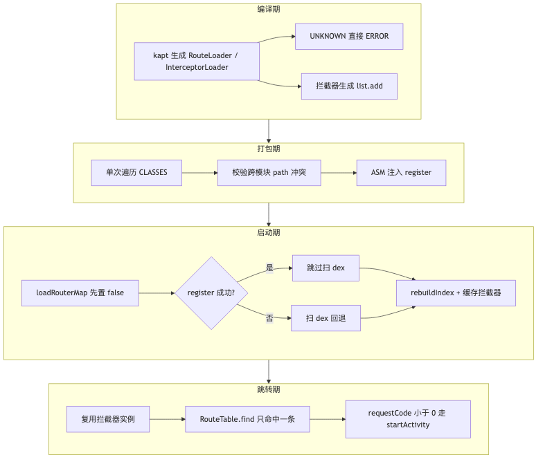
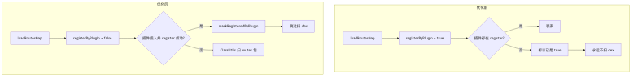
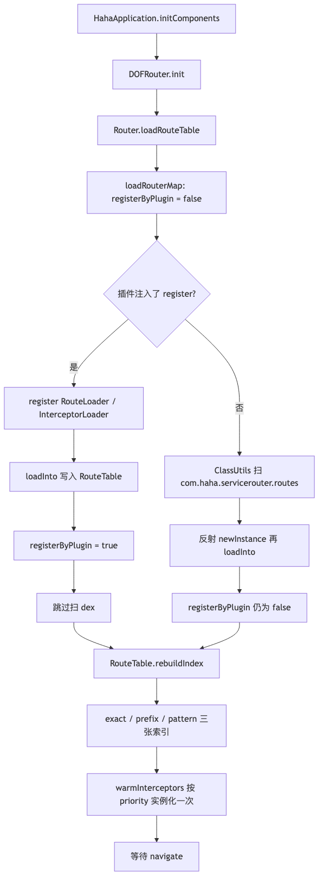
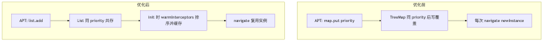
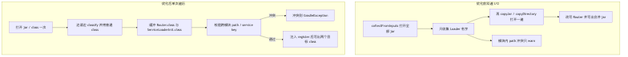
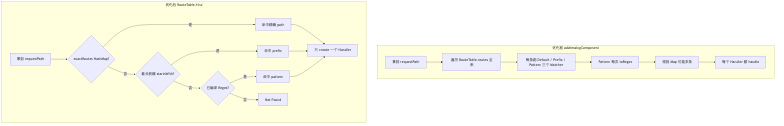
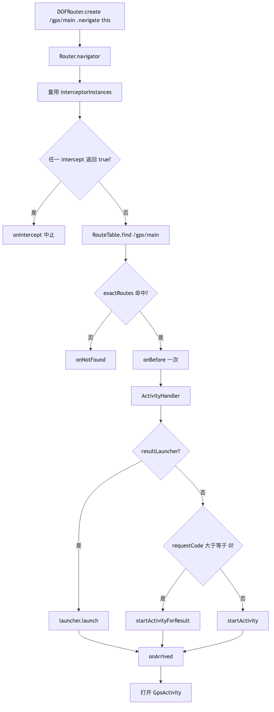

# dofrouter：优化后实现与优化前对比

记录时间：2026-09-06  
对照代码：`Router`、`RouteTable`、`ActivityHandler`、`RouteProcessor`、`InterceptorProcessor`、
`RouterRegisterTask`  
优化前链路见同目录 [dofrouter-DOFRouter底层实现.md](dofrouter-DOFRouter底层实现.md)。  
示例仍用 `GpsActivity`：`@Route(path = RoutePath.GPS)` →
`DOFRouter.create(RoutePath.GPS).navigate(this)`。

配套流程图（PNG 可直接预览）：

| 图                        | PNG                                  | SVG                                  | 源文件                                  |
|--------------------------|--------------------------------------|--------------------------------------|--------------------------------------|
| 优化后四段总览                  | [png](dofrouter-opt-overview.png)    | [svg](dofrouter-opt-overview.svg)    | [mmd](dofrouter-opt-overview.mmd)    |
| `registerByPlugin` 回退对比  | [png](dofrouter-opt-register.png)    | [svg](dofrouter-opt-register.svg)    | [mmd](dofrouter-opt-register.mmd)    |
| 优化后 `init` 装表            | [png](dofrouter-opt-init.png)        | [svg](dofrouter-opt-init.svg)        | [mmd](dofrouter-opt-init.mmd)        |
| 寻址：全表 Matcher vs `find`  | [png](dofrouter-opt-addressing.png)  | [svg](dofrouter-opt-addressing.svg)  | [mmd](dofrouter-opt-addressing.mmd)  |
| 拦截器：TreeMap vs List + 缓存 | [png](dofrouter-opt-interceptor.png) | [svg](dofrouter-opt-interceptor.svg) | [mmd](dofrouter-opt-interceptor.mmd) |
| 插件：双遍 I/O vs 单次遍历        | [png](dofrouter-opt-plugin.png)      | [svg](dofrouter-opt-plugin.svg)      | [mmd](dofrouter-opt-plugin.mmd)      |
| 优化后 `navigate`           | [png](dofrouter-opt-navigate.png)    | [svg](dofrouter-opt-navigate.svg)    | [mmd](dofrouter-opt-navigate.mmd)    |

模块分层、APT 生成 `RouteLoader_app`、插件往 `loadRouterMap` 插 `register(String)` 这三件**没换骨架**
。变的是：标志位语义、冲突检查、寻址算法、拦截器容器、启动补索引、跳转只处理一条。



---

## 1. 没变的骨架

两边都还是 ARouter 那条路：**编译期收注解，打包期发现 Loader，启动时装表，运行期按 path 跳**。

| 层   | 谁                          | 优化前后都一样                                        |
|-----|----------------------------|------------------------------------------------|
| 注解  | `:ServiceRouterAnnotation` | `@Route` / `@Interceptor`，`CLASS` 保留           |
| APT | `:ServiceRouterProcessor`  | 每模块一份 `RouteLoader_模块名`                        |
| 插件  | `:ServiceRouterPlugin`     | `Scope.ALL` 扫 CLASSES，改 `Router.loadRouterMap` |
| 运行时 | `:ServiceRouter`           | `DOFRouter` 门面，`Router` 单例干活                   |
| 业务  | `:app`                     | `create(path).navigate(context)`               |

`HahaApplication.initComponents()` 仍然是：

```kotlin
DOFRouter.openDebug()
DOFRouter.init(this)
```

因此「从 `@Route` 到 `GpsActivity`」的故事没改：kapt 写出 `GpsActivity.class`，插件把 `RouteLoader_app`
的全类名写进 `loadRouterMap`，`init` 时 `loadInto`。优化针对的是这条链上的正确性、冲突和跳转开销。

---

## 2. 总对照表

| 点                    | 优化前                                    | 优化后                                      | 为什么改            |
|----------------------|----------------------------------------|------------------------------------------|-----------------|
| `loadRouterMap` 初值   | 源码写成 `registerByPlugin = true`         | 必须先 `false`，`register()` 成功才置 true       | 插桩失败时回退被废掉      |
| 扫 dex 回退             | 理论上有，实际走不到                             | 插件未注入时仍扫 `com.haha.servicerouter.routes` | 没打插件也能装表        |
| 跨模块 path             | APT 只在本模块 warn，后 `loadInto` 覆盖         | 插件解析 `map.put`，不同 Class 同 path 构建失败      | 组件一拆就会静默跳错页     |
| `@Route` 打错类型        | 写成 `UNKNOWN` 仍入库                       | kapt `ERROR`，不生成这条                       | 空跳应在编译期失败       |
| 拦截器容器                | `TreeMap<priority, meta>`              | `MutableList` + `list.add`               | 同 priority 后写覆盖 |
| 拦截器实例                | 每次 `navigate` 都 `newInstance`          | `init` 后 `warmInterceptors` 缓存           | 少反射、可持有状态       |
| 寻址                   | 全表 × 3 个 Matcher，正则每次编译                | `rebuildIndex` 后精确 O(1)，前缀最长，正则预编译       | 跳转热路径           |
| 多命中                  | `filter` 出 Map，**每个 Handler 都 handle** | `find` 只返回一条：精确 > 最长前缀 > 正则              | 避免连开两个页         |
| 回调                   | `onBefore` / `onArrived` 每个 Handler 一次 | 整次 navigate 各一次                          | 语义和一次跳转对齐       |
| `navigate(activity)` | `startActivityForResult(-1)`           | `requestCode < 0` 走 `startActivity`      | 不用废弃 API 表达普通跳转 |
| 插件 I/O               | 先 collect 再 copy，jar 打开两遍              | 单次遍历，目标 class 缓冲后注入                      | 打包少一半 CLASSES 读 |
| 插件职责                 | 只注入 + Service 冲突                       | 额外校验路由 path 冲突                           | 与 Service 注册对齐  |

---

## 3. 底层注册：`registerByPlugin` 回退

优化前源码在 `loadRouterMap()` **开头就写 `true`**。`loadRouteTable()` 先调它，再看标志决定是否扫
dex。插件若没扫到 Loader，会 keep 原方法——标志已经是 true，回退永远不跑。`markRegisteredByPlugin()`
变成空操作。

优化后约定（与 ARouter `LogisticsCenter.loadRouterMap` 一致）：

1. 源码坑里先 `registerByPlugin = false`
2. ASM 在 `RETURN` 前插入 `register("...RouteLoader_app")` 等
3. `register()` → `registerRouteRoot` / `registerInterceptor` → `markRegisteredByPlugin()`
4. 只有真正 `loadInto` 成功过，才跳过扫 dex



没打 `id 'com.haha.servicerouter.register'`、插桩失败、或 debug 未走到 transform 时，启动仍可用
`ClassUtils.getFileNameByPackageName` 找回 Loader。插件成功时启动只做几次 `Class.forName`，这条快路径没变。

---

## 4. 底层注册：优化后 `init` 装表

`DOFRouter.init` → `Router.loadRouteTable()` 现在多两步收尾，都在主线程、只做一次：

1. `loadRouterMap()`（插件或空方法）
2. 若标志仍为 false：扫 dex 反射装表
3. **`RouteTable.rebuildIndex()`**：把 `routes` 拆成 `exactRoutes` / `prefixRoutes` / `patternRoutes`
4. **`warmInterceptors()`**：按 `priority` 再按类名排序，`getDeclaredConstructor().newInstance()`
   一次，放进 `interceptorInstances`



对 GPS：`RouteLoader_app.loadInto` 仍写入

```text
RouteTable.routes["/gps/main"] = RouteMetaData(..., GpsActivity.class)
```

`rebuildIndex` 见 `path` 非空，放进 `exactRoutes["/gps/main"]`。`InterceptorLoader_app` 把
`LogInterceptor` `list.add` 进 `RouteTable.interceptors`，再缓存成实例。

---

## 5. 底层注册：APT 与拦截器模型

### 5.1 路由：UNKNOWN 不再入库

优化前：不是 Activity / 旧 Fragment / `androidx.Fragment` 时，`routeType = UNKNOWN` 仍 `map.put`。运行时落到
`UnknownRouteHandler`，只打日志。

优化后：`Messager` 对元素报 `ERROR` 并 `continue`，这条不进 `RouteLoader`。组件里把 `@Route` 打在普通类上，应在
CI 红，而不是线上空跳。

`RouteLoader_app` 的 `loadInto(Map)` 形态没变，GPS 仍是一条 `map.put("/gps/main", ...)`。

### 5.2 拦截器：List 替代 TreeMap

优化前接口是 `loadInto(TreeMap<Int, InterceptorMetaData>)`，APT 用 `priority` 当 key。本模块重复
priority 会 skip；跨模块后 `loadInto` **覆盖**。登录、埋点都想挂 `priority = 0` 时，后装的模块把先装的吃掉。

优化后：

```kotlin
interface IInterceptorLoader {
    fun loadInto(list: MutableList<InterceptorMetaData>)
}
```

生成代码是 `list.add(new InterceptorMetaData(0, "LogInterceptor", LogInterceptor.class))`。APT 只对*
*同一 Class 注册两次**去重。运行时排序：`priority` 升序，相同再比类名。



`LogInterceptor.intercept` 仍只打日志、返回 `false`。差别是实例在 `init` 就建好，每次 `navigate` 复用，不再
`newInstance()`。

---

## 6. 底层注册：插件单次遍历与跨模块冲突

`RouterRegisterTask` 仍对 `ScopedArtifact.CLASSES` + `Scope.ALL` 做 transform，输出一个合并
jar。优化前是两遍：

1. `collectFromInputs`：打开全部 jar，只认 Loader
2. `copyJar` / `copyDirectory`：再打开一遍，改 `Router.class` 后写出

优化后合成一遍：读到普通 class 立刻写入输出 jar；`Router.class` 与 `ServiceLoaderInit.class` 先缓冲；同时收集
Loader 全类名，并解析 `RouteLoader.loadInto` 里的 `map.put(path, new RouteMetaData(..., Xxx.class))`。

遍历结束后：

- 同一 path、不同 Class → `GradleException`（`Route path conflict`）
- Service 的 key / `defaultImpl` 冲突检查保留
- 再对缓冲的两个 class 做原来的 ASM `register(...)` 注入



Service 冲突本来就能在打包期失败；路由现在对齐。本模块内 APT 仍会 warn 并 skip 后写的那条，跨模块只能靠插件看见
**合并后的全部 Loader**。

注入字节码形态没变：

```text
aload_0
ldc "com.haha.servicerouter.routes.RouteLoader_app"
invokespecial Router.register(String)
```

启动仍反射 `new RouteLoader_app()`。没改成直接 `new Loader().loadInto`，那是后续可选项。

---

## 7. 上层跳转：寻址

优化前 `addressingComponent`：

```text
RouteTable.routes.filter { (path, meta) ->
    matchers.any { it.match(path, requestPath, meta) }
}
```

每条路由跑 `DefaultMatcher` + `PrefixMatcher` + `PatternMatcher`。`PatternMatcher` 里
`pathPattern.toRegex()` **每次跳转、每条路由**都编译。精确跳 `/gps/main` 也是 O(全表)。多条命中会进
`createRouteHandler`，按 priority 排序后 **forEach handle**——精确 `/gps/main` 再加一条
`pathPrefix = "/gps"` 会连开两个 Activity。`onBefore` 也跟着调多次。

优化后装表结束建索引，`RouteTable.find` 只返回一条：

| 优先级 | 索引                           | 匹配                  |
|-----|------------------------------|---------------------|
| 1   | `exactRoutes` HashMap        | `meta.path` 非空，O(1) |
| 2   | `prefixRoutes` 按前缀长度降序       | `startsWith`，取最长    |
| 3   | `patternRoutes`（`Regex` 已编译） | 第一条命中               |

GPS 只有 `path = "/gps/main"`，走第一档，不再碰 Matcher 列表。`RouteTable.matchers` 仍保留，给 `clear()`
和旧语义留口，热路径不走它。



---

## 8. 上层跳转：优化后 `navigate`

`create("/gps/main").navigate(this)` 现在是：

1. `isIntercept`：遍历**已缓存**的 `interceptorInstances`，任一 `true` 则 `onIntercept` 并返回
2. `RouteTable.find`：GPS 命中 `GpsActivity` 元数据；空则 `onNotFound`
3. `onBefore` **一次**
4. `createHandler` → `ActivityHandler`
5. 启动页：有 `resultLauncher` 用它；`requestCode >= 0` 才 `startActivityForResult`；否则
   `startActivity`
6. `onArrived` **一次**



优化前 `navigate(this)` 只设了 `navigator.context`，会走进 `context is Activity` 分支，调用
`startActivityForResult(intent, -1, options)`。系统把负数 requestCode 当普通 `startActivity`
，功能对，但一直走废弃 API。优化后普通跳转明确走 `ActivityCompat.startActivity`。

Fragment 路由仍返回实例；Activity 仍返回 `null`。

---

## 9. 和优化前框架差在哪（按调用栈）

用同一条 GPS 链路串起来：

| 阶段                 | 优化前                          | 优化后                                 |
|--------------------|------------------------------|-------------------------------------|
| 写 `@Route`         | 任意类型也能进表                     | 非页面类型编译失败                           |
| kapt 拦截器           | `map.put(0, LogInterceptor)` | `list.add(LogInterceptor)`          |
| 打包扫 CLASSES        | 两遍打开全部 class                 | 一遍；缓冲两个注入点                          |
| 跨模块同 path          | 后写覆盖，运行时才发现                  | 构建失败                                |
| `loadRouterMap` 源码 | 先标 true                      | 先标 false                            |
| `init` 收尾          | `loadInto` 完就结束              | `rebuildIndex` + `warmInterceptors` |
| 点首页跳 GPS           | 全表 Matcher，可能多 Handler       | HashMap 一条，一个 Handler               |
| 打开页                | `startActivityForResult(-1)` | `startActivity`                     |

对当前仓库（只有 `RouteLoader_app` + `LogInterceptor`），用户可感知的几乎只是「普通跳转不再走
forResult」。组件拆成 login / shop / 多个 `priority = 0` 拦截器之后，差别才是：冲突在打包期暴露、跳转不再扫全表、拦截器不会互相覆盖。

---

## 10. 刻意没改、留给下一档的

这些在优化方案里排在后面，当前代码仍与优化前同类：

- 启动仍一次性装**全表**，没有按 path 第一段做 group 懒加载
- 插桩仍是 `register(String)` + `Class.forName`，不是直接 `new RouteLoader_app().loadInto`
- APT 仍是 kapt，未标增量、未迁 KSP
- `Navigator` 仍是一长串 `withInt` / `withString`，path 仍是手写字符串
- 拦截器仍是 `Boolean` 短路，不是 `chain.proceed()`
- 路由没有 `process` 过滤（Service 侧已有）
- 扫 dex 回退仍用废弃 `DexFile`，`getSourcePaths` 仍不合并 split APK

旧文 [dofrouter-扫dex与插件插桩性能.md](dofrouter-扫dex与插件插桩性能.md) 里「插件比扫 dex
快」的结论仍成立；优化后只是：**插件失败时扫 dex 重新可用**，以及打包少读一遍 CLASSES。
