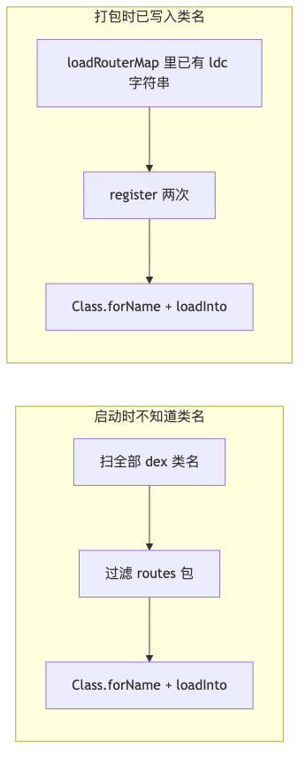
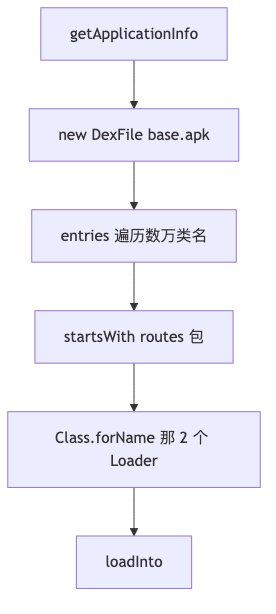
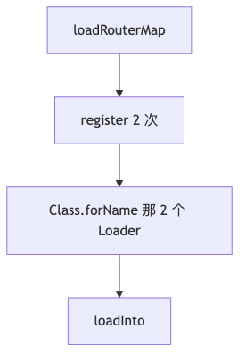

# dofrouter：扫 dex 与预留插件插桩，谁更快、慢在哪

记录时间：2026-09-06  
对照实现：`Router.loadRouteTable()`、`ClassUtils.getFileNameByPackageName()`、
`ServiceRouterPlugin` 的 ASM 注入。  
路由实现总览见同目录 [dofrouter-DOFRouter底层实现.md](dofrouter-DOFRouter底层实现.md)。

配套流程图（PNG 可直接预览）：

| 图           | PNG                                 | 源文件                                 |
|-------------|-------------------------------------|-------------------------------------|
| 发现 vs 已知    | [png](dofrouter-scan-vs-plugin.png) | [mmd](dofrouter-scan-vs-plugin.mmd) |
| 扫 dex 启动期步骤 | [png](dofrouter-scan-dex-cost.png)  | [mmd](dofrouter-scan-dex-cost.mmd)  |
| 插桩启动期步骤     | [png](dofrouter-plugin-runtime.png) | [mmd](dofrouter-plugin-runtime.mmd) |

---

## 1. 核心差别：装表一样，发现不同

两边最后都是 `Class.forName` + `newInstance` + `loadInto`，几乎一样快。慢的是扫 dex 前面那一大段
**「在整包 class 海里捞几颗沙子」**。

`Router` 编译在 `:ServiceRouter` 里，比 `:app` 早。它不可能在源码里写死：

```kotlin
register("com.haha.servicerouter.routes.RouteLoader_app")
```

原因：

- 每个模块的 kapt 只看见本模块的 `@Route`，各自生成 `RouteLoader_模块名`。
- 模块名、Loader 个数，库编译时都未知。
- 多模块时会有 `RouteLoader_app`、`RouteLoader_login`……名字是打包后才齐的。

所以运行时只有两条路：

| 方案    | 何时知道全类名                                | 代价落在谁身上                      |
|-------|----------------------------------------|------------------------------|
| 扫 dex | App 启动时，遍历 dex 里所有类名，按包名过滤             | **用户手机、主线程、冷启动**             |
| 插件插桩  | 打包期扫合并后的 CLASSES，把名字写进 `loadRouterMap` | **开发机 / CI，启动只剩几次 register** |

插桩更快，是因为把「O(全量 class)」从启动挪到了编译。



---

## 2. 扫 dex 慢：按本仓库代码逐项拆

回退路径在 `registerByPlugin == false` 时走 `ClassUtils.getFileNameByPackageName(context,
Consts.PACKAGE)`。`Consts.PACKAGE` 是 `com.haha.servicerouter.routes`。真正要的可能只有 2 个类：
`RouteLoader_app`、`InterceptorLoader_app`。扫 dex 却要为这两个名字付下面整套账单。

### 2.1 先问 PackageManager：一次 Binder

`getSourcePaths()` 先 `getApplicationInfo`，跨进程 Binder，拿到 `/data/app/.../base.apk`。本身几毫秒级，但发生在
`Application.onCreate` → `DOFRouter.init`，和别的启动工作抢主线程。

然后还要判断 VM 是否原生支持 MultiDex、必要时读 `SharedPreferences("multidex.version")`、拼
secondary-dex 路径。老设备这条更长。

### 2.2 打开 DexFile：按「整包 APK」做 I/O

每个 path 在线程池里 `new DexFile(path)` 或 `DexFile.loadDex(path, path + ".tmp", 0)`。

现代机（ART、VM 2.1+）通常只有一条 path：整包 `base.apk`。`new DexFile(apk)` 会：

1. 打开 APK（zip），定位里面的 `classes.dex`（实现上往往**只稳妥覆盖第一个 dex**）。
2. 读 dex header、`class_defs` 表。
3. 可能触发校验 / 和 ART 已加载的 dex 再映射一份。
4. `DexFile` 在新系统已废弃，额外映射、权限、hidden API 都更贵。

冷启动时 APK 还在 flash 上，page cache 是冷的，这一下就是**大块 I/O**。老设备走
`DexFile.loadDex(..., .tmp)` 更差：还要**写出一份 .tmp**。

本工程还带 Flutter、AndroidX、Glide、OkHttp 等，APK / dex 体积大，打开和枚举都更慢。

### 2.3 枚举「全部类名」：复杂度是 O(应用所有 class)

`DexFile.entries()` 会吐出**该 dex 里每一个类**，再 `startsWith("com.haha.servicerouter.routes")`。

没有「按包索引」。中型 App 常见 **2～8 万** 个类名。有效工作量 ≈ 2 次字符串比较；实际工作量 ≈
**数万次枚举 + 比较**。这是扫 dex 慢的主因。

命中后还不能提前停：可能还有别的模块的 Loader，必须扫完整个 dex。

### 2.4 线程池帮不上忙，主线程还在死等

`DefaultPoolExecutor` 是 `CPU+1` 条线程。并行单位是 **path（每个 dex/apk）**，不是「每个类」。

现代设备 `isVMMultidexCapable() == true` 时，`paths` **经常只有 1 个**（整个 base.apk）。于是：

- 第一次用线程池：创建 `CPU+1` 个线程（启动期很贵）。
- 只丢进去 1 个任务。
- **主线程 `CountDownLatch.await()` 卡死**，直到这一个 dex 扫完。

所以「开了线程池」≠「启动变快」。`DOFRouter.init` 在 `HahaApplication.initComponents()`
里同步调用，扫 dex 的时间直接加在冷启动上。

另外 `classNames` 是普通 `HashSet`，多 path 并发 `add` 本身也不安全（ARouter 同款写法的老问题）。

### 2.5 扫完还要再反射一遍

过滤后再 `Class.forName` + `newInstance` + `loadInto`。插件路径同样要这一步。**这段两边一样，不是差距来源。
**
差距是前面为了得到这两个字符串，扫了整包 dex。

### 2.6 扫 dex 的隐性成本

| 项        | 为什么贵                      |
|----------|---------------------------|
| 冷 I/O    | 首次读 APK，flash + zip + dex |
| 内存       | DexFile 映射、数万短字符串、线程栈     |
| GC       | 枚举产生大量临时 `String`         |
| 与 ART 重复 | 类本来已被加载器管着，又用废弃 API 再打开一遍 |
| 不能增量     | 每次进程启动都全量扫                |
| 与业务抢主线程  | 卡在 `init`，推迟首屏            |

经验数量级（随机型和包体变化很大）：扫 dex 常见 **几十到几百毫秒**；极端低端机 + 大包可以到秒级。插桩路径通常是
**1～5ms 量级**（几次 `Class.forName` + 几次 `HashMap.put`）。



---

## 3. 预留插桩为什么快：启动期几乎没有「发现」

插件在 `loadRouterMap` 的 **`RETURN` 前**插入：

```text
aload_0
ldc "com.haha.servicerouter.routes.RouteLoader_app"
invokespecial Router.register:(Ljava/lang/String;)V
```

启动时等价于：已经知道要加载哪两个类，直接 `register`。

ART 的 `Class.forName` 是按名字在已加载 dex 里查符号，**只碰这一个类**，不会遍历 class_defs。然后
`RouteLoader_app.loadInto` 就是编译期写死的若干次 `map.put`。

插桩路径启动期**没有**：

- PackageManager
- `new DexFile(apk)`
- 枚举数万类名
- 线程池 / `CountDownLatch`
- 按包名过滤

复杂度从 **O(dex 内全部 class)** 变成 **O(Loader 个数)**。本工程 Loader 通常就是 2 个。



---

## 4. 「预留空方法」本身不加速，它只是把扫描提前

`loadRouterMap` 里留空（或只设标志）不是为了运行更快，而是给 ASM 一个**稳定锚点**：

- 类名、方法名、描述符固定：`Router.loadRouterMap()V`
- 插件不用猜业务代码结构
- 在 `RETURN` 前插入 `register(String)` 即可

扫描并没有消失，只是换了时间和机器：

|       | 扫 dex            | 插件                      |
|-------|------------------|-------------------------|
| 扫什么   | 设备上已安装 APK 的 dex | 打包时全部 CLASSES（jar + 目录） |
| 何时    | 每次冷启动            | 每次 assemble（可缓存）        |
| 谁付钱   | 用户               | 开发 / CI                 |
| 结果怎么用 | 当场过滤出类名再反射       | 把类名写成 `ldc` 写进方法        |

插件的 `classifyLoader` 也要看很多 `.class`，但：

1. 发生在 Gradle，不进 `onCreate`。
2. 只认 `com/haha/servicerouter/routes/` 前缀，接口对上才收录。
3. 结果固化进 APK，用户侧不再扫。

所以对比的是 **启动耗时**，不是「全世界少做了扫描」。

---

## 5. 数量级对照（以 GPS 这条链路为例）

假设 APK 里约 4 万个类，Loader 2 个：

| 步骤                      | 扫 dex     | 插桩              |
|-------------------------|-----------|-----------------|
| 解析 APK / 打开 DexFile     | 1 次，大 I/O | 0               |
| 遍历类名                    | ~40000    | 0               |
| `startsWith`            | ~40000    | 0               |
| `Class.forName(Loader)` | 2         | 2               |
| `loadInto` put          | 1～N 条路由   | 同样 1～N 条        |
| 主线程阻塞                   | 扫完才能返回    | 两次 register 就返回 |

路由条数（1 个 `GpsActivity` 还是 100 个页）对两种方案几乎一样——`loadInto` 都是
O(路由数)。**拉开差距的是「找 Loader」**，和页面多少无关，和 **App 总 class 数、dex 数、APK
体积、是否冷 IO** 强相关。

App 越大、依赖越多，扫 dex 越亏；插桩几乎仍是「register 次数 = 模块数 × 2」。

---

## 6. 和 ARouter 同一套取舍

这就是 ARouter `LogisticsCenter.loadRouterMap` + `arouter-register` 的原因：

- 库代码不能写死各模块生成类。
- 运行时用 `DexFile` 发现是正确但贵。
- 打包期把发现结果写进空方法，启动变成常数时间。

本仓库的 `registerByPlugin` 就是这个开关：插桩成功并 `register` 过，就认为表已齐，**禁止再付扫
dex 的账**。

---

## 7. 小结

扫 dex 慢，是因为它在启动主线程上做了一次「打开 APK → 枚举几乎全部类名 → 用包名前缀捞出 1～2
个生成类」。有效输出极小，输入却是整个 dex 的 class 表，再叠加 I/O、废弃 `DexFile`、线程池冷启动和
`await()`。

插桩快，是因为打包期已经把 `RouteLoader_app` / `InterceptorLoader_app` 写进
`loadRouterMap`，启动只做「已知类名 → 反射 → put 表」，复杂度跟路由模块数成正比，跟 App 体积无关。

两边最后装表方式相同；快的是**消灭了运行时的全量类发现**，不是 `loadInto` 本身更快。
