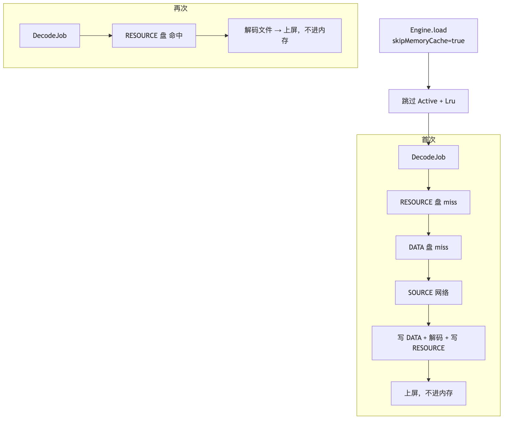
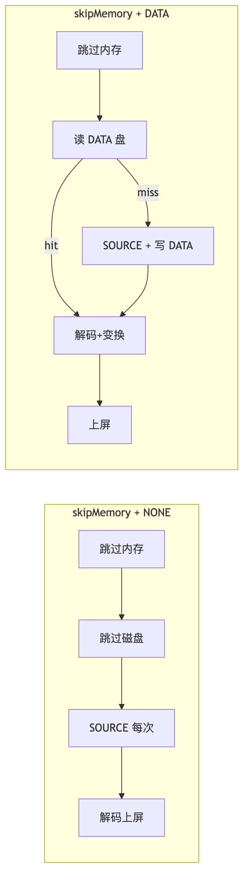
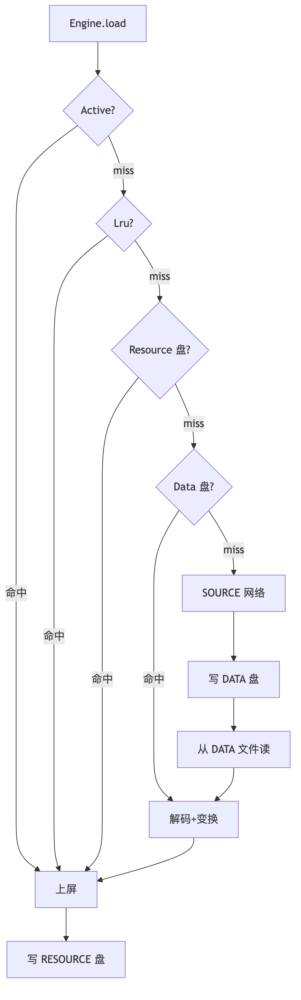
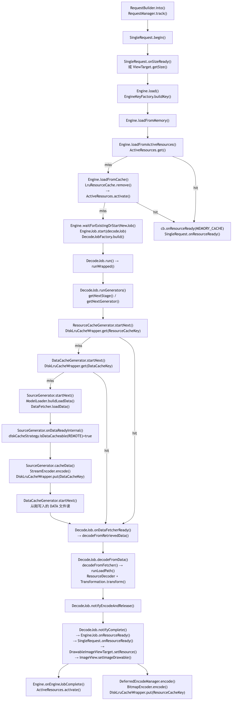

# Glide 缓存与 Engine 链路笔记

记录时间：2026-08-28  
版本依据：Glide 4.15.1  
说明：整理自近期连续 5 次问答，覆盖 `skipMemoryCache` 与 `DiskCacheStrategy` 组合、多级查找链、源码流程图，以及
`Lru.remove` 转入 Active 的设计。

配套流程图（PNG / SVG / mermaid 源文件）：

| 图                         | 对应章节 | PNG                                                  | SVG                                                  | 源文件                                                  |
|---------------------------|------|------------------------------------------------------|------------------------------------------------------|------------------------------------------------------|
| skipMemory + ALL 首次 vs 再次 | §1.6 | [png](assets/glide-skip-memory-all-flow.png)         | [svg](assets/glide-skip-memory-all-flow.svg)         | [mmd](assets/glide-skip-memory-all-flow.mmd)         |
| NONE vs DATA 流程图对比        | §2.5 | [png](assets/glide-skip-memory-strategy-compare.png) | [svg](assets/glide-skip-memory-strategy-compare.svg) | [mmd](assets/glide-skip-memory-strategy-compare.mmd) |
| ALL 首次网络多级查找链             | §3.5 | [png](assets/glide-all-lookup-chain.png)             | [svg](assets/glide-all-lookup-chain.svg)             | [mmd](assets/glide-all-lookup-chain.mmd)             |
| ALL 首次网络加载总流程（含源码）        | §4.1 | [png](assets/glide-all-first-load.png)               | [svg](assets/glide-all-first-load.svg)               | [mmd](assets/glide-all-first-load.mmd)               |

流程图已渲染为 PNG，放在 `assets/`；Android Studio Markdown 预览可直接看图；图与源文件在 `assets/`，同名
`.mmd`。

---

## 目录

1. [同一请求里
   `skipMemoryCache(true) + diskCacheStrategy(ALL)` 时 Engine 每一级怎么走](#1-同一请求里-skipmemorycachetrue--diskcachestrategyall-时-engine-每一级怎么走)
2. [`skipMemoryCache + NONE` 与
   `skipMemoryCache + DATA` 对照](#2-skipmemorycache--none-与-skipmemorycache--data-对照)
3. [ALL / DATA / RESOURCE 下的多级查找链](#3-all--data--resource-下的多级查找链)
4. [ALL 首次网络加载总流程图（含源码类/方法）](#4-all-首次网络加载总流程图含源码类方法)
5. [为何 `loadFromCache` 要用
   `LruResourceCache.remove(key)`](#5-为何-loadfromcache-要用-lruresourcecacheremovekey)

---

## 1. 同一请求里 skipMemoryCache(true) + diskCacheStrategy(ALL) 时 Engine 每一级怎么走

下面按 **「同一请求、首次加载」** 和 **「同一请求、再次加载」** 两种情形，把 `skipMemoryCache(true)` +
`diskCacheStrategy(ALL)` 时 Engine 每一级怎么走讲清楚。

### 1.1 两个参数各自管什么

| 参数                       | 控制范围                     | 本组合下的效果   |
|--------------------------|--------------------------|-----------|
| `skipMemoryCache(true)`  | **仅内存**（Active + Lru）    | 不读、不写内存缓存 |
| `diskCacheStrategy(ALL)` | **仅磁盘**（DATA + RESOURCE） | 能读则读、该写则写 |

二者 **互不覆盖**：内存全关，磁盘全开。

### 1.2 总览：Engine 查找顺序（本组合）

```text
Engine.load
  │
  ├─ ① ActiveResources     → 跳过（skipMemoryCache）
  ├─ ② LruResourceCache    → 跳过（skipMemoryCache）
  │
  └─ 未命中 → DecodeJob
        ├─ ③ RESOURCE 磁盘   → 尝试读（ALL: decodeCachedResource=true）
        ├─ ④ DATA 磁盘       → 尝试读（ALL: decodeCachedData=true）
        └─ ⑤ SOURCE          → 网络/本地拉源
              └─ 写 DATA 盘（REMOTE 时 isDataCacheable=true）
        解码 + 变换
              └─ 写 RESOURCE 盘（isResourceCacheable=true）
        回调 UI
              └─ 不进 Active / 不进 Lru
```

### 1.3 源码层：为什么内存两级直接跳过

`skipMemoryCache(true)` → `isMemoryCacheable = false`，传给 `Engine.load()`。

`loadFromMemory()` 开头：

```java
if(!isMemoryCacheable){
        return null;  // Active、Lru 都不查
        }
```

因此：

- 不会 `activeResources.get(key)`
- 不会 `cache.remove(key)`（Lru）
- 即使别的请求把同 URL 放进了 Lru，**本请求也故意不读**

### 1.4 首次加载（网络图，假设 500×500 + centerCrop）

#### 读路径（Engine → DecodeJob）

| 级别           | 是否走    | 结果                        |
|--------------|--------|---------------------------|
| ① Active     | **不走** | `isMemoryCacheable=false` |
| ② Lru        | **不走** | 同上                        |
| ③ RESOURCE 盘 | **走**  | 首次无文件 → miss              |
| ④ DATA 盘     | **走**  | 首次无文件 → miss              |
| ⑤ SOURCE     | **走**  | `SourceGenerator` 拉网络流    |

#### SOURCE 阶段写 DATA（ALL 生效）

网络数据返回且 `DataSource=REMOTE`：

```text
isDataCacheable(REMOTE) = true   // ALL 策略
  → SourceGenerator.cacheData()
  → diskCache.put(DataCacheKey, 原始字节)
  → 再从刚写的文件读回 → 解码
```

#### 解码后写 RESOURCE（ALL 生效）

```text
解码 + centerCrop(500×500)
  → isResourceCacheable(...)=true
  → notifyComplete 先上屏
  → DeferredEncodeManager 写 ResourceCacheKey 到磁盘
```

#### 写内存（skipMemoryCache 生效）

```text
onEngineJobComplete:
  if (resource.isMemoryCacheable()) activate(...)  // false → 不 activate

SingleRequest 显示期间:
  Request 持有 EngineResource，acquired≥1
  但不在 ActiveResources 的 Map 里

clear / release 后:
  onResourceReleased → isMemoryCacheable=false
  → 不 cache.put，直接 recycle 进 BitmapPool
```

**首次加载小结：**

| 层级         | 读           | 写             |
|------------|-------------|---------------|
| Active     | ✗           | ✗             |
| Lru        | ✗           | ✗             |
| DATA 盘     | miss→SOURCE | ✓（REMOTE 写原图） |
| RESOURCE 盘 | miss        | ✓（写变换后）       |
| SOURCE     | ✓ 网络        | —             |

### 1.5 再次加载（同一 URL、同一尺寸、同一变换）

内存仍跳过，**磁盘承担全部复用**。

#### 读路径

| 级别           | 是否走          | 典型结果                       |
|--------------|--------------|----------------------------|
| ① Active     | **不走**       | —                          |
| ② Lru        | **不走**       | —                          |
| ③ RESOURCE 盘 | **走**        | **命中**（同 ResourceCacheKey） |
| ④ DATA 盘     | ③ 命中则不到这     | —                          |
| ⑤ SOURCE     | ③④ 都 miss 才走 | 一般不需要                      |

RESOURCE 命中时：

```text
ResourceCacheGenerator 读文件
  → 解码（通常不再做 Transformation）
  → onResourceReady(DataSource.RESOURCE_DISK_CACHE)
  → 仍不 activate / 不 put Lru
```

若 RESOURCE miss、DATA 命中：

```text
DataCacheGenerator 读原图文件
  → 按 500×500 + centerCrop 重新解码变换
  → 再写 RESOURCE 盘
  → 仍不进内存缓存
```

**再次加载小结：**

| 层级           | 读                | 写                 |
|--------------|------------------|-------------------|
| Active / Lru | ✗                | ✗                 |
| RESOURCE 盘   | ✓ 优先             | 可能更新              |
| DATA 盘       | RESOURCE miss 时读 | 一般已有              |
| SOURCE       | 磁盘都没有才走          | REMOTE 时可能再写 DATA |

体感：**仍可能很快**（磁盘 RESOURCE），但 **不会** 出现 `MEMORY_CACHE` 那种零解码命中。

### 1.6 流程图（首次 vs 再次）



[SVG](assets/glide-skip-memory-all-flow.svg) · [mermaid 源文件](assets/glide-skip-memory-all-flow.mmd)

### 1.7 与「只开磁盘、关内存」的设计意图

常见场景：

- 大图预览、敏感图：不想长时间占 **RAM**
- 仍希望 **下次** 从磁盘快速打开（ALL 保留 DATA + RESOURCE）
- 列表滑走释放后：**不占 Lru**，把内存让给别的 item

代价：

- 每次都要走 DecodeJob（至少读盘 + 解码），**无法** 内存秒开
- 同一屏重复 bind 同一图，也 **不会** 从 Lru 命中（除非改 `skipMemoryCache(false)`）

### 1.8 和「只设 ALL、不设 skipMemoryCache」对比

| 行为                | 默认内存 + ALL      | skipMemoryCache + ALL |
|-------------------|-----------------|-----------------------|
| 读 Active/Lru      | ✓               | ✗                     |
| 读 RESOURCE/DATA 盘 | ✓               | ✓                     |
| 写 RESOURCE/DATA 盘 | ✓               | ✓                     |
| release 后进 Lru    | ✓               | ✗                     |
| 再次加载最快路径          | 内存 → RESOURCE 盘 | 仅 RESOURCE 盘          |

### 1.9 易混点

**1. `DataSource.MEMORY_CACHE` 还会出现吗？**  
本请求 **不会**（故意不读内存）。日志里常见 `RESOURCE_DISK_CACHE` 或 `REMOTE`。

**2. 显示期间图在哪？**  
在 `SingleRequest` + `EngineResource` 引用计数里，**不在** Active Map，**不在** Lru。

**3. ALL 会写本地 drawable 吗？**  
ALL 对 **REMOTE** 写 DATA；本地资源通常不写 DATA，但 **RESOURCE** 仍可能写（取决于
`isResourceCacheable` 与 `DataSource.LOCAL` 等条件）。

**4. 同 URL 两请求：一个 skip、一个不 skip**  
EngineKey 通常相同，可能 **合并 EngineJob**；但不 skip 的会进内存，skip
的仍不读内存。细节较绕，面试一般说到「内存策略按请求独立」即可。

### 1.10 面试 15 秒版

> `skipMemoryCache(true)` 只关内存：Engine 不查 Active/Lru，完成后不 activate、release 也不 put Lru。
`diskCacheStrategy(ALL)` 只开磁盘：DecodeJob 仍走 RESOURCE → DATA → SOURCE，REMOTE 写 DATA，解码后写
> RESOURCE。再次加载靠磁盘 RESOURCE 或 DATA，快但不占内存 LRU。

---

## 2. skipMemoryCache + NONE 与 skipMemoryCache + DATA 对照

下面把 **`skipMemoryCache(true)` + `NONE`** 和 **`skipMemoryCache(true)` + `DATA`** 放在一起对照，并顺带和
**`skipMemoryCache + ALL`** 做横向对比。

### 2.1 三个组合总表（核心对照）

| 维度                    | skipMemory + **NONE** | skipMemory + **DATA** | skipMemory + **ALL**（参考） |
|-----------------------|-----------------------|-----------------------|--------------------------|
| **读 Active**          | ✗                     | ✗                     | ✗                        |
| **读 Lru**             | ✗                     | ✗                     | ✗                        |
| **读 RESOURCE 盘**      | ✗                     | ✗                     | ✓                        |
| **读 DATA 盘**          | ✗                     | ✓                     | ✓                        |
| **走 SOURCE（网络/本地）**   | ✓ 每次都走                | 磁盘 miss 才走            | 磁盘 miss 才走               |
| **写 DATA 盘（原图）**      | ✗                     | ✓（REMOTE 等）           | ✓                        |
| **写 RESOURCE 盘（变换后）** | ✗                     | ✗                     | ✓                        |
| **release 后进 Lru**    | ✗                     | ✗                     | ✗                        |
| **再次加载最快路径**          | 无缓存，全重拉+全重解码          | DATA 盘 → 解码+变换        | RESOURCE 盘 → 轻解码         |
| **占 RAM（闲置后）**        | 低                     | 低                     | 低                        |
| **占磁盘**               | 不增长                   | 只存原图字节                | 原图 + 变换结果                |

### 2.2 Engine 每一级怎么走

#### skipMemoryCache(true) + diskCacheStrategy(NONE)

读路径（每次 load）：

```text
Engine.load
  ├─ Active     → 跳过
  ├─ Lru        → 跳过
  └─ DecodeJob
        ├─ RESOURCE_CACHE → 跳过（decodeCachedResource=false）
        ├─ DATA_CACHE     → 跳过（decodeCachedData=false）
        └─ SOURCE         → 直接拉源（网络/本地）
              → 不写 DATA
        解码 + 变换
              → 不写 RESOURCE
        上屏 → 不进内存
```

| 级别           | 读    | 写 |
|--------------|------|---|
| Active / Lru | ✗    | ✗ |
| RESOURCE 盘   | ✗    | ✗ |
| DATA 盘       | ✗    | ✗ |
| SOURCE       | ✓ 每次 | — |

再次加载同一 URL：与首次完全相同，网络/本地 → 解码 → 变换 → 上屏，无任何磁盘/内存 shortcut。

**典型场景：** 一次性图、强隐私、调试、或必须每次最新（配合 `.signature()` 更彻底）。

#### skipMemoryCache(true) + diskCacheStrategy(DATA)

读路径：

```text
Engine.load
  ├─ Active / Lru → 跳过
  └─ DecodeJob
        ├─ RESOURCE_CACHE → 跳过（decodeCachedResource=false）
        ├─ DATA_CACHE     → 尝试读原图文件
        └─ SOURCE         → DATA miss 才走
              → REMOTE 成功则写 DATA
        解码 + 变换（每次按当前宽高/Transformation）
              → 不写 RESOURCE
        上屏 → 不进内存
```

| 级别           | 读           | 写                       |
|--------------|-------------|-------------------------|
| Active / Lru | ✗           | ✗                       |
| RESOURCE 盘   | ✗           | ✗                       |
| DATA 盘       | ✓           | ✓（REMOTE 等，不写已缓存的 DATA） |
| SOURCE       | DATA miss 时 | 写 DATA                  |

再次加载（同 URL，**不同** override/变换）：

```text
DATA 盘命中（DataCacheKey 相同，只认 url+signature）
  → 跳过网络
  → 仍要按本次 400×400 / centerCrop 解码+变换
  → 不进内存
```

**典型场景：** 不想占内存，但要省流量；同一 URL 多种尺寸/裁剪，只存一份原图。

### 2.3 首次 / 再次 行为对照（NONE vs DATA）

假设：网络图，`500×500 + centerCrop`。

| 阶段                | skipMemory + **NONE** | skipMemory + **DATA**             |
|-------------------|-----------------------|-----------------------------------|
| **首次**            | SOURCE 网络 → 解码 → 上屏   | SOURCE 网络 → **写 DATA** → 解码 → 上屏  |
| **再次（同配置）**       | 再网络 → 再解码             | **读 DATA** → 解码+变换 → 上屏（无网络）      |
| **再次（改 400×400）** | 再网络 → 再解码             | **读 DATA**（同文件）→ 按 400 解码（仍无网络）   |
| **DataSource 日志** | `REMOTE`              | 首次 `REMOTE`，再次常 `DATA_DISK_CACHE` |
| **磁盘文件**          | 无                     | 有原图，无 RESOURCE                    |

### 2.4 和 skipMemory + ALL 的关键差异

| 问题                     | NONE    | DATA               | ALL                  |
|------------------------|---------|--------------------|----------------------|
| 换尺寸还要解码吗？              | 要，且还要下载 | **要解码，不下载**        | RESOURCE 命中时可少解码     |
| 换 centerCrop→fitCenter | 全重来     | DATA 共享，**重解码+变换** | 各一份 RESOURCE 或走 DATA |
| 列表滑回顶部                 | 最慢（全链路） | 中等（读盘+解码）          | 较快（RESOURCE 盘）       |
| 磁盘膨胀                   | 无       | 适中（仅原图）            | 较大（原图+多尺寸变换）         |

### 2.5 流程图对比



[SVG](assets/glide-skip-memory-strategy-compare.svg) · [mermaid 源文件](assets/glide-skip-memory-strategy-compare.mmd)

### 2.6 选型建议

| 需求                 | 推荐                                        |
|--------------------|-------------------------------------------|
| 不占内存、也不留磁盘         | **skipMemory + NONE**                     |
| 不占内存、省流量、可接受每次解码   | **skipMemory + DATA**                     |
| 不占内存、还要尽量快（同尺寸同变换） | **skipMemory + ALL**                      |
| 列表常规头像             | 通常 **默认内存 + AUTOMATIC/ALL**，不必 skipMemory |

### 2.7 面试 15 秒版

> **skipMemory + NONE**：内存和磁盘全关，每次 SOURCE 全链路。**skipMemory + DATA**：内存关，只缓存原图
> DATA；再次加载免网络但仍解码变换，不写 RESOURCE。**skipMemory + ALL** 在此基础上还多 RESOURCE
> 盘，同尺寸同变换时最快。三者共同点是 release 后都不进 Lru。

---

## 3. ALL / DATA / RESOURCE 下的多级查找链

常见理解：

> 若在 `DiskCacheStrategy.ALL` 的情况下，应该是五级缓存：先 ActiveResource、Lru、Resource、Data、Source；若是
`DiskCacheStrategy.DATA`，是四级缓存：先 ActiveResource、Lru、Data、Source；若是
`DiskCacheStrategy.RESOURCE`，是四级缓存：先 ActiveResource、Lru、Resource、Source；并且若有 Data
> 缓存时，会先把数据写到磁盘，而后再读取进行解码，显示在界面，再写入到 Resource。

**大方向正确。** 下面确认、补全、修正几处容易混的细节。

### 3.1 模型：基本成立

在 **`skipMemoryCache(false)`（默认）** 下，可以把一次 `Engine.load` 看成「按顺序尝试的多级管道」：

| DiskCacheStrategy | 完整查找链（含内存）                                              | 级数       |
|-------------------|---------------------------------------------------------|----------|
| **ALL**           | Active → Lru → **Resource 盘** → **Data 盘** → **Source** | **5 级**  |
| **DATA**          | Active → Lru → **Data 盘** → **Source**                  | **4 级**  |
| **RESOURCE**      | Active → Lru → **Resource 盘** → **Source**              | **4 级**  |
| **NONE**          | Active → Lru → **Source**                               | 3 级（无磁盘） |

说明：

- **Active / Lru** 是 **内存**，不由 `DiskCacheStrategy` 开关；策略只决定 **DecodeJob 里要不要走
  Resource/Data 盘**。
- **Source** 严格说不是「缓存」，而是 **原始数据源**（网络/本地/ContentProvider 等）；放在最后一级表示「前面都
  miss 才拉源」，这样理解没问题。

### 3.2 各级在源码里对应什么

```text
Engine.load()
  ├─ loadFromActiveResources()     → Active
  ├─ loadFromCache() / cache.remove → Lru
  └─ DecodeJob.runGenerators()
        ├─ Stage.RESOURCE_CACHE  → ResourceCacheGenerator（Resource 盘）
        ├─ Stage.DATA_CACHE      → DataCacheGenerator（Data 盘）
        └─ Stage.SOURCE          → SourceGenerator（网络/本地）
```

`getNextStage()` 会根据策略 **跳过** 某些 Stage：

| 策略       | RESOURCE_CACHE | DATA_CACHE | SOURCE |
|----------|----------------|------------|--------|
| ALL      | ✓              | ✓          | ✓      |
| DATA     | ✗              | ✓          | ✓      |
| RESOURCE | ✓              | ✗          | ✓      |
| NONE     | ✗              | ✗          | ✓      |

### 3.3 DATA 流程：要分「首次网络」和「已有 DATA」

#### 情况 A：首次从网络（ALL 或 DATA，REMOTE）

```text
SOURCE 拉到 InputStream
  → 先写 DATA 盘（SourceGenerator.cacheData）
  → 再从 DATA 文件读回（DataCacheGenerator）
  → 解码 + Transformation
  → 上屏（notifyComplete）
  → 若 ALL（且满足 isResourceCacheable）→ 再写 RESOURCE 盘（DeferredEncode）
```

要点：

1. **先写 DATA 再读**，不是为了「多此一举」，而是：流只能读一次、路径统一、和下次冷启动读盘走同一套逻辑。
2. **RESOURCE 写入**在 **解码+变换之后**，且通常是 **先回调 UI，再 encode 写盘**
   （DeferredEncode），不是「显示很久以后才写」，而是 **同一次 DecodeJob 里，上屏回调先于写 RESOURCE**。

#### 情况 B：DATA 盘已有（第二次及以后）

```text
跳过 SOURCE
  → 读 DATA 盘
  → 解码 + Transformation
  → 上屏
  → ALL 时：写 RESOURCE（若策略允许且 key 不同/需要）
```

此时 **不会再写一遍 DATA**（已有文件）。

#### 情况 C：RESOURCE 盘已命中（ALL 或 RESOURCE）

```text
读 RESOURCE 盘
  → 解码成 Bitmap/Drawable（通常不再做 Transformation）
  → 上屏
  → 一般不再写 RESOURCE
```

### 3.4 三种策略的「读 + 写」对照

| 策略           | 读顺序                             | SOURCE 时写 DATA | 解码后写 RESOURCE |
|--------------|---------------------------------|----------------|---------------|
| **ALL**      | Active→Lru→Resource→Data→Source | ✓（REMOTE）      | ✓             |
| **DATA**     | Active→Lru→Data→Source          | ✓（REMOTE）      | ✗             |
| **RESOURCE** | Active→Lru→Resource→Source      | ✗              | ✓（满足条件时）      |
| **NONE**     | Active→Lru→Source               | ✗              | ✗             |

### 3.5 总流程图（ALL，首次网络）



[SVG](assets/glide-all-lookup-chain.svg) · [mermaid 源文件](assets/glide-all-lookup-chain.mmd)

**DATA only**：去掉 Resource 盘读写、去掉写 RESOURCE。  
**RESOURCE only**：去掉 Data 盘读写、SOURCE 不写 DATA。

### 3.6 需要修正/细化的 4 点

#### ① 「五级缓存」是「五级查找链」，不是五个独立 Cache 池

- Active、Lru、Resource 盘、Data 盘 才是缓存；
- Source 是 **fallback 数据源**。

#### ② 内存两级 **不受** DiskCacheStrategy 控制

即使用 `NONE`，默认仍会 **先查 Active、Lru**（除非 `skipMemoryCache(true)`）。

#### ③ DATA 与 RESOURCE 的 Key 不同 → 复用粒度不同

| 磁盘       | Key                     | 同 URL 不同尺寸     |
|----------|-------------------------|----------------|
| DATA     | `sourceKey + signature` | **共享** 同一份原图文件 |
| RESOURCE | + 宽高 + Transformation   | **不共享**，各存各的   |

所以 ALL 下：换尺寸可能 DATA 命中、RESOURCE miss，仍要 **重新解码+变换**，再 **写新的 RESOURCE 文件**。

#### ④ 「显示后再写入 Resource」要表述准确

更准确的说法：

> **先 `onResourceReady` 上屏，再在同一次任务里 DeferredEncode 写 RESOURCE 盘**（不阻塞首帧，但通常紧接着发生）。

### 3.7 面试可直接用的总结

> Glide 在默认开内存时，Engine 先查 **Active、Lru**；未命中进入 DecodeJob，按策略依次尝试 **Resource
盘、Data 盘、Source**。`ALL` 是五级链路；`DATA` 跳过 Resource 盘；`RESOURCE` 跳过 Data 盘。网络首次加载在
> DATA/ALL 下会 **先落 DATA 再读盘解码**；ALL 还会在解码变换后 **DeferredEncode 写 RESOURCE**。Source
> 不是缓存，是最后一级数据源。

---

## 4. ALL 首次网络加载总流程图（含源码类/方法）

前提：**DiskCacheStrategy.ALL + 首次网络加载 + 默认开内存**。

### 4.1 总流程图（含源码类/方法）



[SVG](assets/glide-all-first-load.svg) · [mermaid 源文件](assets/glide-all-first-load.mmd)

### 4.2 按阶段文字说明（与图一一对应）

#### 阶段 0：发起请求

| 步骤   | 类 / 方法                                             | 说明                                               |
|------|----------------------------------------------------|--------------------------------------------------|
| 入口   | `RequestBuilder.into()` → `RequestManager.track()` | 创建 `SingleRequest`，绑定 `ImageViewTarget`          |
| 启动   | `SingleRequest.begin()`                            | 状态 → `WAITING_FOR_SIZE`，等 View 尺寸或 `override`    |
| 尺寸就绪 | `SingleRequest.onSizeReady()`                      | 调 `Engine.load(..., DiskCacheStrategy.ALL, ...)` |

#### 阶段 1：内存两级（Engine 层）

| 步骤        | 类 / 方法                                                       | 说明                                                        |
|-----------|--------------------------------------------------------------|-----------------------------------------------------------|
| 查内存       | `Engine.load()` → `Engine.loadFromMemory()`                  | 首次网络必 miss                                                |
| L1 Active | `Engine.loadFromActiveResources()` → `ActiveResources.get()` | 无正在使用的同 Key 资源                                            |
| L2 Lru    | `Engine.loadFromCache()` → `LruResourceCache.remove(key)`    | 取出并 `activate()`；首次为空                                     |
| 开任务       | `Engine.waitForExistingOrStartNewJob()`                      | 新建 `EngineJob` + `DecodeJob`，`EngineJob.start(decodeJob)` |

**Key 类：** `EngineKey` / `EngineKeyFactory`（model + 尺寸 + 变换 + options 等）

#### 阶段 2：DecodeJob 磁盘两级 + Source（ALL 全开）

| 步骤            | 类 / 方法                                                 | 说明                                                        |
|---------------|--------------------------------------------------------|-----------------------------------------------------------|
| 调度            | `DecodeJob.run()` → `runWrapped()` → `runGenerators()` | 循环 `startNext()`，失败则 `getNextStage()` 推进                  |
| 阶段选择          | `DecodeJob.getNextStage()` + `DiskCacheStrategy.ALL`   | `decodeCachedResource()=true`，`decodeCachedData()=true`   |
| L3 Resource 盘 | `ResourceCacheGenerator.startNext()`                   | `DiskLruCacheWrapper.get(ResourceCacheKey)` → **首次 miss** |
| L4 Data 盘     | `DataCacheGenerator.startNext()`                       | `DiskLruCacheWrapper.get(DataCacheKey)` → **首次 miss**     |
| L5 Source     | `SourceGenerator.startNext()`                          | `ModelLoader` + `DataFetcher.loadData()` 拉网络流             |

**Key 类：**

- Resource 盘：`ResourceCacheKey`（含宽高 + Transformation）
- Data 盘：`DataCacheKey`（仅 `sourceKey + signature`）
- 物理文件：`DiskLruCacheWrapper` + `SafeKeyGenerator`（SHA-256 文件名）

#### 阶段 3：网络数据 → 写 DATA → 再读 DATA

| 步骤     | 类 / 方法                                                         | 说明                                                        |
|--------|----------------------------------------------------------------|-----------------------------------------------------------|
| 判断是否写盘 | `SourceGenerator.onDataReadyInternal()`                        | `ALL.isDataCacheable(REMOTE)=true` → `dataToCache = data` |
| 切线程    | `DecodeJob.reschedule()`                                       | 网络回调线程 → Glide source/disk 线程                             |
| 写 DATA | `SourceGenerator.cacheData()`                                  | `DataRewinder.rewindAndGet()`                             |
| 编码落盘   | `DataCacheWriter.write()` → `StreamEncoder.encode()`           | InputStream → 磁盘文件                                        |
| 提交     | `DiskLruCacheWrapper.put(DataCacheKey, writer)`                | `DiskCacheWriteLocker` 加锁，`Editor.commit()`               |
| 读回     | `new DataCacheGenerator(...).startNext()`                      | 从刚写的文件再 `loadData()`                                      |
| 回调解码   | `DecodeJob.onDataFetcherReady()` → `decodeFromRetrievedData()` | 进入解码流水线                                                   |

**设计意图：** 流只读一次、与下次冷启动共用 `DataCacheGenerator` 读盘路径。

#### 阶段 4：解码 + 变换 + 上屏

| 步骤           | 类 / 方法                                                                 | 说明                      |
|--------------|------------------------------------------------------------------------|-------------------------|
| 解码           | `DecodeJob.decodeFromData()` → `decodeFromFetcher()` → `runLoadPath()` | `StreamBitmapDecoder` 等 |
| 变换           | `DecodeCallback.onResourceDecoded()` 内 `Transformation.transform()`    | 如 `CenterCrop`          |
| 是否写 RESOURCE | `DiskCacheStrategy.isResourceCacheable()`                              | ALL 下通常为 true           |
| 准备写盘         | `DeferredEncodeManager.init(ResourceCacheKey, BitmapEncoder, ...)`     | 先锁定 Resource            |
| **先上屏**      | `notifyEncodeAndRelease()` → `notifyComplete()`                        | 不阻塞首帧                   |
| 主线程          | `EngineJob.onResourceReady()` → `SingleRequest.onResourceReady()`      | 切主线程                    |
| 显示           | `DrawableImageViewTarget.onResourceReady()` → `setImageDrawable()`     | UI 可见                   |

#### 阶段 5：写 RESOURCE + 进 Active

| 步骤              | 类 / 方法                                                        | 说明                                                                     |
|-----------------|---------------------------------------------------------------|------------------------------------------------------------------------|
| 进 Active        | `Engine.onEngineJobComplete()` → `ActiveResources.activate()` | 内存「在用」集合                                                               |
| 引用计数            | `EngineResource.acquire()`                                    | Target 持有期间 `acquired≥1`                                               |
| **后写 RESOURCE** | `DeferredEncodeManager.encode()`                              | `BitmapEncoder.encode()` → `DiskLruCacheWrapper.put(ResourceCacheKey)` |
| release 后       | `Engine.onResourceReleased()` → `LruResourceCache.put()`      | clear 后闲置图进 Lru（若未 `skipMemoryCache`）                                  |

### 4.3 简化版「五级 + 源码」对照表

| 级 | 名称         | 核心类                                 | 核心方法                                        | 首次网络        |
|---|------------|-------------------------------------|---------------------------------------------|-------------|
| 1 | Active     | `ActiveResources`                   | `get()` / `activate()`                      | miss        |
| 2 | Lru        | `LruResourceCache`                  | `remove()`                                  | miss        |
| 3 | Resource 盘 | `ResourceCacheGenerator`            | `startNext()` + `DiskLruCacheWrapper.get()` | miss        |
| 4 | Data 盘     | `DataCacheGenerator`                | `startNext()` + `DiskLruCacheWrapper.get()` | miss → 写后再读 |
| 5 | Source     | `SourceGenerator`                   | `startNext()` + `DataFetcher.loadData()`    | ✓ 网络        |
| — | 解码         | `DecodeJob`                         | `decodeFromRetrievedData()`                 | ✓           |
| — | 上屏         | `SingleRequest` / `ImageViewTarget` | `onResourceReady()`                         | ✓           |
| — | 写 RESOURCE | `DeferredEncodeManager`             | `encode()`                                  | ✓（ALL）      |

### 4.4 时序简图（类级别）

```text
RequestBuilder
  → SingleRequest.begin / onSizeReady
    → Engine.load
        → [Active miss] → [Lru miss]
        → EngineJob.start(DecodeJob)
          → ResourceCacheGenerator [miss]
          → DataCacheGenerator [miss]
          → SourceGenerator
              → HttpUrlFetcher (示例)
              → cacheData → DiskLruCacheWrapper.put (DATA)
              → DataCacheGenerator 读文件
          → DecodeJob.decodeFromRetrievedData
          → Transformation
          → EngineJob.onResourceReady (主线程)
              → SingleRequest → ImageViewTarget
          → DeferredEncodeManager.encode
              → DiskLruCacheWrapper.put (RESOURCE)
          → ActiveResources.activate
```

### 4.5 面试 30 秒版

> ALL 首次网络：`SingleRequest` 调 `Engine.load`，先 `ActiveResources.get` 和
`LruResourceCache.remove`，都 miss 后 `EngineJob` 跑 `DecodeJob`。`runGenerators` 依次
`ResourceCacheGenerator`、`DataCacheGenerator` miss，到 `SourceGenerator` 拉流；`cacheData` 用
`StreamEncoder` 写 `DataCacheKey` 到 `DiskLruCacheWrapper`，再 `DataCacheGenerator` 读文件，
`decodeFromRetrievedData` 解码变换，`notifyComplete` 上屏，最后 `DeferredEncodeManager` 写
`ResourceCacheKey`，`ActiveResources.activate` 进内存在用集合。

---

## 5. 为何 loadFromCache 要用 LruResourceCache.remove(key)

常见理解：

> 调用 `Engine.loadFromCache()` 就要移除 key，`LruResourceCache.remove(key)`，是因为读取到了，所以需要把数据从
`LruResourceCache` 中移除掉，添加到 `activeResourceCache` 中。

这个理解 **完全正确**。可以再精确一点说：**不是「读一下还留在 Lru」**，而是 **「从 Lru 取出来 →
标记为正在使用 → 放进 Active」** 的所有权转移。

### 5.1 源码在做什么

`Engine.loadFromCache()` 大致是：

```java
private EngineResource<?> loadFromCache(Key key) {
    EngineResource<?> cached = getEngineResourceFromCache(key);  // 内部 cache.remove(key)
    if (cached != null) {
        cached.acquire();                    // 引用计数 +1
        activeResources.activate(key, cached); // 放进 Active
    }
    return cached;
}

private EngineResource<?> getEngineResourceFromCache(Key key) {
    Resource<?> cached = cache.remove(key);  // 从 Lru 移除，不是 get
  ...
}
```

所以流程就是：

```text
LruResourceCache.remove(key)   // 离开「闲置内存池」
  → acquire()
  → ActiveResources.activate() // 进入「正在使用池」
```

### 5.2 为什么要 remove，而不是 get？

| 若用 `get`（不移除）                     | 实际用 `remove`                |
|-----------------------------------|-----------------------------|
| 同一份 Resource 同时在 Lru 和 Active 逻辑里 | **同一时刻只在一处**                |
| Lru 满时可能把「正在被新请求取用的图」淘汰           | 已在 Active，**不受 Lru LRU 淘汰** |
| 引用关系混乱，难以判断能不能 recycle            | 清晰：**在用 → Active；闲置 → Lru** |

核心设计：**Active 与 Lru 互斥**，Engine 只在一处管理同一份 `EngineResource`。

### 5.3 和生命周期的对应关系

```text
release 前（正在显示）
  → 在 Active，acquired ≥ 1
  → 不在 Lru

release 后（acquired = 0）
  → ActiveResources.deactivate()
  → LruResourceCache.put(key, resource)   // 又回 Lru

再次 load 命中
  → LruResourceCache.remove(key)          // 这一步
  → activate() 回 Active
```

所以：

- **进 Lru**：`onResourceReleased` 里 `cache.put`
- **出 Lru**：`loadFromCache` 里 `cache.remove` + `activate`

### 5.4 和「读到了所以要移除」的关系

更严谨的说法：

> 从 Lru **命中**后，要把资源从「闲置可淘汰队列」里 **取出来**，转为「正在使用」，所以必须 `remove`，再
`activate` 到 Active；不是读完再放回 Lru。

`remove` 在这里的含义是 **「认领所有权」**，不是删除/销毁 Bitmap。

### 5.5 面试一句话

> `loadFromCache` 用 `remove` 而不是 `get`，是为了避免同一份资源同时存在于 Lru 和 Active；命中后移出
> Lru、`acquire` 并 `activate` 到 ActiveResources，释放后再 `put` 回 Lru，形成清晰的在用/闲置两态流转。
