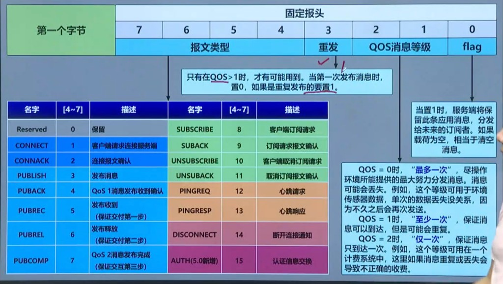

# MQTT 发送方 / 接收方与 Fixed Header

记录时间：2026-08-30  
示例代码：

- `app/src/main/java/com/haha/main/retrofit/MqttTest.kt` — 导演：先订后发，按报文表逐项跑一遍
- `app/src/main/java/com/haha/main/retrofit/MqttSender.kt` — 发送方（一条 TCP）
- `app/src/main/java/com/haha/main/retrofit/MqttReceiver.kt` — 接收方（另一条 TCP）
- `app/src/main/java/com/haha/main/retrofit/MqttConnection.kt` — 裸 TCP 读写
- `app/src/main/java/com/haha/main/retrofit/MqttWire.kt` — Fixed Header + 16 种报文编解码

入口：`TestLearnUtils.test()` → `MqttTest.test()`。Logcat 过滤 `MqttSender` / `MqttReceiver` /
`MqttTest`。

公共 Broker（匿名，国内优先 EMQX）：`broker.emqx.io:1883` → `broker.hivemq.com:1883` →
`test.mosquitto.org:1883`。

本 Demo **不经过 Paho**，自己编解码，才能在日志里看到 `PUBACK` / `PUBREC` / `PUBREL` / `PUBCOMP`。协议级别是
**MQTT 3.1.1**；`AUTH` 是 5.0，只编码不上线。

---

## 1. 对照图：Fixed Header 第一字节

图源为学习笔记截图，保存在同目录 [`mqtt-fixed-header.jpg`](mqtt-fixed-header.jpg)。



```text
  7 6 5 4 |  3  | 2 1 |  0
  Type    | DUP | QoS | RETAIN
```

| 位   | 含义            | 何时有效                    |
|-----|---------------|-------------------------|
| 7–4 | 控制报文类型（0～15）  | 每一种包                    |
| 3   | DUP（重发）       | **仅 PUBLISH**，且 QoS > 0 |
| 2–1 | QoS 0 / 1 / 2 | **仅 PUBLISH**           |
| 0   | RETAIN        | **仅 PUBLISH**           |

其它报文的低 4 位不是 DUP/QoS/RETAIN。规范写死：

- `PUBREL` / `SUBSCRIBE` / `UNSUBSCRIBE` 必须是 `0010`
- 其余（CONNECT、CONNACK、PUBACK、PING…）必须是 `0000`
- type 0 **Reserved** 禁止发送

编码见 `MqttFixedHeader.toFirstByte()`：PUBLISH 用 `dup << 3 | qos << 1 | retain`，再与 `type << 4`
拼成一字节。

---

## 2. 16 种报文与代码对应

| 值  | 名称          | 含义             | 本工程谁实现                                |
|----|-------------|----------------|---------------------------------------|
| 0  | Reserved    | 保留，禁止使用        | `MqttWire.reserved()`，调用即抛            |
| 1  | CONNECT     | 客户端请求连接        | 双方 `connect()`                        |
| 2  | CONNACK     | 连接确认           | 双方 `connect()` 里 `readExpect`         |
| 3  | PUBLISH     | 发布消息           | 发送方 `publish*`，接收方 `receivePublish()` |
| 4  | PUBACK      | QoS 1 发布确认     | 发送方等；接收方 QoS 1 回                      |
| 5  | PUBREC      | QoS 2 第一步      | 发送方 `publishQos2()`；接收方 QoS 2 回       |
| 6  | PUBREL      | QoS 2 第二步      | 同上                                    |
| 7  | PUBCOMP     | QoS 2 第三步      | 同上                                    |
| 8  | SUBSCRIBE   | 订阅请求           | 仅接收方 `subscribe()`                    |
| 9  | SUBACK      | 订阅确认           | 仅接收方                                  |
| 10 | UNSUBSCRIBE | 取消订阅           | 仅接收方 `unsubscribe()`                  |
| 11 | UNSUBACK    | 取消订阅确认         | 仅接收方                                  |
| 12 | PINGREQ     | 心跳请求           | 双方 `ping()`                           |
| 13 | PINGRESP    | 心跳响应           | 双方 `ping()`                           |
| 14 | DISCONNECT  | 断开通知           | 双方 `disconnect()`                     |
| 15 | AUTH        | 认证交换（MQTT 5.0） | `MqttSender.auth()` **只编码，3.1.1 不发送** |

QoS 等级（图注）：

| QoS | 名称   | 行为        | 适合           |
|-----|------|-----------|--------------|
| 0   | 最多一次 | 发出就不管，可能丢 | 高频传感器，丢一条可接受 |
| 1   | 至少一次 | 必达，可能重复   | 一般业务         |
| 2   | 恰好一次 | 四次握手，不丢不重 | 计费等不能重复的场景   |

DUP：QoS > 0 时，首次为 0，重发为 1。  
RETAIN=1：Broker 保存该 topic 最后一条，后订阅者也能收到；**payload 为空则清除**保留消息。

---

## 3. 四层结构

```text
MqttTest          导演：先订后发，按图逐项点名
   │
   ├── MqttSender     发送方（一条 TCP）
   └── MqttReceiver   接收方（另一条 TCP，可再开一个看 RETAIN）
           │
           └── MqttConnection   读写「第一字节 + 剩余长度 + body」
                   │
                   └── MqttWire / MqttFixedHeader   对照上图表
```

发送方和接收方**不直连**。两边都连公共 Broker；Broker 按 topic 转发。所以必须**先 SUBSCRIBE，再 PUBLISH
**。

---

## 4. 一条报文在线上长什么样

`MqttConnection.write` 写出三截：

```text
[1 字节 Fixed Header] [1～4 字节 Remaining Length] [body]
```

| 字节         | 含义                                              |
|------------|-------------------------------------------------|
| 第 1 字节     | 上图：高 4 位类型，低 4 位标志                              |
| 接下来 1～4 字节 | Remaining Length，后面 body 有多长（每字节 7 位，最高位表示还有后续） |
| body       | Topic、PacketId、payload 等，因类型而异                  |

读的时候反过来：先读 1 字节解类型，再按剩余长度把 body 一次读完。`readExpect(PUBACK)`：读到的若不是
PUBACK 就失败，避免把心跳当成确认。

MQTT 字符串不是 `\0` 结尾，而是 **2 字节大端长度 + UTF-8**（`ByteSink.writeMqttString`）。解码 PUBLISH 的
topic 必须用报文里的字节长度，不能用 `String.length`。

---

## 5. `MqttWire`：每种报文的 body

### CONNECT（客户端 → Broker）

协议名 `"MQTT"` + 级别 `0x04`（3.1.1）+ Connect Flags（`cleanSession` 时 `0x02`）+ Keep Alive（2 字节）+
ClientId。

`cleanSession=true`：不恢复旧订阅。Demo 每次新连接，所以打开。

### CONNACK（Broker → 客户端）

2 字节：是否已有会话 + 返回码。`0` 才算连上。

### PUBLISH

```text
[2 字节 topic 长度][topic][若 QoS>0 则 2 字节 PacketId][payload]
```

QoS 0 **没有** PacketId。QoS 1/2 必须有，后续确认靠这个数字对上同一条消息。

### 只带 PacketId 的确认包

PUBACK / PUBREC / PUBREL / PUBCOMP / UNSUBACK 的 body 都是 2 字节 PacketId，统一走 `encodePacketId`。

### SUBSCRIBE / SUBACK

SUBSCRIBE：`PacketId + topic + 1 字节请求 QoS`。接收方默认订 QoS 2（「最高能按恰好一次收」）。Broker 实际投递
QoS = `min(发布 QoS, 订阅 QoS)`。

SUBACK：PacketId + 每个订阅的授权码。`0x80` 表示拒绝。

### PING / DISCONNECT / AUTH

PINGREQ、PINGRESP、DISCONNECT 的 body 为空。AUTH 只编码对照，不发。

---

## 6. `MqttConnection`：一条 TCP 上的收发器

发送方、接收方各持有一个实例，**两条独立 TCP**。

- `tcpConnect`：普通 `Socket.connect`，和 `SocketTest` 三次握手同一层。1883 明文 MQTT。
- `nextPacketId`：1～65535 循环，**不能为 0**。QoS>0 的请求/确认靠它配对。
- `write` / `read`：上面三截格式。
- `soTimeout=10s`：对端不回就超时，外层换下一个 Broker。

它不管「这是发布还是订阅」，只负责把 `MqttFixedHeader + body` 送出去、读回来。

---

## 7. `MqttSender`：发送方

发送方**不订阅**。只对 Broker：连上、发布、心跳、断开。

`connect()` = TCP + CONNECT + 等 CONNACK。

私有 `publish()` 写出 PUBLISH；公开方法只是四个开关的不同组合：

| 方法              | qos | dup   | retain | 之后还做什么                |
|-----------------|-----|-------|--------|-----------------------|
| `publishQos0`   | 0   | 0     | 0      | 发出就返回                 |
| `publishQos1`   | 1   | 0     | 0      | 等 PUBACK，核对 PacketId  |
| `publishQos2`   | 2   | 0     | 0      | 四步握手                  |
| `publishDup`    | 1   | **1** | 0      | 等 PUBACK（演示 bit3）     |
| `publishRetain` | 1   | 0     | **1**  | 等 PUBACK；Broker 存最后一条 |
| `clearRetain`   | 0   | 0     | **1**  | payload 为空，清保留消息      |

QoS 2 发送方 ↔ Broker：

```text
Sender                         Broker
  PUBLISH qos=2  ───────────►
  ◄───────────  PUBREC
  PUBREL         ───────────►
  ◄───────────  PUBCOMP
```

这是 **Sender 和 Broker** 之间的握手。接收方还有另一套（见下节）。两条 TCP，两套确认，PacketId **不必相等
**。

`PINGREQ` 空包，等 `PINGRESP`。`DISCONNECT` 空包后关 Socket。

---

## 8. `MqttReceiver`：接收方

接收方**不主动发业务消息**。先登记兴趣，再读 Broker 推过来的 PUBLISH，按 QoS 回确认。

`subscribe()` 写 SUBSCRIBE（请求 QoS 2），等 SUBACK。此后该 topic 才会出现在**这条**连接的输入流。

`receivePublish()`：

| 读到的 QoS | 接收方做什么                          |
|---------|---------------------------------|
| 0       | 只记录                             |
| 1       | 回 PUBACK(packetId)              |
| 2       | 回 PUBREC → 等 PUBREL → 回 PUBCOMP |

```text
Broker                         Receiver
  PUBLISH            ───────────►
  ◄───────────  PUBACK          （QoS 1）

  PUBLISH qos=2      ───────────►
  ◄───────────  PUBREC
  PUBREL             ───────────►
  ◄───────────  PUBCOMP         （QoS 2）
```

返回 `Received`（topic、正文、qos/dup/retain）给 `MqttTest` 打日志。

---

## 9. `MqttTest.runAgainst` 顺序

`test()` → `runAll()` 在 IO 协程里依次试三个 Broker，成功就停。剧本：

```text
① reservedSafe()     type 0，预期抛错，只打日志
② sender.auth()      只编码 AUTH，不上线

③ receiver.connect + subscribe     先占坑
④ sender.connect                   再连发送方

⑤  QoS0 发 → 收
⑥  QoS1 发 → 收
⑦  QoS2 发 → 收          （两边各自和 Broker 握手）
⑧  DUP  发 → 收
⑨  RETAIN 发 → 当前接收方也能收到（RETAIN-live）

⑩ 再 new 一个 MqttReceiver（hB...）
    connect + subscribe → 立刻收到保留消息（RETAIN-new）
    unsubscribe + disconnect

⑪ clearRetain（空 payload + RETAIN=1）
    原接收方再读一条（RETAIN-clear）

⑫ 双方 ping → 接收方退订 → 双方 DISCONNECT
```

设计原因：

- **必须先订后发**。发送方 `publishQos0` 返回时，消息已在（或即将进入）接收方 TCP
  缓冲。交替「发一条、收一条」。先发后订，QoS0 会丢。
- **topic 带随机后缀**（`hahalearn/demo/a3f1`），避免公共频道别人的包撞进 `readExpect(PUBLISH)`。
- **三个 clientId：`hR` / `hS` / `hB`**。同一 Broker 上重复 id 会互踢。
- **RETAIN 要第二个接收方**。已在线订阅者收到的是实时转发，头上 retain 常常是 0。要证明 Broker 存了一份，必须让
  **之后才订阅**的人一 SUBSCRIBE 就收到。
- **clearRetain 后立刻再读一条**。空保留消息会推给当前订阅者；不读掉会堵在流里，后面把 PINGRESP 读乱。
- **`finally` 里 `close()`**：中途失败也关 Socket。
- **`reservedSafe` 包 try/catch**：Reserved 的正确行为就是抛错，不能中断后面真连接。

---

## 10. 两条连接、两套 QoS 2

一次 `publishQos2()` + `receivePublish()` 实际是：

```text
MqttSender ──── TCP-A ──── Broker ──── TCP-B ──── MqttReceiver

  PUBLISH ────────────────►
  ◄──────── PUBREC
  PUBREL  ────────────────►
  ◄──────── PUBCOMP
                   Broker 再向已订阅者转发
                                PUBLISH ──────────►
                                ◄──────── PUBREC
                                PUBREL  ──────────►
                                ◄──────── PUBCOMP
```

`MqttTest` 先让 `sender.publishQos2()` 整段跑完（TCP-A），再 `receiver.receivePublish()`（TCP-B）。两边
PacketId 是各自连接上的计数器。

---

## 11. 对照图读 Logcat

- `>>` 本端写出，`<<` 本端读入
- 发送方：CONNECT、CONNACK、PUBLISH、PUBACK 或 PUBREC/PUBREL/PUBCOMP、PING、DISCONNECT
- 接收方：CONNECT、SUBSCRIBE、SUBACK、PUBLISH、自己回的确认、UNSUBSCRIBE、PING、DISCONNECT

停在 `[1] TCP connect` 后换 Broker：1883 不可达。  
`期望 PUBLISH，实际 PINGRESP`：流上还有没读掉的包，顺序错了。
