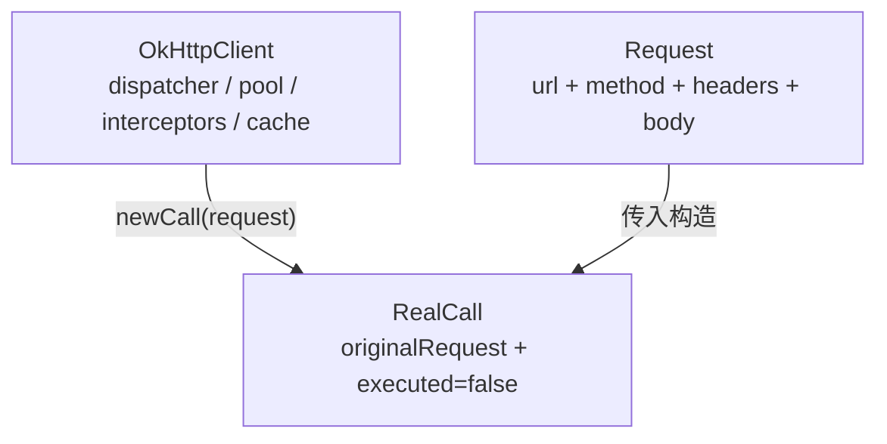
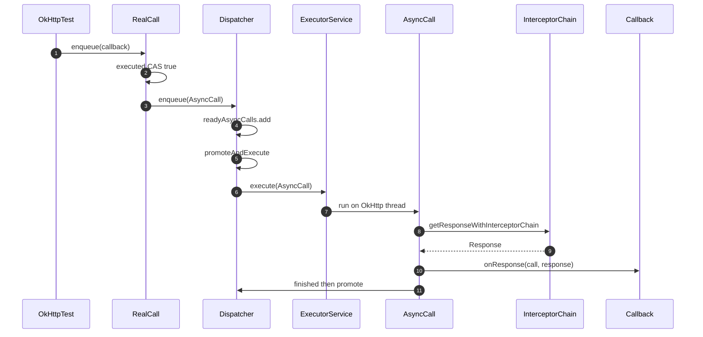
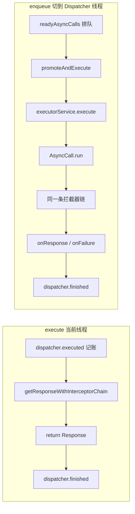
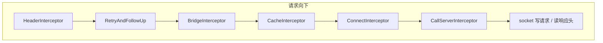
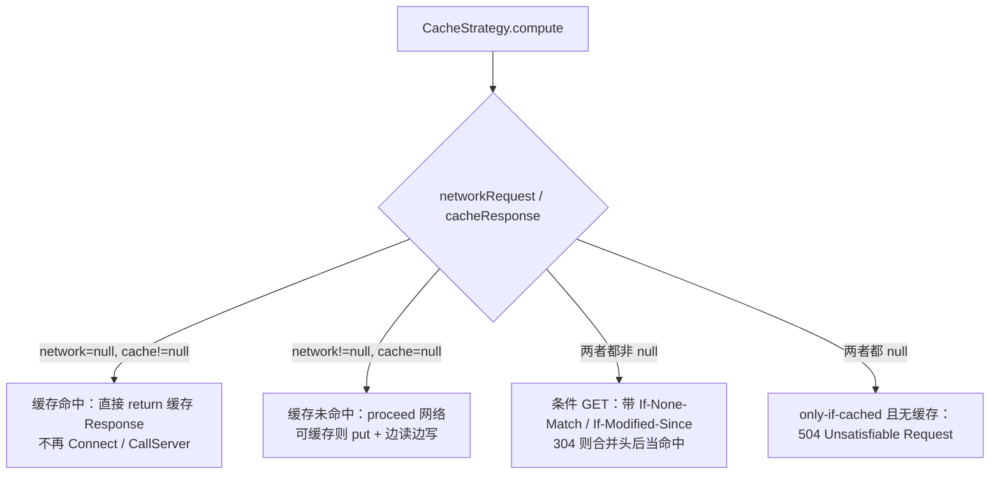
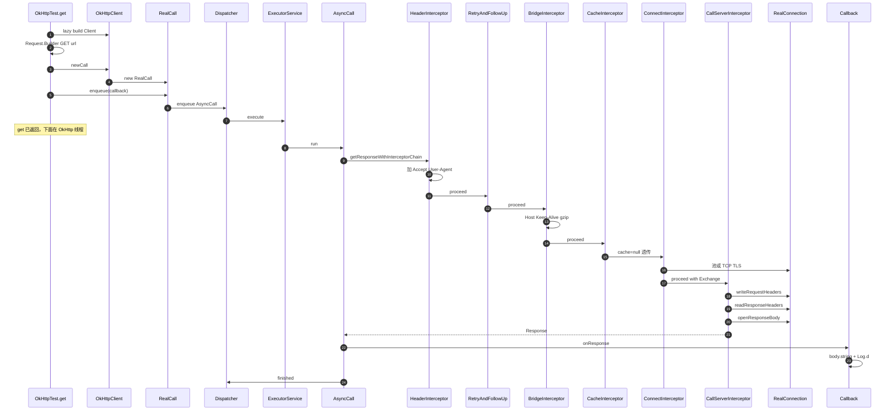

# OkHttp 源码：从 `newCall` 到输出结果

记录时间：2026-08-30  
项目版本：OkHttp 4.9.1（`com.squareup.okhttp3:okhttp`）  
示例代码（主线）：

- `app/src/main/java/com/haha/main/retrofit/OkHttpTest.kt` 的 `get()` / `post()`（共享 Client +
  `enqueue`）
- 入口：`TestLearnUtils.test()` → `okHttpTest.test()`

对照示例（同步 / 反例）：

- `app/src/main/java/com/haha/volume/media/CacheFile.kt` 的 `downloadFile()`（`execute()`）
- `app/src/main/java/com/haha/main/retrofit/RetrofitTest.kt` 的 `okHttpTest()` / `get()` / `post()`

配套时序图（PNG / SVG / mermaid 源文件）：

| 图                                | 对应章节 | PNG                                                   | SVG                                                   | 源文件                                                   |
|----------------------------------|------|-------------------------------------------------------|-------------------------------------------------------|-------------------------------------------------------|
| `OkHttpTest.get()` `enqueue` 全链路 | §9   | [png](assets/okhttp-enqueue-interceptor-sequence.png) | [svg](assets/okhttp-enqueue-interceptor-sequence.svg) | [mmd](assets/okhttp-enqueue-interceptor-sequence.mmd) |
| `enqueue()` + Dispatcher         | §5   | [png](assets/okhttp-enqueue-dispatcher-sequence.png)  | [svg](assets/okhttp-enqueue-dispatcher-sequence.svg)  | [mmd](assets/okhttp-enqueue-dispatcher-sequence.mmd)  |
| `CacheFile.execute()` 同步全链路      | §10  | [png](assets/okhttp-execute-interceptor-sequence.png) | [svg](assets/okhttp-execute-interceptor-sequence.svg) | [mmd](assets/okhttp-execute-interceptor-sequence.mmd) |
| CacheInterceptor 命中策略            | §7.4 | [png](assets/okhttp-cache-strategy-sequence.png)      | [svg](assets/okhttp-cache-strategy-sequence.svg)      | [mmd](assets/okhttp-cache-strategy-sequence.mmd)      |

本文从 **使用步骤 → 源码链路 → 流程图** 三个维度，以 `OkHttpTest` 为主，把 OkHttp 从调用到 `Log.d` 输出
body 的过程拆开。GET / POST 共用同一条链，差别只在 Request 有没有 body。

---

## 1. 先给结论

OkHttp 本质是 **责任链（拦截器洋葱模型）+ Dispatcher 线程调度 + ConnectionPool 连接复用**。

- **组装阶段**：`OkHttpClient` / `Request` / `newCall()` 只是 **new 对象**，不发网。
- **触发阶段**：`execute()` / `enqueue()` 才真正跑，入口都是
  `RealCall.getResponseWithInterceptorChain()`。
- **请求向下、响应向上**：每个拦截器 `chain.proceed(request)` 进下一层，拿到 `Response` 再往回走。

口诀：**Client 是工厂，Call 是一次请求，拦截器链才真正干活；`enqueue` 只是把干活丢给 Dispatcher。**

三份示例走同一条源码路，差别在 Client 配置和触发方式：

|        | `OkHttpTest`（主线）                            | `CacheFile.downloadFile()` | `RetrofitTest.okHttpTest()`                 |
|--------|---------------------------------------------|----------------------------|---------------------------------------------|
| Client | `by lazy` 共享一份；超时 10s + Header 拦截器          | 每次 `OkHttpClient()` 全默认    | `Builder`：Dispatcher 65 + HTTP Cache + Auth |
| 触发     | **`enqueue` 异步**                            | `execute()` 同步             | `execute()`；`post()` 又 `enqueue`（会崩）        |
| Cache  | `null`，拦截器透传                                | 自己扫本地文件，不是 HTTP Cache      | `okhttp3.Cache` 10MB                        |
| 读结果    | `response.use { body?.string() }` 后 `Log.d` | `body?.bytes()`            | `Log.d("$body")`（没读内容）                      |

`app/build.gradle` 同时声明了 `okhttp:4.9.1` 和 `okhttp:3.1.2`，Gradle 解析后实际用的是 **4.9.1**
。4.9.1 里 `RealCall` 在 `okhttp3.internal.connection` 包。

---

## 2. 对照 `OkHttpTest` 业务代码

入口：

```kotlin
// TestLearnUtils.test()
okHttpTest.test()

// OkHttpTest.test()
get("https://api.github.com/users/octocat")
post("https://httpbin.org/post")
```

两次都是 **`enqueue` 异步**，立刻返回，真正发网在 OkHttp 线程。下面先把 GET 走完，再补 POST 多出来的几步。

### 2.1 共享 Client

```kotlin
// app/src/main/java/com/haha/main/retrofit/OkHttpTest.kt
private val client: OkHttpClient by lazy {
    OkHttpClient.Builder()
        .connectTimeout(10, TimeUnit.SECONDS)
        .readTimeout(10, TimeUnit.SECONDS)
        .writeTimeout(10, TimeUnit.SECONDS)
        .addInterceptor { chain ->
            val request = chain.request().newBuilder()
                .header("Accept", "application/json")
                .header("User-Agent", "HahaLearn")
                .build()
            chain.proceed(request)
        }
        .build()
}
```

`by lazy` 保证 `get()` / `post()` 共用 **一个** Client，连接池、线程池才能复用。

### 2.2 GET

```kotlin
val request = Request.Builder()
    .url(url)
    .get()
    .build()
client.newCall(request).enqueue(object : Callback {
    override fun onFailure(call: Call, e: IOException) {
        Log.e(TAG, "get onFailure: ${e.message}")
    }
    override fun onResponse(call: Call, response: Response) {
        response.use {
            val body = it.body?.string()
            if (!it.isSuccessful) {
                Log.e(TAG, "get http ${it.code}, body=$body")
                return
            }
            Log.d(TAG, "get result: $body")
        }
    }
})
```

### 2.3 POST

```kotlin
val requestBody = FormBody.Builder()
    .add("city", "长沙")
    .add("name", "haha")
    .build()
val request = Request.Builder()
    .url(url)
    .post(requestBody)
    .build()
client.newCall(request).enqueue(/* 同样 Callback，Log 前缀 post */)
```

### 2.4 对照：`CacheFile` / `RetrofitTest`

`CacheFile` 是 **GET + 同步 `execute()` + `body.bytes()`**；每次 `new OkHttpClient()`。本地扫文件和
OkHttp 无关。

`RetrofitTest.okHttpTest()` 配了 Dispatcher / HTTP Cache / Authorization，但 `get()` 用 `execute()`
且只 `Log.d(body)`；`post()` 对同一 Call 先 `execute()` 再 `enqueue()`，第二次抛 `Already Executed`
。正式写法以 `OkHttpTest` 为准。

---

## 3. 核心角色（OkHttp 4.9.1）

| 角色   | 类                            | 职责                                         |
|------|------------------------------|--------------------------------------------|
| 客户端  | `OkHttpClient`               | Call 工厂；持有 Dispatcher、连接池、拦截器、Cache        |
| 请求   | `Request`                    | 不可变：url / method / headers / body          |
| 调用   | `RealCall` implements `Call` | 一次请求的执行句柄；`execute` / `enqueue` / `cancel` |
| 调度   | `Dispatcher`                 | 同步记账；异步排队并丢给线程池                            |
| 异步任务 | `RealCall.AsyncCall`         | `Runnable`，在 OkHttp 线程跑拦截器链                |
| 链    | `RealInterceptorChain`       | `proceed()` 把请求交给下一个拦截器                    |
| 连接查找 | `ExchangeFinder`             | 复用当前连接 → 池 → DNS/TCP/TLS 建新连接              |
| 连接   | `RealConnection`             | 一条 TCP/TLS socket，可被池化                     |
| 一次交换 | `Exchange`                   | 这次请求/响应对应的 codec（HTTP/1 或 HTTP/2 stream）   |
| 响应   | `Response` + `ResponseBody`  | 状态码、头、body 流；body **必须关闭且只能读一次**           |

两个 `proceed` 不是一回事：

| 调用                                                     | 谁                       | 含义             |
|--------------------------------------------------------|-------------------------|----------------|
| `chain.proceed(request)`                               | 你或内置拦截器                 | 把请求交给链上下一个拦截器  |
| `exchange.writeRequestHeaders` / `readResponseHeaders` | `CallServerInterceptor` | 真正往 socket 写/读 |

---

## 4. 第 1 步：组装（不发网）

### 4.1 `OkHttpClient.Builder().build()`

`OkHttpClient()` 内部就是 `Builder().build()`。Builder 默认值（4.9.1）对照 `OkHttpTest`：

| 配置                         | 默认                                      | `OkHttpTest`        | `CacheFile` | `RetrofitTest.okHttpTest` |
|----------------------------|-----------------------------------------|---------------------|-------------|---------------------------|
| `dispatcher`               | `maxRequests=64`，`maxRequestsPerHost=5` | 默认                  | 默认（且每次 new） | 改成 65                     |
| `connectionPool`           | 最多 5 条空闲，keep-alive 5 分钟                | 默认                  | 每次新建空池      | 默认                        |
| `interceptors`             | 空                                       | Accept + User-Agent | 无           | Authorization             |
| `networkInterceptors`      | 空                                       | 未加                  | 未加          | 未加                        |
| `cache`                    | `null`                                  | `null`（透传）          | `null`      | 10MB DiskLruCache         |
| 超时                         | connect/read/write 各 10s                | **显式写成 10s**        | 默认 10s      | 默认 10s                    |
| `retryOnConnectionFailure` | `true`                                  | 未改                  | 未改          | 未改                        |
| `followRedirects`          | `true`，最多 20 次                          | 未改                  | 未改          | 未改                        |

源码：`OkHttpClient.newCall()` 直接 new `RealCall`：

```kotlin
// okhttp3/OkHttpClient.kt
override fun newCall(request: Request): Call =
    RealCall(this, request, forWebSocket = false)
```

官方注释：**OkHttpClient 应该共享**。`OkHttpTest` 的 `by lazy` 做对了；`CacheFile` 每次 `new`
会浪费连接池和线程池。

### 4.2 `Request.Builder`

GET：`.url(url)` 解析成 `HttpUrl`；`.get()` 把 method 设为 `"GET"`、body 为 null。

POST：`FormBody` 的 Content-Type 是 `application/x-www-form-urlencoded`，内容是 `city=长沙&name=haha`
（已 URL 编码）。真正写 `Content-Type` / `Content-Length` 的是后面的 `BridgeInterceptor`，不是 Builder。

### 4.3 `newCall` → `RealCall`

```kotlin
class RealCall(
    val client: OkHttpClient,
    val originalRequest: Request,   // 应用层原始请求，重定向也不会改这个字段
    val forWebSocket: Boolean
) : Call
```

构造时还会拿到 `RealConnectionPool`、`EventListener`、`AsyncTimeout`。此时 **还没有进 Dispatcher，也没有连
socket**。



---

## 5. 第 2 步：`enqueue()` 异步触发（`OkHttpTest` 主线）

```kotlin
client.newCall(request).enqueue(object : Callback { ... })
```

```kotlin
// RealCall.kt
override fun enqueue(responseCallback: Callback) {
    check(executed.compareAndSet(false, true)) { "Already Executed" }
    callStart()
    client.dispatcher.enqueue(AsyncCall(responseCallback))
}
```

逐步：

1. **`executed` CAS**：这个 Call 只能执行一次。所以 `RetrofitTest.post()` 先 `execute()` 再
   `enqueue()` 第二次必崩。
2. **`callStart()`**：记 stacktrace（查 body 泄漏）、发 `eventListener.callStart`。
3. **`AsyncCall(callback)`**：内部 `Runnable`，包着 `onResponse` / `onFailure`。
4. **`Dispatcher.enqueue`**：

```kotlin
internal fun enqueue(call: AsyncCall) {
    synchronized(this) {
        readyAsyncCalls.add(call)
        // 同 host 的 in-flight 请求共享 AtomicInteger，用来限 maxRequestsPerHost
    }
    promoteAndExecute()
}

private fun promoteAndExecute(): Boolean {
    while (readyAsyncCalls 还有) {
        if (runningAsyncCalls.size >= maxRequests) break
        if (这台 host 已达 maxRequestsPerHost) continue
        移到 runningAsyncCalls
    }
    for (asyncCall in executableCalls) {
        asyncCall.executeOn(executorService)
    }
}
```

线程池默认：

```text
ThreadPoolExecutor(0, Integer.MAX_VALUE, 60s, SynchronousQueue, "OkHttp Dispatcher")
```

有任务就立刻 new 线程，空闲 60 秒回收。真正并发上限是 `maxRequests` / `maxRequestsPerHost`，不是线程池本身。

**到这里，调用 `get()` / `post()` 的线程已经返回了。** `test()` 里两次 enqueue 几乎同时提交；不同
host，互不影响 `maxRequestsPerHost`，会开两条 OkHttp 线程并行跑。

`AsyncCall.run()`：

```kotlin
override fun run() {
    threadName("OkHttp ${redactedUrl()}") {
        timeout.enter()
        try {
            val response = getResponseWithInterceptorChain()
            responseCallback.onResponse(this@RealCall, response)
        } catch (e: IOException) {
            responseCallback.onFailure(this@RealCall, e)
        } finally {
            client.dispatcher.finished(this)
        }
    }
}
```

GET 和 POST 都进 **同一个** `getResponseWithInterceptorChain()`。失败（DNS、超时、取消）走 `onFailure` →
`Log.e("get/post onFailure: ...")`。

`onResponse` 跑在 **OkHttp 线程**，不是主线程。Retrofit 的 `Call.enqueue` 才会再 `callbackExecutor`
切回主线程。

[SVG](assets/okhttp-enqueue-dispatcher-sequence.svg) · [mermaid 源文件](assets/okhttp-enqueue-dispatcher-sequence.mmd)



---

## 6. 对照：`execute()` 同步（`CacheFile`）

同步不走线程池，当前线程直接跑同一条拦截器链：

```kotlin
override fun execute(): Response {
    check(executed.compareAndSet(false, true)) { "Already Executed" }
    timeout.enter()
    callStart()
    try {
        client.dispatcher.executed(this)
        return getResponseWithInterceptorChain()
    } finally {
        client.dispatcher.finished(this)
    }
}
```

`dispatcher.executed(this)` 只把 Call 放进 `runningSyncCalls` 记账。主线程调 `execute()` 会
NetworkOnMainThread。时序图见 §10。

`execute` vs `enqueue`：



---

## 7. 拦截器逐层（对照 `OkHttpTest.get()`）

`getResponseWithInterceptorChain()` 是整条链路的心脏：

```kotlin
internal fun getResponseWithInterceptorChain(): Response {
    val interceptors = mutableListOf<Interceptor>()
    interceptors += client.interceptors                 // ① 应用拦截器
    interceptors += RetryAndFollowUpInterceptor(client) // ② 失败重试 / 重定向
    interceptors += BridgeInterceptor(client.cookieJar) // ③ 补 HTTP 头、gzip
    interceptors += CacheInterceptor(client.cache)      // ④ HTTP 缓存
    interceptors += ConnectInterceptor                  // ⑤ 找/建连接
    if (!forWebSocket) {
        interceptors += client.networkInterceptors      // ⑥ 网络拦截器
    }
    interceptors += CallServerInterceptor(forWebSocket) // ⑦ 真正写 socket

    val chain = RealInterceptorChain(
        call = this, interceptors, index = 0,
        exchange = null,
        request = originalRequest,
        connectTimeoutMillis = client.connectTimeoutMillis,  // OkHttpTest = 10_000
        readTimeoutMillis = client.readTimeoutMillis,
        writeTimeoutMillis = client.writeTimeoutMillis
    )
    return chain.proceed(originalRequest)
}
```

对照三条链：

```text
OkHttpTest:
  HeaderInterceptor → RetryAndFollowUp → Bridge → Cache(null) → Connect → CallServer

CacheFile（默认 Client）:
  RetryAndFollowUp → Bridge → Cache(null) → Connect → CallServer

RetrofitTest.okHttpTest:
  AuthInterceptor → RetryAndFollowUp → Bridge → Cache(10MB) → Connect → CallServer
```

`RealInterceptorChain.proceed()` 每次只做一件事：把 **下一个** 拦截器的 `intercept` 调起来：

```kotlin
override fun proceed(request: Request): Response {
    val next = copy(index = index + 1, request = request)
    val interceptor = interceptors[index]
    return interceptor.intercept(next)
}
```

所以 `OkHttpTest` 里写的 `chain.proceed(request)`，就是调用 RetryAndFollowUp 的 `intercept`
。这是标准责任链，不是递归同一层。

洋葱模型（请求向内，响应向外）：



返回时沿原路往回：CallServer 组好 `Response`（body 还是流）→ Connect → Cache → Bridge（可能 gzip 解压）→
Retry（可能跟重定向再来一轮）→ Header 拦截器 → `AsyncCall` 调 `onResponse`。

### 7.1 ① 应用拦截器：加 `Accept` / `User-Agent`

```kotlin
.addInterceptor { chain ->
    val request = chain.request().newBuilder()
        .header("Accept", "application/json")
        .header("User-Agent", "HahaLearn")
        .build()
    chain.proceed(request)
}
```

特点（和 networkInterceptor 的差别）：

- 在连接之前跑，可以改 URL、短接返回、重试多次 `proceed`。
- **看不到** 内部重定向的中间请求；RetryAndFollowUp 消化完才把最终 Response 交回来。
- `chain.connection()` 此时是 `null`。

### 7.2 ② `RetryAndFollowUpInterceptor`

这是一个 `while (true)` 循环：

1. `call.enterNetworkInterceptorExchange(request, newExchangeFinder)`  
   准备 `ExchangeFinder`（地址、连接池、DNS 路由）。
2. `realChain.proceed(request)` 进下一层。
3. 若抛 `RouteException` / `IOException`：判断能不能换一条路由重试（`retryOnConnectionFailure`、body 是否
   one-shot、是否还有路由）。
4. 若拿到 Response：看状态码要不要 follow-up：
    - 401 → `authenticator`
    - 407 → `proxyAuthenticator`
    - 300/301/302/303/307/308 → 跟 `Location`，最多 **20** 次
    - 408 / 503 → 有条件重试
5. 没有 follow-up 就 `return response`。

GitHub `/users/octocat` 一般不重定向，走一遍就返回。所以一次用户眼里的 `enqueue()`，内部仍可能多次走
Bridge → Cache → Connect → CallServer。

### 7.3 ③ `BridgeInterceptor`：应用请求 ↔ 网络请求

往请求上补浏览器也会带的头：

| 条件                           | 写入                          | `OkHttpTest` GET        | `OkHttpTest` POST                   |
|------------------------------|-----------------------------|-------------------------|-------------------------------------|
| 有 body 且有 contentType        | `Content-Type`              | 无                       | `application/x-www-form-urlencoded` |
| body.length >= 0             | `Content-Length`；否则 chunked | 无                       | 写出表单字节长度                            |
| 没有 Host                      | `Host`                      | `api.github.com`        | `httpbin.org`                       |
| 没有 Connection                | `Connection: Keep-Alive`    | 补                       | 补                                   |
| 没有 Accept-Encoding 且没有 Range | `Accept-Encoding: gzip`     | 补（记下 transparentGzip）   | 补                                   |
| CookieJar 有 cookie           | `Cookie`                    | 默认 NONE，不加              | 不加                                  |
| 没有 User-Agent                | OkHttp 默认 UA                | **已有 `HahaLearn`，不再覆盖** | 同左                                  |

然后 `chain.proceed(requestBuilder.build())`。

响应回来后：

- `cookieJar.receiveHeaders` 存 cookie
- 若开了透明 gzip，且响应是 `Content-Encoding: gzip`，用 `GzipSource` 包一层，并去掉
  `Content-Encoding` / `Content-Length`

所以 `body.string()` 拿到的已经是解压后的 JSON，不是网上的原始 gzip 流。

### 7.4 ④ `CacheInterceptor`：HTTP 缓存

`OkHttpTest` / `CacheFile` 的 `client.cache == null`：`cache?.get()` 得到
null，策略永远是「只走网络、不写盘」，这一层几乎是透传。

`RetrofitTest.okHttpTest` 配了 `Cache(file, 10MB)`，基于 DiskLruCache，按 RFC 7234：

```kotlin
val cacheCandidate = cache?.get(chain.request())
val strategy = CacheStrategy.Factory(now, request, cacheCandidate).compute()
val networkRequest = strategy.networkRequest
val cacheResponse = strategy.cacheResponse
```

四种结果：



可缓存条件（简化）：GET/HEAD、响应有 `Expires` / `Cache-Control: max-age` 等、没有 `no-store`。

**这和 `CacheFile` 自己的文件缓存不是一回事：**

|    | `CacheFile` 本地文件        | `okhttp3.Cache`  |
|----|-------------------------|------------------|
| 键  | 文件名（歌手-歌名.mp3）          | URL 的 md5        |
| 语义 | 「磁盘上有这个文件就当命中」          | 遵守 HTTP 新鲜度 / 校验 |
| 谁读 | 业务自己 `file.readBytes()` | 拦截器在发网前决定        |

命中缓存时，`ConnectInterceptor` 和 `CallServerInterceptor` **根本不会执行**。

### 7.5 ⑤ `ConnectInterceptor`：拿到一条可用连接

整个类就几行：

```kotlin
object ConnectInterceptor : Interceptor {
    override fun intercept(chain: Interceptor.Chain): Response {
        val realChain = chain as RealInterceptorChain
        val exchange = realChain.call.initExchange(chain)
        val connectedChain = realChain.copy(exchange = exchange)
        return connectedChain.proceed(realChain.request)
    }
}
```

`initExchange` → `ExchangeFinder.find()` → `RealConnection.newCodec()`。

`ExchangeFinder.findConnection()` 的优先级：

1. **当前 Call 已持有的连接**（重定向 follow-up 常走这里）
2. **连接池** `RealConnectionPool.callAcquirePooledConnection`（同 Address 可复用）
3. **RouteSelector**：DNS（默认 `InetAddress.getAllByName`）+ 代理，得到一组 `Route`
4. DNS 之后再查一次池（HTTP/2 coalescing 可能已经有人连上了）
5. **`RealConnection.connect()`**：TCP → TLS（https）→ ALPN 选 HTTP/2 或 HTTP/1.1
6. 放入连接池，`call.acquireConnectionNoEvents`

默认池：最多 5 条空闲，空闲超过 5 分钟回收。`OkHttpTest` 共享 Client，第二次再 GET 同 host 多半在第 2
步命中池。`CacheFile` 每次 new Client，等于每次新建空池。

### 7.6 ⑥ 网络拦截器

`OkHttpTest` 没有 `addNetworkInterceptor`。若有，它们在 **已经连上、即将写 socket** 时执行，能看到最终
URL、连接对象，且必须 `proceed` 恰好一次。

### 7.7 ⑦ `CallServerInterceptor`：真正的网络 IO

最后一环，不再 `proceed`。

**GET**（无 body）：

1. `exchange.writeRequestHeaders(request)` — 写 `GET /users/octocat HTTP/1.1` + 头
2. `exchange.noRequestBody()` + `finishRequest()`
3. `readResponseHeaders()` — 读 `200 OK` 和响应头
4. `openResponseBody(response)` — **只打开流，内容还在 socket 上**
5. `return response`

**POST** 在第 2 步改为：`requestBody.writeTo(bufferedRequestBody)`，FormBody 在这里写出
`city=...&name=...`。若有 `Expect: 100-continue`，先 flush 再等 100。

若请求或响应头有 `Connection: close`，标记这条连接不再复用。

到这里 `AsyncCall.run()` 就可以把 `Response` 交给 `onResponse`。body 仍连着 socket。

---

## 8. 第 3 步：读 body，才是「输出结果」

### 8.1 `OkHttpTest`：`response.use { body?.string() }`

```kotlin
override fun onResponse(call: Call, response: Response) {
    response.use {
        val body = it.body?.string()
        if (!it.isSuccessful) {
            Log.e(TAG, "get http ${it.code}, body=$body")
            return
        }
        Log.d(TAG, "get result: $body")
    }
}
```

逐步：

1. **线程**：仍是 OkHttp Dispatcher 线程，不是主线程。
2. **`response.use { }`**：Kotlin 对 `Closeable` 的 `try-finally close()`。`Response.close()` 就是关
   `body`。
3. **`body.string()`**（OkHttp 4.9.1）：

```kotlin
fun string(): String = source().use { source ->
    source.readString(charset = source.readBomAsCharset(charset()))
}
```

把 socket/gzip 流读干，按 BOM 或 `Content-Type` charset（否则 UTF-8）转成 String，并 close 流。流只能读一次。

4. **`isSuccessful`**：`code in 200..299`。4xx/5xx 仍有 body，走 `Log.e`。
5. **`Log.d("get result: $body")`**：这就是这次调用的输出结果。
6. **`AsyncCall.finally`**：`dispatcher.finished`，从 `runningAsyncCalls` 移除，再 `promoteAndExecute`。

### 8.2 POST 与 GET 只差这几处

| 步骤                    | GET                    | POST                              |
|-----------------------|------------------------|-----------------------------------|
| Request               | method=`GET`，body=null | method=`POST`，body=`FormBody`     |
| FormBody              | —                      | `city=长沙&name=haha`（已 URL 编码）     |
| BridgeInterceptor     | 不写 Content-Length      | 写 `Content-Type`、`Content-Length` |
| CallServerInterceptor | `noRequestBody()`      | `requestBody.writeTo(...)`        |
| 之后                    | 同一条链、同一个 `onResponse`  | Log 前缀是 `post result`             |

`enqueue`、Dispatcher、Retry、Cache、Connect **完全一样**。httpbin 会把表单原样 JSON 回显，所以
`body.string()` 里能看到 `city` / `name`。

### 8.3 对照：`CacheFile.bytes()` / `RetrofitTest` 只打对象

`CacheFile` 的 `body.bytes()` 同样读干并 close，但整个文件进内存；下 mp3 更该流式写盘。

`RetrofitTest.get()` 的 `Log.d("$body")` 打印的是 `ResponseBody.toString()`，*
*没有 `string()` / `bytes()`**，流没读、连接可能一直占着。

### 8.4 响应往回走时各层还做了什么

| 层          | 返回路径上的动作                                                   |
|------------|------------------------------------------------------------|
| CallServer | 带上流式 body 的 Response                                       |
| Connect    | 原样返回（连接已绑在 Exchange 上）                                     |
| Cache      | `OkHttpTest` 透传；若可缓存则边读边写 DiskLruCache                     |
| Bridge     | 透明 gzip 解压                                                 |
| Retry      | 无 follow-up 则返回；有则关掉当前 body，换新 Request 再循环                 |
| Header 拦截器 | 原样返回（没改 response）                                          |
| AsyncCall  | `onResponse`；已 cancel 则 close 并抛 `IOException("Canceled")` |
| Dispatcher | `finished` 再 promote                                       |

---

## 9. 一张图串起来：`OkHttpTest.get()` 全链路

[SVG](assets/okhttp-enqueue-interceptor-sequence.svg) · [mermaid 源文件](assets/okhttp-enqueue-interceptor-sequence.mmd)



---

## 10. 对照图：`CacheFile.execute()` 未命中本地文件

业务先扫 `externalCacheDir/songCache`，没有同名文件才进入 OkHttp。HTTP 部分是同步 `execute()`，拦截器链比
`OkHttpTest` 少最外层 Header 拦截器。

[SVG](assets/okhttp-execute-interceptor-sequence.svg) · [mermaid 源文件](assets/okhttp-execute-interceptor-sequence.mmd)

---

## 11. 和 Retrofit 的衔接

`docs/retrofit/retrofit-usage-guide.md` 讲到 `OkHttpCall.createRawCall()` 之后，底层就是本文这条链：

```text
Retrofit: service.listRepos().enqueue(callback)
    → OkHttpCall.enqueue
        → okhttp3.Call.enqueue          ← 本文 §5
            → getResponseWithInterceptorChain
        → Converter 把 ResponseBody 转成 List<EatGame>
        → 再经 callbackExecutor 切回主线程
```

若要让 Retrofit 走 `OkHttpTest` 那套超时和 Header，应
`Retrofit.Builder().client(同一个 OkHttpClient)`。

---

## 12. 对照小结

| 步骤          | `OkHttpTest` 代码                          | 源码落点                                  | 是否发网     | 线程            |
|-------------|------------------------------------------|---------------------------------------|----------|---------------|
| ① 配 Client  | `Builder()...build()` + `by lazy`        | 不可变 Client + 拦截器列表                    | 否        | 首次访问 lazy 的线程 |
| ② 组 Request | `Request.Builder().get/post().build()`   | 不可变 Request                           | 否        | 调用线程          |
| ③ newCall   | `client.newCall(request)`                | `new RealCall(...)`                   | 否        | 调用线程          |
| ④ 触发        | `call.enqueue(callback)`                 | Dispatcher 排队 + 线程池                   | 否（只提交）   | 调用线程立刻返回      |
| ⑤ 拦截器链      | `AsyncCall.run`                          | Header → 重试 → 桥接 → 缓存 → 连接 → 写 socket | **是**    | OkHttp 线程     |
| ⑥ 读结果       | `onResponse` + `body.string()` + `Log.d` | 把流读成 String 并 close                   | 读剩余 body | OkHttp 线程     |
| 失败          | `onFailure`                              | `run` 里 catch `IOException`           | 发网失败     | OkHttp 线程     |

三句话：

1. **`newCall` 只创建 `RealCall`；`enqueue` 把 `AsyncCall` 丢进 Dispatcher，当前线程立刻返回。**
2. **OkHttp 线程里跑同一条洋葱链：Header → 重试 → 桥接头 → 缓存透传 → 连接 → 写 socket。**
3. **`Response` 交到 `onResponse` 时 body 还是流；`string()` 读完并关闭，`Log.d` 才是这次的输出。**

---

## 13. 这几份示例里值得记下的点

1. **正式用法看 `OkHttpTest`**：共享 Client + `enqueue` + `response.use { body.string() }`。
2. **`CacheFile` 每次 `new OkHttpClient()`**：连接池和线程池都浪费。下载多次应复用同一个 Client。
3. **`CacheFile` 的「缓存」不是 `okhttp3.Cache`**：只是扫本地文件名。
4. **`downloadSongInfo` 下载 mp3 时传入了 `songInfo.lrcUrl`**，不是 `songUrl`。
5. **`RetrofitTest.post()` 对同一 Call 又 `execute` 又 `enqueue`**：第二次必失败。
6. **`RetrofitTest.get()` 没读 body**：只打印对象 `toString()`。
7. **同步 `execute` 不能在主线程**；异步 `onResponse` 也不在主线程。
8. **下载大文件不要 `bytes()` / `string()`**，应对 `body.source()` 流式写入 `FileOutputStream`。
