# Retrofit 使用详解（纯 Call，不含 RxJava）

记录时间：2026-08-28  
项目版本：Retrofit 2.6.1  
示例代码：

- `app/src/main/java/com/haha/main/retrofit/RetrofitTest.kt`
- `app/src/main/java/com/haha/mviFrame/main/RetrofitBuilder.kt`
- `app/src/main/java/com/haha/mviFrame/main/ApiService.kt`

本文从 **使用步骤 → 源码链路 → 流程图** 三个维度，详细讲解 Retrofit 如何将接口注解转为 HTTP 请求并返回数据。
**不涉及 RxJava**，重点在 `Call<T>` + `enqueue` / `execute`。

配套流程图（PNG / SVG / mermaid 源文件）：

| 图                        | 对应章节  | PNG                                                  | SVG                                                  | 源文件                                                  |
|--------------------------|-------|------------------------------------------------------|------------------------------------------------------|------------------------------------------------------|
| 整体架构图                    | §1.1  | [png](assets/retrofit-architecture.png)              | [svg](assets/retrofit-architecture.svg)              | [mmd](assets/retrofit-architecture.mmd)              |
| 五步总览                     | §2.2  | [png](assets/retrofit-five-steps.png)                | [svg](assets/retrofit-five-steps.svg)                | [mmd](assets/retrofit-five-steps.mmd)                |
| Builder 组装流程             | §3.3  | [png](assets/retrofit-builder-assemble.png)          | [svg](assets/retrofit-builder-assemble.svg)          | [mmd](assets/retrofit-builder-assemble.mmd)          |
| 动态代理流程                   | §4.2  | [png](assets/retrofit-dynamic-proxy.png)             | [svg](assets/retrofit-dynamic-proxy.svg)             | [mmd](assets/retrofit-dynamic-proxy.mmd)             |
| 单次方法调用内部流程               | §5.3  | [png](assets/retrofit-method-invoke.png)             | [svg](assets/retrofit-method-invoke.svg)             | [mmd](assets/retrofit-method-invoke.mmd)             |
| enqueue vs execute       | §6.1  | [png](assets/retrofit-enqueue-vs-execute.png)        | [svg](assets/retrofit-enqueue-vs-execute.svg)        | [mmd](assets/retrofit-enqueue-vs-execute.mmd)        |
| enqueue 完整时序             | §7.1  | [png](assets/retrofit-enqueue-sequence.png)          | [svg](assets/retrofit-enqueue-sequence.svg)          | [mmd](assets/retrofit-enqueue-sequence.mmd)          |
| 线程切换                     | §8    | [png](assets/retrofit-thread-switch.png)             | [svg](assets/retrofit-thread-switch.svg)             | [mmd](assets/retrofit-thread-switch.mmd)             |
| OkHttp 拦截器链              | §9    | [png](assets/retrofit-okhttp-interceptor.png)        | [svg](assets/retrofit-okhttp-interceptor.svg)        | [mmd](assets/retrofit-okhttp-interceptor.mmd)        |
| 响应解析流程                   | §10.1 | [png](assets/retrofit-parse-response.png)            | [svg](assets/retrofit-parse-response.svg)            | [mmd](assets/retrofit-parse-response.mmd)            |
| Call 生命周期                | §11   | [png](assets/retrofit-call-lifecycle.png)            | [svg](assets/retrofit-call-lifecycle.svg)            | [mmd](assets/retrofit-call-lifecycle.mmd)            |
| 端到端一图流                   | §13   | [png](assets/retrofit-e2e-flow.png)                  | [svg](assets/retrofit-e2e-flow.svg)                  | [mmd](assets/retrofit-e2e-flow.mmd)                  |
| RequestFactory 两阶段模型     | §19.2 | [png](assets/retrofit-request-factory-two-phase.png) | [svg](assets/retrofit-request-factory-two-phase.svg) | [mmd](assets/retrofit-request-factory-two-phase.mmd) |
| 解析 @GET / @Path / @Query | §19.3 | [png](assets/retrofit-request-factory-parse.png)     | [svg](assets/retrofit-request-factory-parse.svg)     | [mmd](assets/retrofit-request-factory-parse.mmd)     |
| 运行时拼 Request             | §19.4 | [png](assets/retrofit-request-factory-create.png)    | [svg](assets/retrofit-request-factory-create.svg)    | [mmd](assets/retrofit-request-factory-create.mmd)    |
| @Path 替换流程               | §19.5 | [png](assets/retrofit-path-replace.png)              | [svg](assets/retrofit-path-replace.svg)              | [mmd](assets/retrofit-path-replace.mmd)              |
| @Query 拼接流程              | §19.6 | [png](assets/retrofit-query-append.png)              | [svg](assets/retrofit-query-append.svg)              | [mmd](assets/retrofit-query-append.mmd)              |
| 无 @Query 时拼 URL          | §19.7 | [png](assets/retrofit-no-query.png)                  | [svg](assets/retrofit-no-query.svg)                  | [mmd](assets/retrofit-no-query.mmd)                  |
| URL 拼装时序                 | §19.8 | [png](assets/retrofit-url-assemble-sequence.png)     | [svg](assets/retrofit-url-assemble-sequence.svg)     | [mmd](assets/retrofit-url-assemble-sequence.mmd)     |

流程图已渲染为 PNG，放在 `assets/`；Android Studio Markdown 预览可直接看图；图与源文件在 `assets/`，同名
`.mmd`。

---

## 1. Retrofit 是什么

Retrofit 是 Square 出品的 **类型安全 HTTP 客户端**：你定义 interface + 注解，它通过 **动态代理**
生成实现，底层交给 **OkHttp** 发请求，再用 **Converter** 把 JSON 转成对象。

```text
你的 ApiService 接口
        ↓  动态代理 + 注解解析
Retrofit（拼 Request、解析 Response）
        ↓
OkHttp（真正发 HTTP）
        ↓
Converter（Gson/Moshi：JSON ↔ 对象）
        ↓
Call<T> 返回给业务层
```

### 1.1 整体架构图

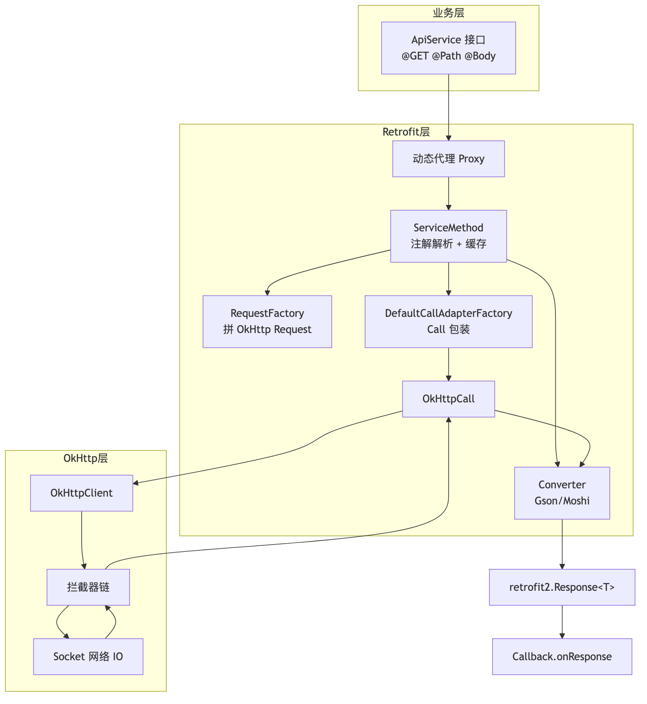

[SVG](assets/retrofit-architecture.svg) · [mermaid 源文件](assets/retrofit-architecture.mmd)

---

## 2. 标准使用流程（5 步）

### 2.1 示例代码

**最简配置（RetrofitBuilder）：**

```kotlin
// app/src/main/java/com/haha/mviFrame/main/RetrofitBuilder.kt
Retrofit.Builder()
    .baseUrl(BASE_URL)
    .addConverterFactory(MoshiConverterFactory.create())
    .build()
```

**完整 Call 异步示例（RetrofitTest）：**

```kotlin
// app/src/main/java/com/haha/main/retrofit/RetrofitTest.kt
val retrofit = Retrofit.Builder()
    .baseUrl("https://api.github.com/")
    .addConverterFactory(GsonConverterFactory.create(Gson()))
    .build()   // 纯 Call 用法不需要 addCallAdapterFactory

val service = retrofit.create(ApiService::class.java)
val call = service.listRepos("octocat")

call.enqueue(object : Callback<List<EatGame>> {
    override fun onResponse(call: Call<List<EatGame>>, response: Response<List<EatGame>>) {
        if (response.isSuccessful) {
            val data = response.body()
        }
    }
    override fun onFailure(call: Call<List<EatGame>>, t: Throwable) {}
})
```

**接口定义：**

```kotlin
interface ApiService {
    @GET("users/{user}/repos")
    fun listRepos(@Path("user") user: String): Call<List<EatGame>>
}
```

### 2.2 五步总览

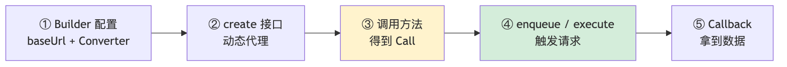

[SVG](assets/retrofit-five-steps.svg) · [mermaid 源文件](assets/retrofit-five-steps.mmd)

| 步骤     | 代码                            | 是否发网  |
|--------|-------------------------------|-------|
| ① 配置   | `Retrofit.Builder().build()`  | 否     |
| ② 创建代理 | `retrofit.create(ApiService)` | 否     |
| ③ 调方法  | `service.listRepos(...)`      | 否     |
| ④ 发请求  | `call.enqueue(callback)`      | **是** |
| ⑤ 回调   | `onResponse(body)`            | 是     |

---

## 3. 第 1 步：Retrofit.Builder 配置

### 3.1 常用配置项

| 配置项                    | 作用                                        |
|------------------------|-------------------------------------------|
| `baseUrl`              | 所有接口 URL 的前缀，**必填**，必须以 `/` 结尾            |
| `client(OkHttpClient)` | 自定义超时、拦截器、缓存等                             |
| `addConverterFactory`  | 响应 JSON → 对象，请求对象 → JSON                  |
| `callbackExecutor`     | 可选，`Call.enqueue` 回调切到指定线程（Android 默认主线程） |

纯 `Call` 用法 **不需要** `addCallAdapterFactory`，`build()` 会自动添加 `DefaultCallAdapterFactory`。

### 3.2 `build()` 源码做了什么

```java
public Retrofit build() {
    if (baseUrl == null) throw new IllegalStateException("Base URL required.");

    // 没配 client 就 new OkHttpClient()
    if (callFactory == null) callFactory = new OkHttpClient();

    // Android 默认主线程 Executor
    if (callbackExecutor == null) callbackExecutor = platform.defaultCallbackExecutor();

    // CallAdapter 列表 = 用户添加的 + 默认 DefaultCallAdapterFactory
    callAdapterFactories.addAll(platform.defaultCallAdapterFactories(callbackExecutor));

    // Converter 列表 = BuiltInConverters + 用户 Gson/Moshi + 平台默认
    converterFactories.add(new BuiltInConverters());
    converterFactories.addAll(this.converterFactories);
}
```

### 3.3 Builder 组装流程图

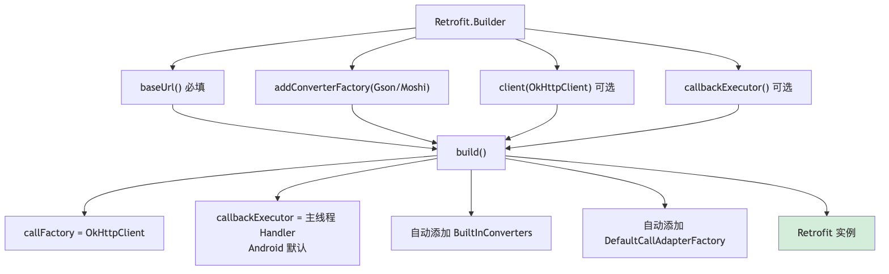

[SVG](assets/retrofit-builder-assemble.svg) · [mermaid 源文件](assets/retrofit-builder-assemble.mmd)

### 3.4 baseUrl 规则

- **必须以 `/` 结尾**，否则抛 `IllegalArgumentException`
- endpoint 以 `/` 开头 → 绝对路径，忽略 base 的 path
- endpoint 是完整 URL → 替换 host/scheme

```text
✅ baseUrl: https://api.github.com/  +  @GET("users/{id}")  →  .../users/{id}
❌ baseUrl: https://api.github.com   （缺少尾部 /）
```

---

## 4. 第 2 步：`create()` 动态代理

```kotlin
val service = retrofit.create(ApiService::class.java)
```

### 4.1 源码

```java
public <T> T create(final Class<T> service) {
    Utils.validateServiceInterface(service);  // 必须是 interface
    return (T) Proxy.newProxyInstance(service.getClassLoader(),
            new Class<?>[]{service},
            new InvocationHandler() {
                public Object invoke(Object proxy, Method method, Object[] args) {
                    if (method.getDeclaringClass() == Object.class) {
                        return method.invoke(this, args);  // toString/equals
                    }
                    return loadServiceMethod(method).invoke(args);  // 核心
                }
            });
}
```

### 4.2 动态代理流程图

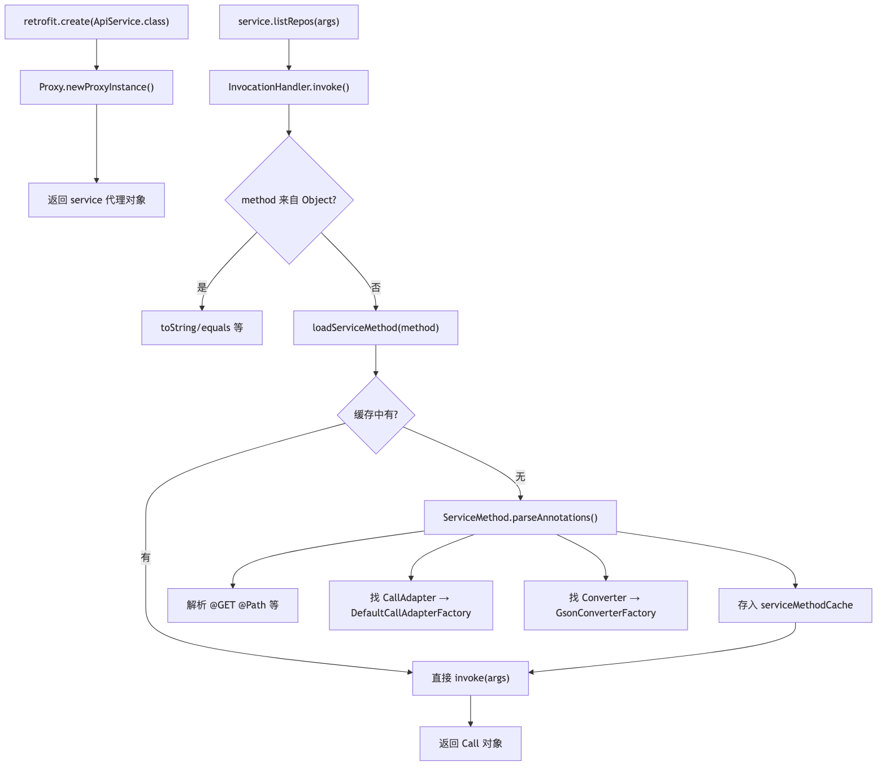

[SVG](assets/retrofit-dynamic-proxy.svg) · [mermaid 源文件](assets/retrofit-dynamic-proxy.mmd)

### 4.3 方法解析缓存

```java
ServiceMethod<?> loadServiceMethod(Method method) {
    ServiceMethod<?> result = serviceMethodCache.get(method);
    if (result != null) return result;  // 命中缓存

    synchronized (serviceMethodCache) {
        result = ServiceMethod.parseAnnotations(this, method);
        serviceMethodCache.put(method, result);
    }
    return result;
}
```

**第一次**调用某方法会做反射解析（稍慢），之后走 `ConcurrentHashMap` 缓存。

解析时会做三件事：

1. `RequestFactory.parseAnnotations()` → 读 `@GET`/`@Path`，生成「如何拼 Request」
2. `retrofit.callAdapter(returnType)` → `DefaultCallAdapterFactory` 处理 `Call<T>`
3. `retrofit.responseBodyConverter()` → Gson/Moshi 创建 Converter

---

## 5. 第 3 步：调用接口方法 —— 得到 Call，尚未发网

```kotlin
val call = service.listRepos("octocat")
```

### 5.1 源码：`HttpServiceMethod.invoke`

```java
ReturnT invoke(Object[] args) {
    // 1. 创建 OkHttpCall（注意：还没 execute/enqueue）
    Call<ResponseT> call = new OkHttpCall<>(requestFactory, args, callFactory, responseConverter);
    // 2. CallAdapter 包装（Android 上会包成 ExecutorCallbackCall）
    return adapt(call, args);
}
```

### 5.2 `DefaultCallAdapterFactory.adapt`

```java
public Call<Object> adapt(Call<Object> call) {
    return executor == null
            ? call                              // 原始 OkHttpCall
            : new ExecutorCallbackCall<>(executor, call);  // enqueue 回调切主线程
}
```

实际对象结构：

```text
ExecutorCallbackCall          ← enqueue 时把 Callback post 到主线程
    └── delegate: OkHttpCall    ← 真正干活的
```

### 5.3 单次方法调用内部流程

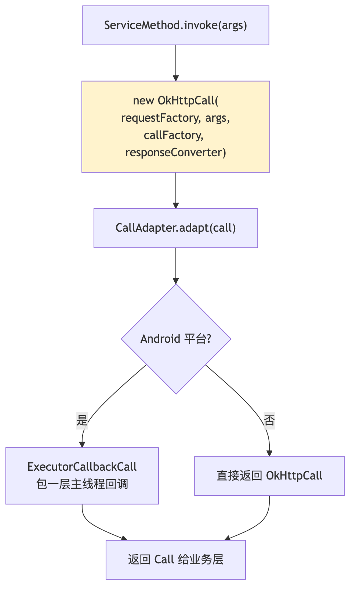

[SVG](assets/retrofit-method-invoke.svg) · [mermaid 源文件](assets/retrofit-method-invoke.mmd)

> ⚠️ 此阶段仅创建 Call，未 execute / enqueue，**没有网络请求**。

---

## 6. 第 4 步：执行请求 —— `enqueue` 或 `execute`

| 方式                       | 特点              | 适用         |
|--------------------------|-----------------|------------|
| `call.enqueue(Callback)` | 异步，OkHttp 线程池发网 | Android 常用 |
| `call.execute()`         | 同步阻塞当前线程        | 后台线程 / 测试  |

### 6.1 `enqueue` vs `execute` 对比

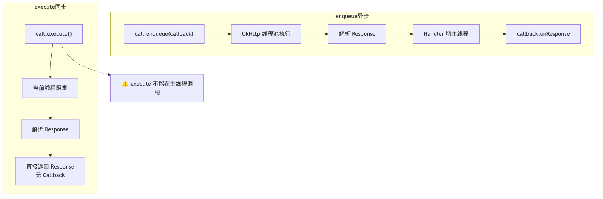

[SVG](assets/retrofit-enqueue-vs-execute.svg) · [mermaid 源文件](assets/retrofit-enqueue-vs-execute.mmd)

---

## 7. `enqueue` 完整源码链路

### 7.1 时序图

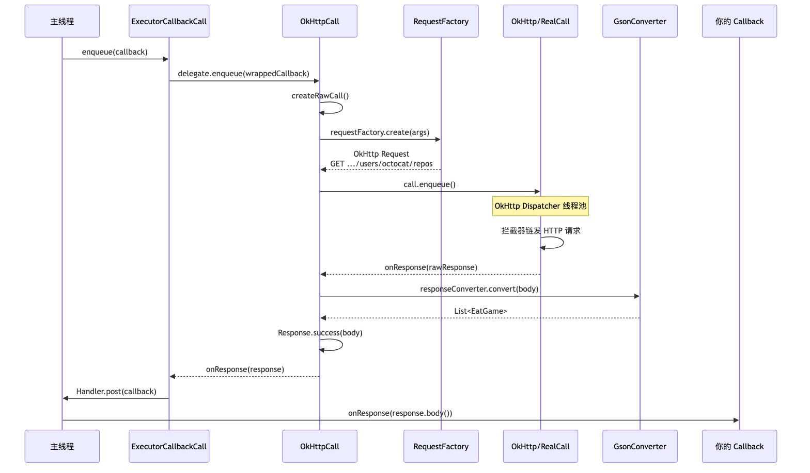

[SVG](assets/retrofit-enqueue-sequence.svg) · [mermaid 源文件](assets/retrofit-enqueue-sequence.mmd)

### 7.2 ExecutorCallbackCall.enqueue（外层）

```java
public void enqueue(final Callback<T> callback) {
    delegate.enqueue(new Callback<T>() {
        public void onResponse(Call<T> call, final Response<T> response) {
            callbackExecutor.execute(() -> {
                callback.onResponse(ExecutorCallbackCall.this, response);  // Handler → 主线程
            });
        }

        public void onFailure(Call<T> call, final Throwable t) {
            callbackExecutor.execute(() -> {
                callback.onFailure(ExecutorCallbackCall.this, t);
            });
        }
    });
}
```

### 7.3 OkHttpCall.enqueue（内层）

```java
public void enqueue(final Callback<T> callback) {
    synchronized (this) {
        if (executed) throw new IllegalStateException("Already executed.");
        executed = true;
        call = rawCall = createRawCall();  // 第一次才真正拼 Request
    }
    call.enqueue(new okhttp3.Callback() {
        public void onResponse(okhttp3.Call call, okhttp3.Response rawResponse) {
            Response<T> response = parseResponse(rawResponse);  // Gson 解析
            callback.onResponse(OkHttpCall.this, response);
        }

        public void onFailure(okhttp3.Call call, IOException e) {
            callback.onFailure(OkHttpCall.this, e);
        }
    });
}
```

### 7.4 createRawCall —— 拼 OkHttp Request

```java
private okhttp3.Call createRawCall() throws IOException {
    okhttp3.Call call = callFactory.newCall(requestFactory.create(args));
    return call;
}
```

---

## 8. 线程切换

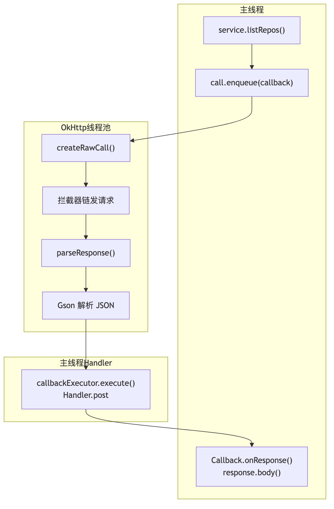

[SVG](assets/retrofit-thread-switch.svg) · [mermaid 源文件](assets/retrofit-thread-switch.mmd)

| 阶段                         | 线程                                |
|----------------------------|-----------------------------------|
| 调用接口、`enqueue`             | 主线程（通常）                           |
| 拼 Request、发 HTTP、Gson 解析   | OkHttp Dispatcher 线程              |
| `onResponse` / `onFailure` | Android 默认主线程（`callbackExecutor`） |

---

## 9. OkHttp 拦截器链

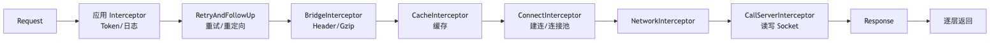

[SVG](assets/retrofit-okhttp-interceptor.svg) · [mermaid 源文件](assets/retrofit-okhttp-interceptor.mmd)

Retrofit 不实现网络 IO，最终都交给 OkHttp 这条链。正式示例见 `OkHttpTest.kt`（共享 Client +
`enqueue`）；拦截器链源码见 `docs/okhttp/okhttp-call-to-response.md`。

---

## 10. 响应解析（`parseResponse`）

```java
Response<T> parseResponse(okhttp3.Response rawResponse) throws IOException {
    int code = rawResponse.code();
    if (code < 200 || code >= 300) {
        return Response.error(bufferedBody, rawResponse);  // 4xx/5xx
    }
    T body = responseConverter.convert(catchingBody);      // Gson 解析
    return Response.success(body, rawResponse);            // 2xx
}
```

Gson Converter：

```java
public T convert(ResponseBody value) throws IOException {
    JsonReader jsonReader = gson.newJsonReader(value.charStream());
    T result = adapter.read(jsonReader);  // List<EatGame>
    value.close();
    return result;
}
```

### 10.1 响应解析流程图

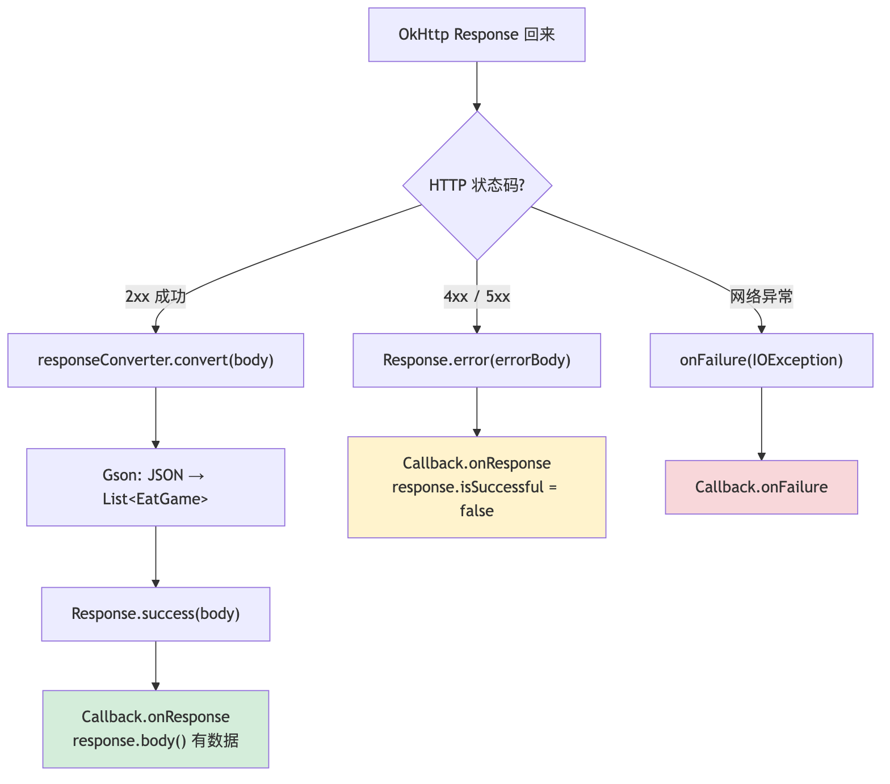

[SVG](assets/retrofit-parse-response.svg) · [mermaid 源文件](assets/retrofit-parse-response.mmd)

### 10.2 错误处理

| 类型      | 触发条件         | `enqueue` 走哪个回调                                 |
|---------|--------------|-------------------------------------------------|
| 网络错误    | 断网、超时、DNS 失败 | `onFailure(Throwable)`                          |
| HTTP 错误 | 404、500 等    | `onResponse`，但 `response.isSuccessful == false` |

```kotlin
override fun onResponse(call: Call<List<EatGame>>, response: Response<List<EatGame>>) {
    if (response.isSuccessful) {
        val data = response.body()        // 2xx，已 Gson 解析
    } else {
        val code = response.code()        // 404、500...
        val errorBody = response.errorBody()?.string()
    }
}

override fun onFailure(call: Call<List<EatGame>>, t: Throwable) {
    // IOException：网络层失败
}
```

---

## 11. Call 生命周期

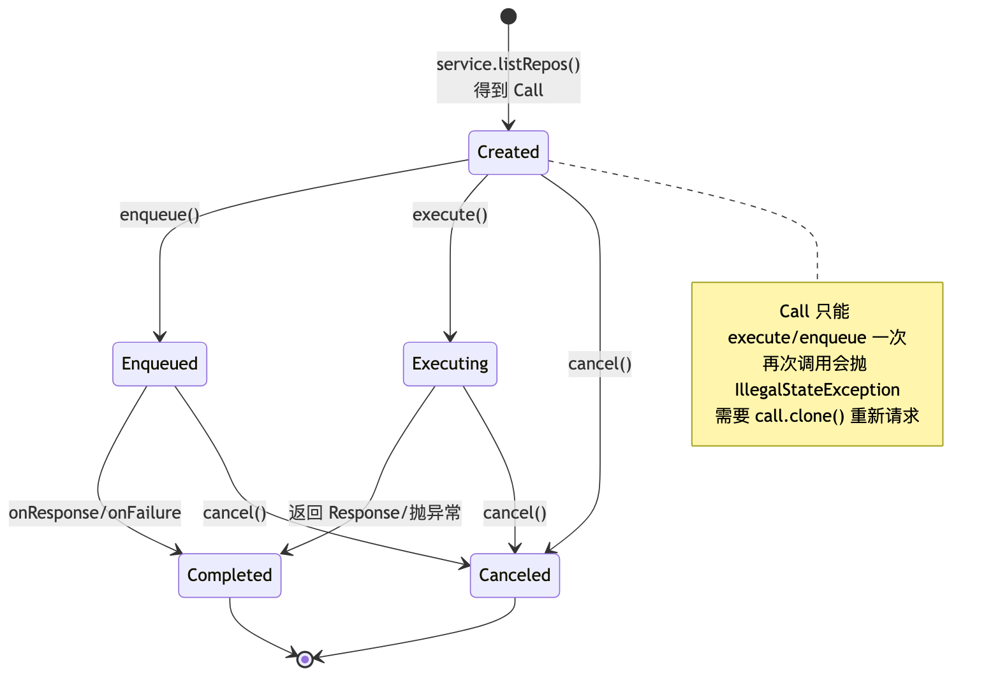

[SVG](assets/retrofit-call-lifecycle.svg) · [mermaid 源文件](assets/retrofit-call-lifecycle.mmd)

```kotlin
call.cancel()       // 取消请求
call.isCanceled     // 是否已取消
call.isExecuted     // 是否已 execute/enqueue 过
call.clone()        // 复制一份新 Call（Call 只能执行一次）
```

---

## 12. 常用 HTTP 注解

| 注解                           | 作用               | 示例                                     |
|------------------------------|------------------|----------------------------------------|
| `@GET("path")`               | GET 请求           | `@GET("users/{id}")`                   |
| `@POST("path")`              | POST             | `@POST("login")`                       |
| `@Path("key")`               | 替换 URL 占位符       | `@Path("id") userId: Int`              |
| `@Query("key")`              | Query 参数         | `@Query("page") page: Int`             |
| `@Body`                      | 请求体（需 Converter） | `@Body user: User`                     |
| `@Header("key")`             | 请求头              | `@Header("Token") token: String`       |
| `@Headers(...)`              | 固定请求头            | `@Headers("Accept: application/json")` |
| `@FormUrlEncoded` + `@Field` | 表单               | 登录表单                                   |
| `@Multipart` + `@Part`       | 文件上传             | 头像上传                                   |
| `@Url`                       | 动态完整 URL         | 覆盖 baseUrl                             |

---

## 13. 端到端一图流（面试可画）

```text
┌─────────────────────────────────────────────────────────────────┐
│                        配置阶段                                   │
│  Retrofit.Builder().baseUrl().addConverterFactory().build()    │
└────────────────────────────┬────────────────────────────────────┘
                             ▼
┌─────────────────────────────────────────────────────────────────┐
│  retrofit.create(ApiService)  →  JDK 动态代理                     │
└────────────────────────────┬────────────────────────────────────┘
                             ▼
┌─────────────────────────────────────────────────────────────────┐
│  api.listRepos("octocat")                                        │
│    ├─ loadServiceMethod (首次解析注解 + 缓存)                      │
│    ├─ new OkHttpCall                                             │
│    └─ DefaultCallAdapter.adapt → ExecutorCallbackCall            │
│  【返回 Call，尚未发网】                                           │
└────────────────────────────┬────────────────────────────────────┘
                             ▼
┌─────────────────────────────────────────────────────────────────┐
│  call.enqueue(Callback)                                          │
│    ├─ RequestFactory.create(args) → GET .../users/octocat/repos │
│    └─ OkHttp Dispatcher 线程池                                    │
└────────────────────────────┬────────────────────────────────────┘
                             ▼
┌─────────────────────────────────────────────────────────────────┐
│  OkHttp 拦截器链 → Socket → 收到 ResponseBody(JSON)              │
└────────────────────────────┬────────────────────────────────────┘
                             ▼
┌─────────────────────────────────────────────────────────────────┐
│  OkHttpCall.parseResponse()                                      │
│    ├─ 2xx → Gson.convert → List<EatGame>                         │
│    └─ 4xx/5xx → Response.error()                                 │
└────────────────────────────┬────────────────────────────────────┘
                             ▼
┌─────────────────────────────────────────────────────────────────┐
│  Handler.post → 主线程 Callback.onResponse()                      │
│    response.body() → List<EatGame> 业务数据                       │
└─────────────────────────────────────────────────────────────────┘
```

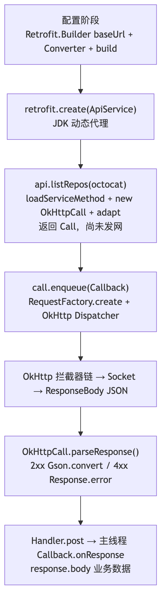

[SVG](assets/retrofit-e2e-flow.svg) · [mermaid 源文件](assets/retrofit-e2e-flow.mmd)

---

## 14. 与 OkHttp 的关系

|         | 原生 OkHttp            | Retrofit        |
|---------|----------------------|-----------------|
| 拼 URL   | 手动 `Request.Builder` | 注解自动拼           |
| 解析 JSON | 手动读 `ResponseBody`   | Converter 自动转对象 |
| 接口形式    | 命令式                  | 声明式 interface   |
| 底层发网    | OkHttp               | 还是 OkHttp       |

自定义 OkHttp 传给 Retrofit：

```kotlin
val client = OkHttpClient.Builder()
    .addInterceptor { chain ->
        val request = chain.request().newBuilder()
            .header("Authorization", "Bearer token")
            .build()
        chain.proceed(request)
    }
    .connectTimeout(30, TimeUnit.SECONDS)
    .build()

Retrofit.Builder()
    .client(client)
    .baseUrl(BASE_URL)
    .addConverterFactory(GsonConverterFactory.create())
    .build()
```

---

## 15. 核心组件对照表

| 步骤   | 你写的代码                         | 源码关键类                      | 是否发网  |
|------|-------------------------------|----------------------------|-------|
| 配置   | `Retrofit.Builder().build()`  | `Retrofit.Builder`         | 否     |
| 创建代理 | `retrofit.create(ApiService)` | `Proxy.newProxyInstance`   | 否     |
| 调方法  | `service.listRepos(...)`      | `HttpServiceMethod.invoke` | 否     |
| 发请求  | `call.enqueue(callback)`      | `OkHttpCall.enqueue`       | **是** |
| 解析   | （自动）                          | `parseResponse` + Gson     | 是     |
| 回调   | `onResponse(body)`            | `ExecutorCallbackCall`     | 是     |

| 组件                 | 管什么                                         | 不管什么                |
|--------------------|---------------------------------------------|---------------------|
| `Converter`        | JSON ↔ 对象、Body 编解码                          | 线程、返回类型             |
| `CallAdapter`      | `Call` 怎么返回（默认 `DefaultCallAdapterFactory`） | RxJava 等需额外 Factory |
| `callbackExecutor` | `Call.enqueue` 回调线程                         | 协程、suspend          |

---

## 16. 面试核心记忆点

1. **动态代理**：`create()` 不生成实现类，而是 `Proxy + InvocationHandler`
2. **懒执行**：调接口方法只得到 `Call`，`enqueue/execute` 才发网
3. **方法缓存**：`ServiceMethod` 解析注解只做一次，存在 `ConcurrentHashMap`
4. **Converter**：管 JSON ↔ 对象
5. **CallAdapter**：管 `Call` 怎么返回（默认 `DefaultCallAdapterFactory`）
6. **线程**：`enqueue` 在 OkHttp 线程发网 + 解析，Android 默认 Handler 切主线程回调
7. **Call 一次性**：执行后需 `clone()` 才能再请求
8. **HTTP 404** 走 `onResponse`（`isSuccessful=false`），不是 `onFailure`

---

## 17. 纯 Retrofit 推荐写法

```kotlin
// 1. 定义接口
interface ApiService {
    @GET("users/{user}/repos")
    fun listRepos(@Path("user") user: String): Call<List<Repo>>
}

// 2. 构建 Retrofit（无需 addCallAdapterFactory）
val retrofit = Retrofit.Builder()
    .baseUrl("https://api.github.com/")
    .addConverterFactory(GsonConverterFactory.create())
    .build()

// 3. 创建代理
val api = retrofit.create(ApiService::class.java)

// 4. 异步请求
api.listRepos("octocat").enqueue(object : Callback<List<Repo>> {
    override fun onResponse(call: Call<List<Repo>>, response: Response<List<Repo>>) {
        if (response.isSuccessful) {
            val list = response.body()
        }
    }
    override fun onFailure(call: Call<List<Repo>>, t: Throwable) {}
})
```

---

## 18. 延伸阅读

- [Retrofit 官方文档](https://square.github.io/retrofit/)
- 项目内 OkHttp 源码：[
  `docs/okhttp/okhttp-call-to-response.md`](../okhttp/okhttp-call-to-response.md)（主线
  `OkHttpTest` enqueue GET/POST）
- 项目内 RxJava 相关：[
  `docs/rxjava/rxjava-create-subscribe-operators.md`](../rxjava/rxjava-create-subscribe-operators.md)
  与 `app/src/main/java/com/haha/main/retrofit/RxJavaLearn.java`（本文未涉及）
- 协程版接口示例：`app/src/main/java/com/haha/mviFrame/main/ApiService.kt`（`suspend fun getUsers()`）

---

## 19. RequestFactory 如何把 @GET、@Path、@Query 拼成 Request

> 本节补充 URL 拼装细节，与上文第 7 节 `createRawCall` 衔接。

### 19.1 示例接口

```kotlin
// baseUrl = "https://api.github.com/"

@GET("users/{user}/repos")
fun listRepos(
    @Path("user") user: String,      // "octocat"
    @Query("type") type: String,    // "owner"
    @Query("page") page: Int        // 1
): Call<List<Repo>>

// 期望结果：
// GET https://api.github.com/users/octocat/repos?type=owner&page=1
```

### 19.2 两阶段模型

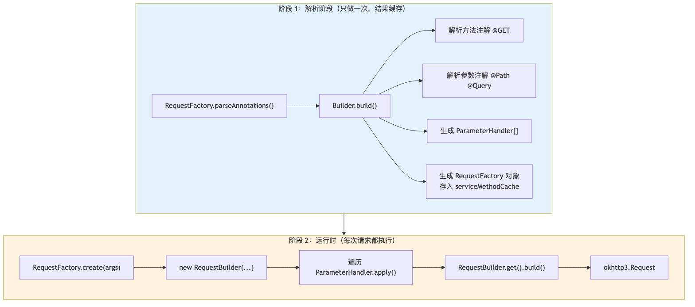

[SVG](assets/retrofit-request-factory-two-phase.svg) · [mermaid 源文件](assets/retrofit-request-factory-two-phase.mmd)

### 19.3 阶段 1：解析 @GET、@Path、@Query

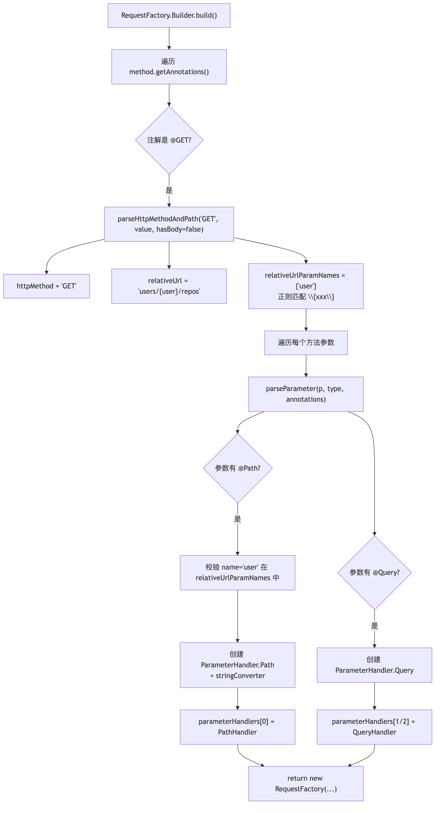

[SVG](assets/retrofit-request-factory-parse.svg) · [mermaid 源文件](assets/retrofit-request-factory-parse.mmd)

**@GET 源码：**

```java
else if(annotation instanceof GET){

parseHttpMethodAndPath("GET",((GET) annotation).

value(), false);
        }
// → httpMethod = "GET"
// → relativeUrl = "users/{user}/repos"
// → relativeUrlParamNames = {"user"}  // 正则 \{([a-zA-Z][a-zA-Z0-9_-]*)\}
```

### 19.4 阶段 2：运行时拼 Request

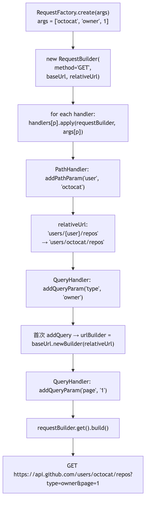

[SVG](assets/retrofit-request-factory-create.svg) · [mermaid 源文件](assets/retrofit-request-factory-create.mmd)

### 19.5 @Path 替换流程

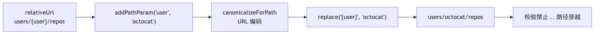

[SVG](assets/retrofit-path-replace.svg) · [mermaid 源文件](assets/retrofit-path-replace.mmd)

- `@Path` 参数 **不能为 null**
- 值会做 URL 编码
- 禁止 `..` 路径穿越

### 19.6 @Query 拼接流程

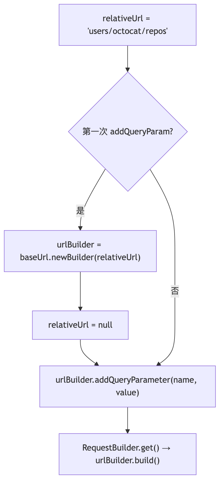

[SVG](assets/retrofit-query-append.svg) · [mermaid 源文件](assets/retrofit-query-append.mmd)

- `@Query` 值为 **null 则跳过**
- `Int` 等经 `stringConverter` 转成 `"1"`

### 19.7 无 @Query 时

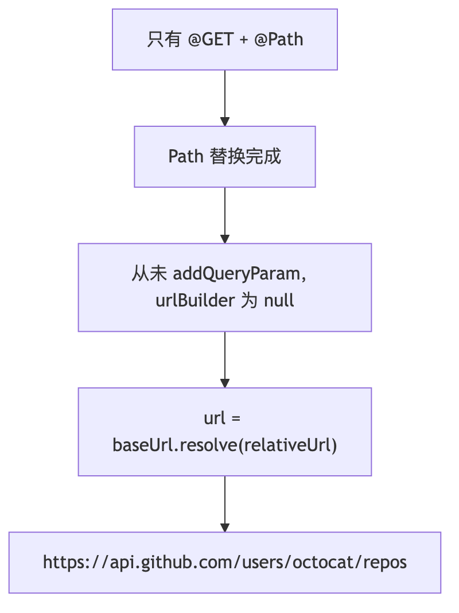

[SVG](assets/retrofit-no-query.svg) · [mermaid 源文件](assets/retrofit-no-query.mmd)

### 19.8 URL 拼装时序图

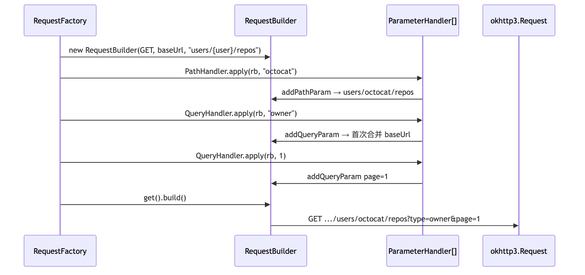

[SVG](assets/retrofit-url-assemble-sequence.svg) · [mermaid 源文件](assets/retrofit-url-assemble-sequence.mmd)

### 19.9 参数顺序约束

- `@Path` 必须在 `@Query` 之前
- `@Url` 不能与 `@Path` 同时使用
- `@GET` 路径里的 `{xxx}` 必须有对应 `@Path("xxx")`

### 19.10 RequestFactory 总结

| 注解               | 解析阶段（一次）                           | 运行阶段（每次）                      |
|------------------|------------------------------------|-------------------------------|
| `@GET("path")`   | 存 `httpMethod`、`relativeUrl`、扫描占位符 | 作为 method 和初始路径               |
| `@Path("user")`  | 创建 `PathHandler`，校验占位符存在           | `replace("{user}", 值)`        |
| `@Query("page")` | 创建 `QueryHandler`                  | `addQueryParameter`，触发 URL 合并 |

**三句话：**

1. `@GET` 定方法和路径模板
2. `@Path` 替换路径里的 `{xxx}`
3. `@Query` 在合并后的 URL 上追加 `?k=v`
