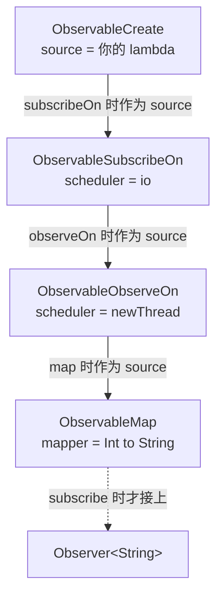
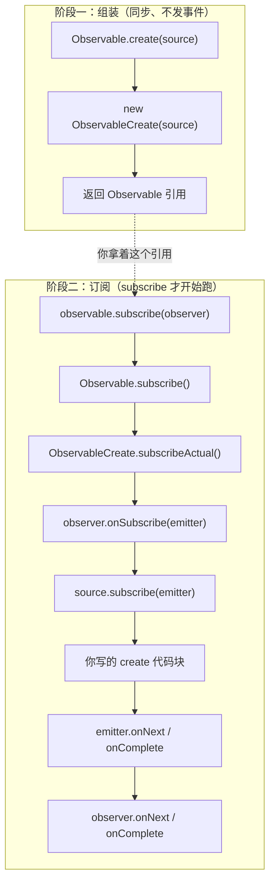
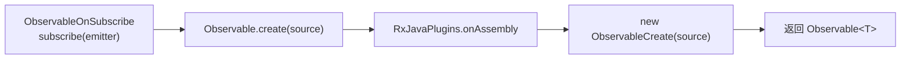
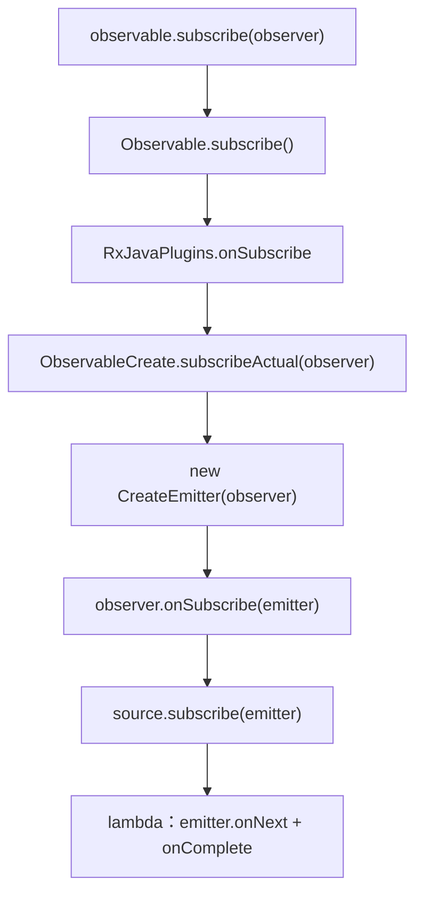
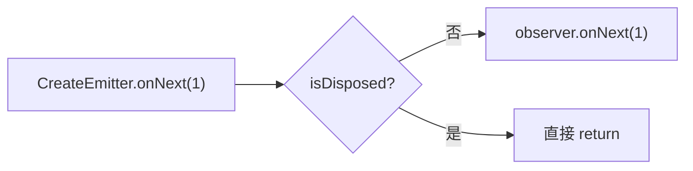
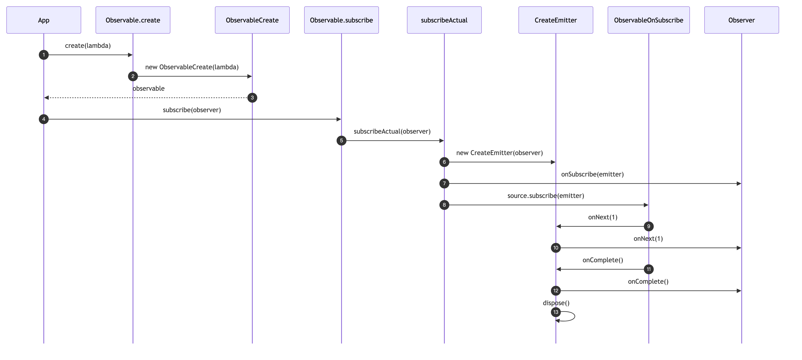
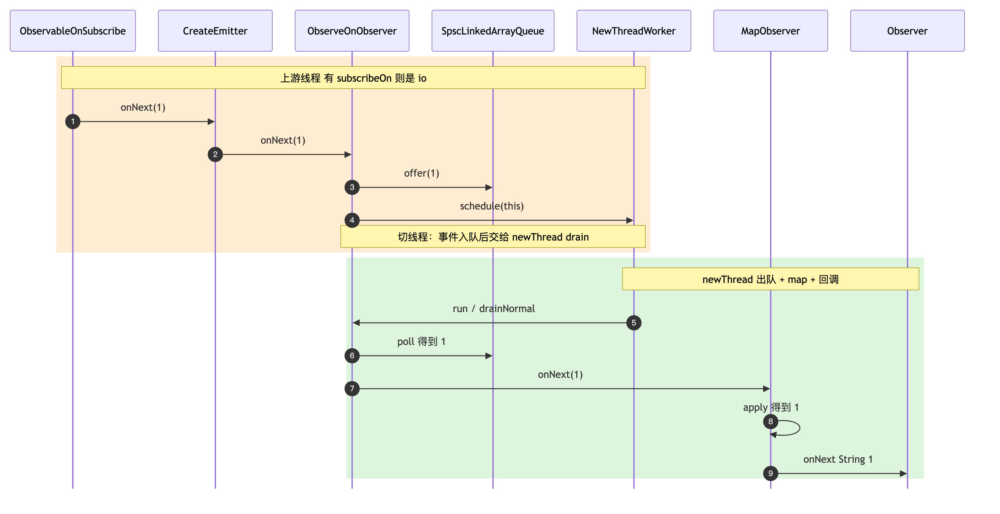
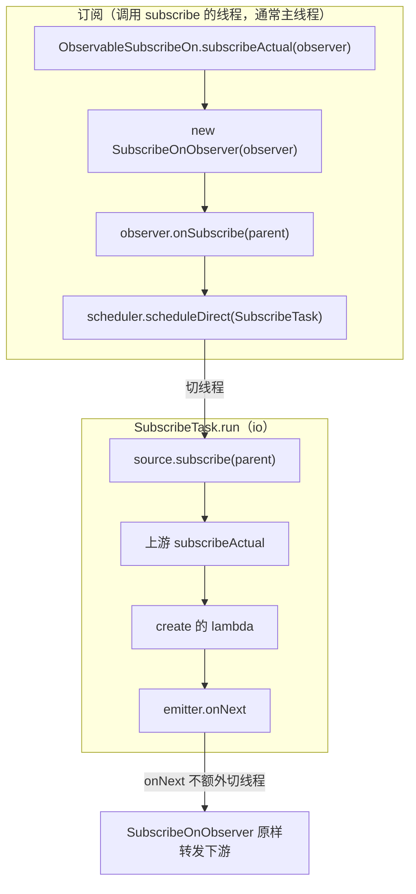
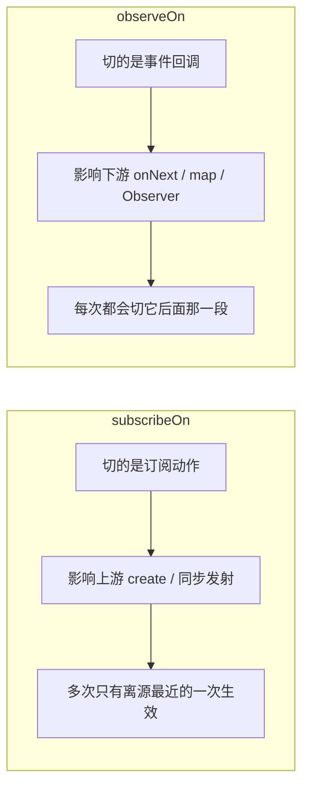
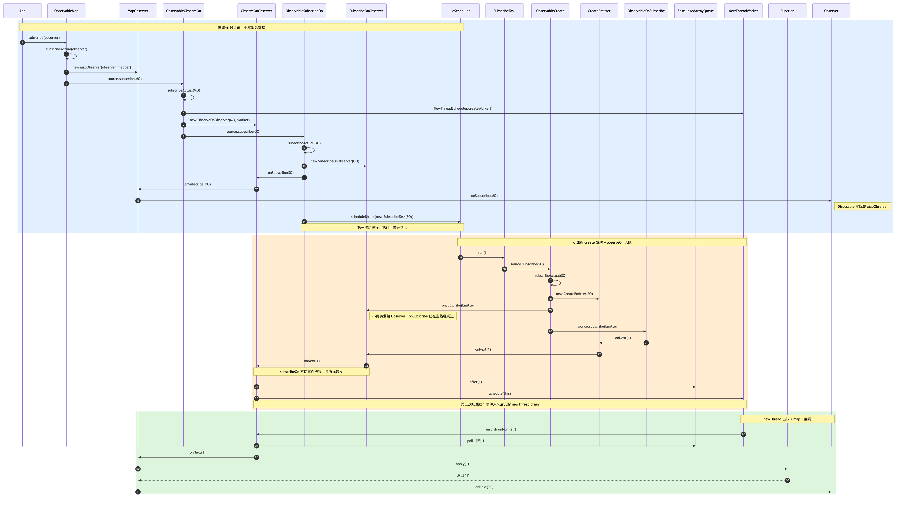

# RxJava 源码：create / subscribe / subscribeOn / observeOn / map

记录时间：2026-08-30  
项目版本：RxJava 3.0.4（`io.reactivex.rxjava3`）  
示例代码：`app/src/main/java/com/haha/main/retrofit/RetrofitTest.kt` 的 `observerTest()`

配套时序图（PNG / SVG / mermaid 源文件）：

| 图                                       | 对应章节   | PNG                                              | SVG                                              | 源文件                                              |
|-----------------------------------------|--------|--------------------------------------------------|--------------------------------------------------|--------------------------------------------------|
| 最简 `create().subscribe()`               | §4.6   | [png](rxjava-create-subscribe-sequence.png)      | [svg](rxjava-create-subscribe-sequence.svg)      | [mmd](rxjava-create-subscribe-sequence.mmd)      |
| `observeOn` 一个 `onNext(1)`              | §5.2.1 | [png](rxjava-observeon-onnext-sequence.png)      | [svg](rxjava-observeon-onnext-sequence.svg)      | [mmd](rxjava-observeon-onnext-sequence.mmd)      |
| `subscribeOn` + `observeOn` + `map` 全链路 | §6     | [png](rxjava-subscribe-observe-map-sequence.png) | [svg](rxjava-subscribe-observe-map-sequence.svg) | [mmd](rxjava-subscribe-observe-map-sequence.mmd) |

本文从 **使用步骤 → 源码链路 → 流程图** 三个维度，先讲最简的 `Observable.create().subscribe()`
，再按同样风格拆 `subscribeOn`、`observeOn`、`map`，全程对照 `observerTest()`。

---

## 1. 先给结论

RxJava 本质是 **观察者模式 + 装饰器（操作符层层包装）+ 线程调度**。

- **组装阶段**：`create` / `map` / `subscribeOn` / `observeOn` 只是 **new 一层 Observable**，不发事件。
- **触发阶段**：`subscribe()` 才真正订阅，调用链 **从下往上**（下游去订上游）。
- **事件阶段**：`onNext` **从上往下** 穿过每一层 Observer。

口诀：**订阅向上，事件向下；subscribeOn 管上游，observeOn 管下游。**

---

## 2. 核心角色（RxJava 3）

| 角色                      | 职责             | 关键方法                                                |
|-------------------------|----------------|-----------------------------------------------------|
| `Observable<T>`         | 被观察者           | `subscribe()` → `subscribeActual()`                 |
| `Observer<T>`           | 观察者            | `onSubscribe` / `onNext` / `onError` / `onComplete` |
| `ObservableOnSubscribe` | `create` 时的数据源 | `subscribe(emitter)`                                |
| `ObservableEmitter`     | 安全发射器          | `onNext` / `onError` / `onComplete`                 |
| `Disposable`            | 订阅句柄           | `dispose()` 取消                                      |

两个 `subscribe` 不是一回事：

| 调用                               | 谁                            | 含义                     |
|----------------------------------|------------------------------|------------------------|
| `observable.subscribe(observer)` | 你                            | 建立订阅                   |
| `source.subscribe(emitter)`      | RxJava 在 `subscribeActual` 里 | 执行 `create { }` 里的发射逻辑 |

---

## 3. 对照 `observerTest()`

当前代码：

```kotlin
// app/src/main/java/com/haha/main/retrofit/RetrofitTest.kt
val observable: Observable<Int> = Observable.create { e ->
    e.onNext(1)
    e.onNext(2)
    e.onNext(3)
    e.onNext(4)
    e.onComplete()
}

observable
    .subscribeOn(Schedulers.io())
    .observeOn(Schedulers.newThread())
    .map { it.toString() }
    .subscribe(observer)
```

组装后的对象链（`source` 指向内侧）：



内存关系：

```text
ObservableMap.mapper  = Int::toString
ObservableMap.source  = ObservableObserveOn
                            └── scheduler = NewThreadScheduler
                            └── source    = ObservableSubscribeOn
                                                └── scheduler = IoScheduler
                                                └── source    = ObservableCreate
                                                                    └── source = 你的 lambda
```

还没 `subscribe` 时，**一条 `onNext` 都不会走**。

---

## 4. 最简：`Observable.create().subscribe()`

先剥掉操作符。对应 `observerTest()` 里「被观察者 + 观察者」两段，只是还没接 `subscribeOn` /
`observeOn` / `map`。

### 4.1 最简代码

```kotlin
val observable = Observable.create<Int> { emitter ->
    emitter.onNext(1)
    emitter.onNext(2)
    emitter.onComplete()
}

observable.subscribe(object : Observer<Int> {
    override fun onSubscribe(d: Disposable) {}
    override fun onNext(t: Int) {
        Log.d(TAG, "$t")
    }
    override fun onError(e: Throwable) {}
    override fun onComplete() {}
})
```

一句话：**`create` 只 new 对象，不发数据；`subscribe` 才真正订阅并触发发射逻辑。**

### 4.2 总览：两阶段



### 4.3 `create`：只把数据源包起来

```java
public static <T> Observable<T> create(ObservableOnSubscribe<T> source) {
    Objects.requireNonNull(source, "source is null");
    return RxJavaPlugins.onAssembly(new ObservableCreate<T>(source));
}
```

`ObservableCreate` 本身几乎是空壳：

```java
public final class ObservableCreate<T> extends Observable<T> {
    final ObservableOnSubscribe<T> source;   // 你写的 lambda

    @Override
    protected void subscribeActual(Observer<? super T> observer) {
        // 等 subscribe() 才会走进来
    }
}
```



此时内存里只有：

```text
ObservableCreate
  └── source = 你的 lambda   （还没调用）
```

`RxJavaPlugins.onAssembly` 是全局 hook（调试、RxDo 会插在这里）。默认原样返回这个 `ObservableCreate`。

### 4.4 `subscribe`：真正的点火

`Observable` 是抽象类，`subscribe` 写在基类，真正干活的是子类的 `subscribeActual`：

```java
public final void subscribe(Observer<? super T> observer) {
    Objects.requireNonNull(observer, "observer is null");
    try {
        observer = RxJavaPlugins.onSubscribe(this, observer);
        subscribeActual(observer);
    } catch (NullPointerException e) {
        throw e;
    } catch (Throwable e) {
        Exceptions.throwIfFatal(e);
        RxJavaPlugins.onError(e);
        throw new NullPointerException(e.toString());
    }
}
```

`subscribe` 里 catch 之后不直接调 `observer.onError`：此时可能还没 `onSubscribe`，下游没准备好，再回调可能二次崩溃。

`ObservableCreate.subscribeActual`：

```java

@Override
protected void subscribeActual(Observer<? super T> observer) {
    CreateEmitter<T> parent = new CreateEmitter<T>(observer);
    observer.onSubscribe(parent);          // ① 先把 Disposable 交给你
    try {
        source.subscribe(parent);          // ② 再调 create 里的代码
    } catch (Throwable ex) {
        Exceptions.throwIfFatal(ex);
        parent.onError(ex);
    }
}
```

顺序是死的：**先 `onSubscribe`，再发数据**。所以才能在 `onSubscribe` 里拿到 `Disposable`，后面
`dispose()`。



### 4.5 事件怎么到 `Observer`

`CreateEmitter` 同时是 `ObservableEmitter` 和 `Disposable`：

```java
static final class CreateEmitter<T>
        extends AtomicReference<Disposable>
        implements ObservableEmitter<T>, Disposable {

    final Observer<? super T> observer;

    @Override
    public void onNext(T t) {
        if (t == null) {
            onError(new NullPointerException("onNext called with null"));
            return;
        }
        if (!isDisposed()) {
            observer.onNext(t);
        }
    }

    @Override
    public void onComplete() {
        if (!isDisposed()) {
            try {
                observer.onComplete();
            } finally {
                dispose();
            }
        }
    }
}
```

没有操作符时，**发射线程 = 调用 `subscribe()` 的线程**，中间没有队列。



### 4.6 最简时序（一个 `onNext(1)`）



[SVG](rxjava-create-subscribe-sequence.svg) · [mermaid 源文件](rxjava-create-subscribe-sequence.mmd)

对象关系：

```text
你的 Observer
      ↑ 持有
CreateEmitter  ←── Disposable（onSubscribe 交出去的就是它）
      ↑ 作为 emitter 传入
你的 lambda（ObservableOnSubscribe）
      ↑ 存在字段 source
ObservableCreate
```

没有操作符时，全程同一线程：谁调 `subscribe`，谁就收 `onNext`。

---

## 5. 三张图：`map` / `observeOn` / `subscribeOn`

仍对照 `observerTest()`。`map` 自己不切线程；`observeOn` 切下游收事件的线程；`subscribeOn` 切「订上游」发生的线程。

### 5.1 图：`map`（变换 Observer）

```java
public final <R> Observable<R> map(Function<? super T, ? extends R> mapper) {
    Objects.requireNonNull(mapper, "mapper is null");
    return RxJavaPlugins.onAssembly(new ObservableMap<T, R>(this, mapper));
}
```

`this` 在 `observerTest()` 里是上一层的 `ObservableObserveOn`。

```java
public final class ObservableMap<T, U> extends AbstractObservableWithUpstream<T, U> {
    final Function<? super T, ? extends U> mapper;

    @Override
    public void subscribeActual(Observer<? super U> observer) {
        source.subscribe(new MapObserver<T, U>(observer, mapper));
    }
}
```

`MapObserver.onNext`：

```java

@Override
public void onNext(T t) {
    if (done) return;
    try {
        U v = Objects.requireNonNull(mapper.apply(t), "mapper returned null");
        downstream.onNext(v);
    } catch (Throwable ex) {
        fail(ex);
    }
}
```

机制就一句：**订阅时把下游 Observer 包成 `MapObserver`，事件经过 `apply` 再往下传。**

```mermaid
flowchart TB
    subgraph assemble["组装（map 被调用时）"]
        A["observeOn 返回的 ObservableObserveOn"]
        B["new ObservableMap(this, mapper)"]
        A --> B
    end

    subgraph sub["订阅（subscribeActual）"]
        C["ObservableMap.subscribeActual(observer)"]
        D["new MapObserver(observer, mapper)"]
        E["source.subscribe(mapObserver)"]
        F["走进 ObservableObserveOn.subscribeActual"]
        C --> D --> E --> F
    end

    subgraph event["事件（onNext）"]
        G["上游 onNext(1)"]
        H["MapObserver.onNext(1)"]
        I["mapper.apply(1) → \"1\""]
        J["observer.onNext(\"1\")"]
        G --> H --> I --> J
    end

    B -.->|"subscribe 之后"| C
    F -.->|"上游开始发事件"| G
```

对照 `observerTest()`：

| 点           | 实际行为                             |
|-------------|----------------------------------|
| 输入类型        | `Int`（来自 `create` / `observeOn`） |
| `apply`     | `1` → `"1"`                      |
| 下游          | `Observer<String>`               |
| `apply` 抛异常 | `fail()` → `onError`             |
| 返回 null     | RxJava 2/3 直接当错误                 |

`map` **自己不切线程**。它写在 `observeOn` **后面**，所以 `toString()` 跑在 `newThread`。

---

### 5.2 图：`observeOn`（切下游收事件的线程）

```java
public final Observable<T> observeOn(Scheduler scheduler) {
    return observeOn(scheduler, false, bufferSize());
}
```

```java

@Override
protected void subscribeActual(Observer<? super T> observer) {
    if (scheduler instanceof TrampolineScheduler) {
        source.subscribe(observer);
        return;
    }
    Scheduler.Worker w = scheduler.createWorker();
    source.subscribe(new ObserveOnObserver<T>(observer, w, delayError, bufferSize));
}
```

`ObserveOnObserver` 同时是 `Observer` + `Runnable`：

```java
public void onNext(T t) {
    if (done) return;
    queue.offer(t);
    schedule();
}

void schedule() {
    if (getAndIncrement() == 0) {
        worker.schedule(this);
    }
}

public void run() {
    drainNormal();
}
```

`Schedulers.newThread()` 每次 `createWorker()` 都会 **new 一条线程**（`NewThreadWorker`）。

```mermaid
flowchart TB
    subgraph sub2["订阅"]
        S1["ObservableObserveOn.subscribeActual(mapObserver)"]
        S2["scheduler.createWorker() → NewThreadWorker"]
        S3["new ObserveOnObserver(mapObserver, worker)"]
        S4["source.subscribe(observeOnObserver)"]
        S5["走进上游 subscribeActual"]
        S1 --> S2 --> S3 --> S4 --> S5
    end

    subgraph up["上游线程（subscribeOn 之后是 io）"]
        U1["CreateEmitter.onNext(1)"]
        U2["ObserveOnObserver.onNext(1)"]
        U3["queue.offer(1)"]
        U4["worker.schedule(this)"]
        U1 --> U2 --> U3 --> U4
    end

    subgraph down["下游线程 = newThread"]
        D1["ObserveOnObserver.run()"]
        D2["queue.poll() → 1"]
        D3["MapObserver.onNext(1)"]
        D4["observer.onNext(\"1\")"]
        D1 --> D2 --> D3 --> D4
    end

    S5 -.-> U1
    U4 -->|"切线程"| D1
```

要点：

- **`observeOn` 不影响上游。** `create` 里的 `e.onNext` 跟 `subscribeOn` 走（这里是 io）。
- **影响它后面的整段下游。** 所以 `map` 和 `Observer.onNext` 都在 `newThread`。
- 切线程靠 **无界队列 + Worker**。上游快、下游慢，事件堆在 `SpscLinkedArrayQueue`（Observable 没有背压）。
- **可以多次 `observeOn`**，每层再切一次后面那段。

#### 5.2.1 时序（一个 `onNext(1)`，只看 observeOn）



[SVG](rxjava-observeon-onnext-sequence.svg) · [mermaid 源文件](rxjava-observeon-onnext-sequence.mmd)

---

### 5.3 图：`subscribeOn`（切「订阅」发生的线程）

```java
public final Observable<T> subscribeOn(Scheduler scheduler) {
    return RxJavaPlugins.onAssembly(new ObservableSubscribeOn<T>(this, scheduler));
}
```

```java

@Override
public void subscribeActual(final Observer<? super T> observer) {
    SubscribeOnObserver<T> parent = new SubscribeOnObserver<>(observer);
    observer.onSubscribe(parent);

    parent.setDisposable(scheduler.scheduleDirect(new SubscribeTask(parent)));
}

final class SubscribeTask implements Runnable {
    @Override
    public void run() {
        source.subscribe(parent);
    }
}
```

`SubscribeOnObserver.onNext` 只是原样转发，**自己不切事件线程**。切的是 **`source.subscribe()` 发生在哪条线程
**。`create` 的 lambda 在 `subscribeActual` 里同步调用，所以发射逻辑也跟着到那条线程。



和 `observeOn` 对比：



多次 `subscribeOn` 只有靠近 `create` 的生效：订阅从下往上走，内层 `SubscribeTask` 一旦把
`source.subscribe` 切到线程 A，外层再 `scheduleDirect`，也只是「在 B 线程里发起一次已经切到 A 的订阅」，发射仍在
A。

`Observer.onSubscribe` 仍在调用 `subscribe()` 的线程，因为 `ObservableSubscribeOn` 在
`scheduleDirect` **之前**就 `observer.onSubscribe(parent)` 了。

---

## 6. 一张总图：从 `subscribe()` 到 `Observer.onNext()`

链：

```text
create → subscribeOn(io) → observeOn(newThread) → map → subscribe(observer)
```



[SVG](rxjava-subscribe-observe-map-sequence.svg) · [mermaid 源文件](rxjava-subscribe-observe-map-sequence.mmd)

### 6.1 两次切线程

| 次数 | 谁发起                     | 源码                                          | 从 → 到              | 切的是什么                                  |
|----|-------------------------|---------------------------------------------|--------------------|----------------------------------------|
| ①  | `ObservableSubscribeOn` | `IoScheduler.scheduleDirect(SubscribeTask)` | 主线程 → **io**       | **订阅上游**（随后 `create` 的 `onNext` 也在 io） |
| ②  | `ObserveOnObserver`     | `NewThreadWorker.schedule(this)`            | io → **newThread** | **下游事件**（`map` / `Observer.onNext`）    |

`SubscribeOnObserver.onNext` 没有 `schedule`，所以 `1` 从 `CreateEmitter` 到
`ObserveOnObserver.offer` 一直停在 io。

### 6.2 逐步对应

**A. 主线程：只建立订阅**

| 步       | 类                                                               | 方法                                     |
|---------|-----------------------------------------------------------------|----------------------------------------|
| A1      | 业务代码                                                            | `subscribe(observer)`                  |
| A2      | `Observable`                                                    | `subscribe()` → `subscribeActual`      |
| A3–A4   | `ObservableMap` / `MapObserver`                                 | 包一层 Observer                           |
| A5–A9   | `ObservableObserveOn` / `ObserveOnObserver` / `NewThreadWorker` | 准备切下游                                  |
| A10–A12 | `ObservableSubscribeOn` / `SubscribeOnObserver`                 | 准备切上游                                  |
| A13–A15 | `onSubscribe` 链                                                 | 最终 `Observer.onSubscribe(MapObserver)` |
| A16     | `IoScheduler`                                                   | `scheduleDirect(SubscribeTask)`        |

**B. io 线程：订到 `create`，事件入队**

| 步      | 类                                       | 方法                                            |
|--------|-----------------------------------------|-----------------------------------------------|
| B1     | `SubscribeTask`                         | `run()` → `source.subscribe(parent)`          |
| B2–B4  | `ObservableCreate` / `CreateEmitter`    | 进入最内层                                         |
| B5     | `SubscribeOnObserver`                   | `onSubscribe(CreateEmitter)`，不再转发给 `Observer` |
| B6     | `ObservableOnSubscribe`                 | `observerTest()` 的 lambda                     |
| B7–B8  | `CreateEmitter` / `SubscribeOnObserver` | `onNext(1)` 原样转发                              |
| B9–B11 | `ObserveOnObserver`                     | `queue.offer(1)` + `worker.schedule(this)`    |

**C. newThread：出队、`map`、回调**

| 步     | 类                                            | 方法                     |
|-------|----------------------------------------------|------------------------|
| C1–C2 | `ObserveOnObserver` / `SpscLinkedArrayQueue` | `drainNormal` + `poll` |
| C3–C4 | `MapObserver` / `Function`                   | `apply(1)` → `"1"`     |
| C5    | `Observer`                                   | `onNext("1")`          |

### 6.3 两个方向（合在一起）

订阅从下往上：

```text
1. ObservableMap.subscribeActual(Observer)
      → source.subscribe(MapObserver)
2. ObservableObserveOn.subscribeActual(MapObserver)
      → createWorker() + source.subscribe(ObserveOnObserver)
3. ObservableSubscribeOn.subscribeActual(ObserveOnObserver)
      → scheduleDirect(SubscribeTask)
4. ObservableCreate.subscribeActual(SubscribeOnObserver)   // 已在 io
      → lambda.subscribe(CreateEmitter)
```

事件从上往下：

```text
lambda.onNext(1)
  → CreateEmitter
  → SubscribeOnObserver          // 仍在 io
  → ObserveOnObserver.offer      // 仍在 io
  → newThread drain
  → MapObserver.apply → "1"
  → Observer.onNext("1")
```

---

## 7. `observerTest()` 线程对照

| 环节                                         | 无线程切换                | 仅 observeOn（旧代码） | 当前：subscribeOn(io) + observeOn(newThread) |
|--------------------------------------------|----------------------|------------------|-------------------------------------------|
| `Observer.onSubscribe`                     | 调用 `subscribe()` 的线程 | 同左               | 同左（通常主线程）                                 |
| `create` 的 lambda / `CreateEmitter.onNext` | 同左                   | 同左               | **io**                                    |
| `ObserveOnObserver.offer`                  | 同左                   | 同左               | **io**                                    |
| `Function.apply` / `Observer.onNext`       | 同左                   | **newThread**    | **newThread**                             |

---

## 8. `dispose` 和 `>= 2` 取消

```kotlin
if (value.toInt() >= 2) {
    disposable?.dispose()
}
```

`create` 同步连发 1/2/3/4。中间有 `observeOn` 队列：

1. io 可能已经把 1、2、3、4 都 `offer` 进队列。
2. `newThread` 处理到 `"2"` 时 `dispose()`。
3. 之后 `drain` 发现 disposed，**不再把 3、4 交给 Observer**。
4. 上游 lambda 可能早就跑完——**dispose 保证不再回调 Observer，不保证上游立刻停**。上游要靠
   `Emitter.isDisposed` / `setCancellable` 自己停。

你在 `onSubscribe` 里拿到的 `Disposable` 实际是 `MapObserver`，`dispose()` 会沿链取消到
`ObserveOnObserver` 的 Worker 和 `CreateEmitter`。

---

## 9. 类名速查

包名按 RxJava 3（`observerTest()` 用的 `io.reactivex.rxjava3`）。RxJava 2 类名相同，包名换成
`io.reactivex`。

| 角色          | 类名                                                                           |
|-------------|------------------------------------------------------------------------------|
| 基类入口        | `io.reactivex.rxjava3.core.Observable`                                       |
| create      | `...internal.operators.observable.ObservableCreate`                          |
| 发射器         | `ObservableCreate.CreateEmitter`                                             |
| 数据源         | `io.reactivex.rxjava3.core.ObservableOnSubscribe`                            |
| subscribeOn | `...ObservableSubscribeOn`                                                   |
|             | `ObservableSubscribeOn.SubscribeOnObserver`                                  |
|             | `ObservableSubscribeOn.SubscribeTask`                                        |
| io 调度       | `...internal.schedulers.IoScheduler`                                         |
| observeOn   | `...ObservableObserveOn`                                                     |
|             | `ObservableObserveOn.ObserveOnObserver`                                      |
| newThread   | `...internal.schedulers.NewThreadScheduler` / `NewThreadWorker`              |
| 队列          | `...internal.queue.SpscLinkedArrayQueue`                                     |
| map         | `...ObservableMap` / `ObservableMap.MapObserver`（继承 `BasicFuseableObserver`） |
| 变换函数        | `io.reactivex.rxjava3.functions.Function`                                    |
| 观察者         | `io.reactivex.rxjava3.core.Observer`                                         |

---

## 10. 面试收口

1. `create` = `new ObservableCreate(source)`，冷的，谁都还没跑。
2. `subscribe(observer)` → 基类 `subscribe()` → 最外层 `subscribeActual()`，一层层往上订。
3. 最内层 `ObservableCreate.subscribeActual` 先 `new CreateEmitter`，立刻 `onSubscribe`，再
   `source.subscribe(emitter)`。
4. **`map`**：`subscribeActual` 里 `new MapObserver` 再订上游；`onNext` 里 `mapper.apply`。不切线程。
5. **`observeOn`**：上游只 `queue.offer`，Worker 在目标线程 `drain`。切的是**它后面的下游**。
6. **`subscribeOn`**：`scheduleDirect(SubscribeTask)`，在目标线程里才 `source.subscribe`。切的是**上游发射
   **。多次只有离源最近的一次生效。
7. `observerTest()`：`create` 在 **io**，`map` 和 `Observer.onNext` 在 **newThread**，`onSubscribe`
   仍在调用 `subscribe()` 的线程。

事件协议：`onSubscribe → (onNext)* → onComplete | onError`，二者互斥、至多一次。RxJava 2/3 整条链禁止
null。需要背压用 `Flowable`，不要用 `Observable`。
