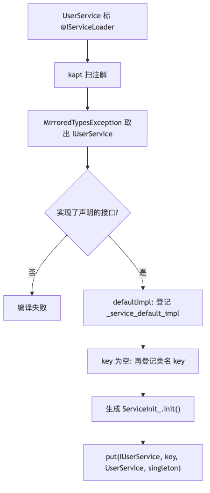
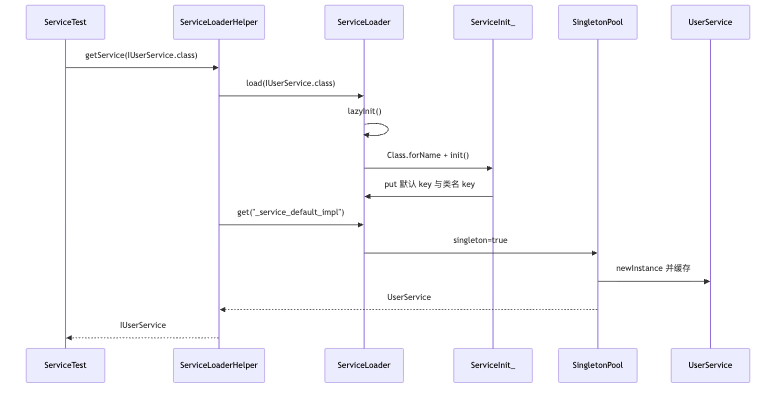
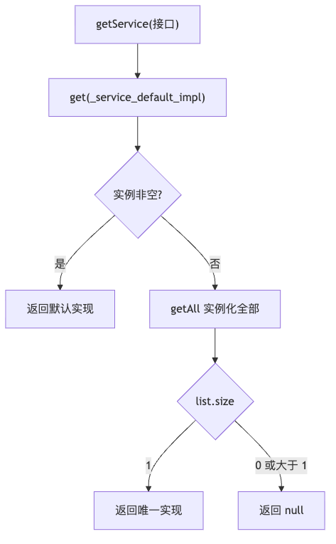
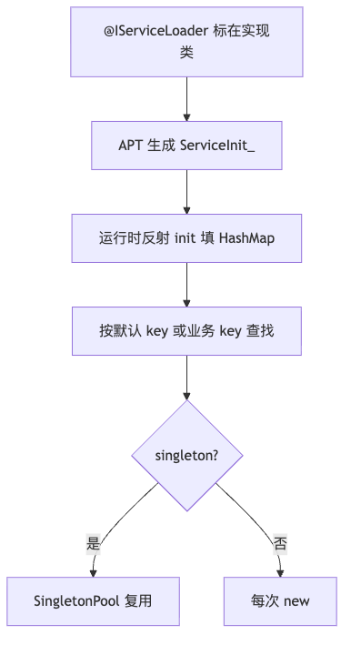
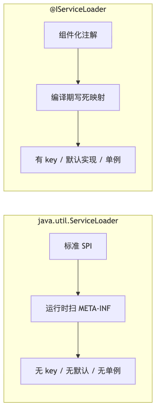

# 组件化 ServiceLoader 优化前笔记

记录时间：2026-09-06

本文合并原先三篇问答底稿：优化前 `getService` 实现、JDK SPI 对照、原框架与改动方案条目。  
当前仓库已落地模块化 Init + 插件聚合 + `ServiceRecord`，以
[优化后设计与流程](service-optimized-design.md) 为准。

配套流程图：

| 图                     | PNG                                     | 源文件                                     |
|-----------------------|-----------------------------------------|-----------------------------------------|
| 优化前模块分层               | [png](service-legacy-modules.png)       | [mmd](service-legacy-modules.mmd)       |
| 优化前 APT               | [png](service-legacy-apt.png)           | [mmd](service-legacy-apt.mmd)           |
| 优化前 getService 时序     | [png](service-legacy-getservice.png)    | [mmd](service-legacy-getservice.mmd)    |
| 优化前无默认 key 兜底         | [png](service-legacy-fallback.png)      | [mmd](service-legacy-fallback.mmd)      |
| JDK SPI 流程            | [png](service-legacy-jdk-flow.png)      | [mmd](service-legacy-jdk-flow.mmd)      |
| 优化前 IServiceLoader 流程 | [png](service-legacy-iservice-flow.png) | [mmd](service-legacy-iservice-flow.mmd) |
| JDK 与自研对照             | [png](service-legacy-spi-compare.png)   | [mmd](service-legacy-spi-compare.mmd)   |
| 优化前后整条链路              | [png](service-compare-pipeline.png)     | [mmd](service-compare-pipeline.mmd)     |
| 优化前后注册表               | [png](service-compare-registry.png)     | [mmd](service-compare-registry.mmd)     |
| 插件聚合                  | [png](service-opt-plugin.png)           | [mmd](service-opt-plugin.mmd)           |

---

## 1. 优化前：`@IServiceLoader` 与 `getService`

入口：`ServiceLoaderHelper.getService(IUserService::class.java)`  
示例：`UserService` 上
`@IServiceLoader(interfaces = [IUserService::class], singleton = true, defaultImpl = true)`

这套不是 JDK `java.util.ServiceLoader`，而是编译期注册 + 运行时按接口查表。  
优化前是固定类名 `ServiceInit_`、魔法默认 key、`getAll().size` 兜底。

### 1.1 组件化要解决什么

`app` 编译期只认 `IUserService`，不能 `new UserService()`，否则必须依赖实现模块。  
`ServiceImpl` 用 `runtimeOnly` 打进 APK。运行时只做一件事：给我接口 Class，返回实现实例。


| 模块                           | 职责                                                        |
|------------------------------|-----------------------------------------------------------|
| `ServiceApi`                 | 只放 `IUserService`                                         |
| `ServiceImpl`                | `UserService` + `@IServiceLoader`                         |
| `ServiceRuntime`             | `ServiceLoader` / `ServiceLoaderHelper` / `SingletonPool` |
| `ServiceAnnotation`          | 注解与元数据 `ServiceImpl`                                      |
| `ServiceAnnotationProcessor` | APT 生成 `ServiceInit_`                                     |

### 1.2 注解三个参数

`@IServiceLoader` 的 `Retention` 是 `BINARY`：运行时反射读不到，信息被 APT 写进生成类。

| 参数                                   | 对 `UserService` 的含义                                |
|--------------------------------------|----------------------------------------------------|
| `interfaces = [IUserService::class]` | 对外提供这个接口                                           |
| `singleton = true`                   | `getService` 走 `SingletonPool`，同一 Class 只 `new` 一次 |
| `defaultImpl = true`                 | 额外登记内部 key `_service_default_impl`，不传 key 也能取      |

`key` 为空时，APT 还会用实现类全名再登记一条。因此 `UserService` 在表里有 **两条** 映射，指向同一个类：

| key                                      | 来源                   |
|------------------------------------------|----------------------|
| `_service_default_impl`                  | `defaultImpl = true` |
| `com.haha.service.impl.impl.UserService` | key 为空时的兜底           |

### 1.3 编译期：注解变成 `ServiceInit_`

`ServiceAnnotationProcessor` 用 `@AutoService(Processor::class)` 注册。`ServiceImpl` 模块 `kapt` 后会跑。

普通轮扫 `@IServiceLoader`；最后一轮 `processingOver()` 用 JavaPoet 写出
`com.haha.service.impl.generated.service.ServiceInit_`。

读 `interfaces = [IUserService::class]` 时不能直接拿 `KClass`，编译器抛 `MirroredTypesException`，
`typeMirrors` 就在异常里。然后校验实现类是非抽象子类型。

`defaultImpl` 为 true 时先 `put(DEFAULT_IMPL_KEY, ...)`；`key` 为空再 `put(null, ...)`，内部把 key
收成类名。同一接口同一 key 登记了两个不同实现，编译期冲突（默认实现只允许一个）。

```java
ServiceLoader.put(IUserService.class, "_service_default_impl", UserService.class, true);
ServiceLoader.put(IUserService.class, "com.haha.service.impl.impl.UserService", UserService.class, true);
```

这里已经是 Class 字面量，运行时不再扫 dex、不再读注解。



### 1.4 运行时：`getService` 五步

入口：

```kotlin
ServiceLoader.load(clazz)?.get(ServiceImpl.DEFAULT_IMPL_KEY)
```

未命中再 `getAll()`，仅当 size == 1 时返回那一个。



**第 1 步：`load` 先 `lazyInit`**

`lazyInit` 只跑一次，反射 `com.haha.service.impl.generated.service.ServiceInit_` 的静态 `init()`。  
不用直接引用生成类，避免主 dex 引用过多，也让 `app` 编译期不必看见 `ServiceImpl`。

**第 2 步：`init()` 往全局表填**

`ServiceLoader.put(接口, key, 实现 Class, singleton)`  
`SERVICES[IUserService]` 下挂一个 `ServiceLoader`，`mMap` 里两条 key。

**第 3 步：按默认 key 取**

`DEFAULT_IMPL_KEY` 即 `_service_default_impl`。`UserService` 标了 `defaultImpl`，走快路径。

未标默认时的兜底：



`getAll()` 按 **map 条目** 计数。`defaultImpl + 类名 key` 会得到 size ==
2，兜底会把「一个实现」误判成多个。  
这是优化前的已知问题，见第 3 节与主文档。

**第 4 步：`singleton = true` 走单例池**

`createInstance` 若 `isSingleton`，调用 `SingletonPool.get(UserService.class)`。  
缓存按 **实现 Class**，不是按接口、也不是按 key。两个 key 指向同一 Class 也只 `new` 一次。

**第 5 步：真正 `new`**

`DefaultFactory` 使用无参构造（当时是 `Class.newInstance()`）。  
要求实现类有公开无参构造。创建成功后返回 `IUserService`，编译期全程不引用 `UserService`。

一句话：优化前把「默认实现是 `UserService` 且单例」写进固定类 `ServiceInit_`；第一次 `getService`
反射执行这份表，再按 `_service_default_impl` 从 `SingletonPool` 取实例。

---

## 2. `java.util.ServiceLoader` 与 `@IServiceLoader`

先把名字分清：`java.util.ServiceLoader` 是 JDK 自带的 **SPI 运行时扫描器**；`@IServiceLoader` 是本项目的
**编译期注册注解**。  
运行时真正干活的是 `com.haha.service.impl.service.ServiceLoader`，不是 JDK 那个类。项目里两套都出现过。

### 2.1 `java.util.ServiceLoader` 是什么

JDK 1.6 起的标准 SPI：接口提供方只定义接口，实现方把实现类全名写进配置文件，运行时按接口扫出来再 `new`。

约定三条：

1. 有一个接口（或抽象类）。
2. 实现类有公开无参构造。
3. 资源路径为 `META-INF/services/<接口全名>`，一行一个实现类全名。多个 jar 会合并。

项目里两处用法：

- **手写 SPI**：`META-INF/services/kotlinx.coroutines.CoroutineExceptionHandler` →
  `HahaGlobalCoroutineExceptionHandler`。协程库内部 `ServiceLoader.load`。
- **`@AutoService`**：例如曾经的 `JavaService` / `AndroidService`。编译后生成
  `META-INF/services/com.haha.service.api.Service`。`@AutoService` 只负责写文件，加载仍是 JDK。APT
  自己也靠这套：`@AutoService(Processor::class)`。


要点：查找发生在运行时；`load()` 只建迭代器，第一次遍历才实例化；每次遍历默认都 `new`；没有
key、没有默认实现；Android 上要 keep `META-INF`，老 Multidex 可能扫不全。

作用：标准解耦，适合驱动、Processor、第三方扩展——谁在 classpath 谁就被发现。

### 2.2 `@IServiceLoader` 是什么

本项目注解，不是 JDK API，也不是 Loader 类。

| 参数            | 含义（优化前）                      |
|---------------|------------------------------|
| `interfaces`  | 对外提供哪些接口                     |
| `key`         | 多实现时的区分键；不写则用实现类全名           |
| `singleton`   | 是否走 `SingletonPool`          |
| `defaultImpl` | 是否登记 `_service_default_impl` |

`Retention.BINARY`：只给 APT 用。调用的是 `ServiceLoaderHelper`，内部是自研 `ServiceLoader`。



作用：Android 组件化跨模块服务发现——`app` 只依赖接口，实现 `runtimeOnly`；按默认实现 / key
取服务，并可单例、编译期查冲突。

### 2.3 定义对照

|      | `java.util.ServiceLoader` | `@IServiceLoader`                               |
|------|---------------------------|-------------------------------------------------|
| 是什么  | JDK 标准类                   | 本项目注解                                           |
| 谁消费  | `ServiceLoader.load()`    | APT（编译期）+ 自研 `ServiceLoader`（运行时）               |
| 注册介质 | `META-INF/services/<接口>`  | 生成类 `ServiceInit_`（优化前）/ `ServiceInit_模块名`（优化后） |
| 发现时机 | 运行时扫资源                    | 编译期写死映射                                         |
| 项目样例 | `@AutoService` / 协程 CEH   | `UserService`                                   |

`@IServiceLoader` 本身不加载任何东西。

### 2.4 区别逐项



**所属层级**  
JDK 是语言标准。`@IServiceLoader` 只有接了 Processor + Runtime 才生效。

**注册方式**  
JDK：配置文件发现。自研：生成代码 `put(Class, key, Class, singleton)`。

**性能**  
JDK 首次扫全部 jar 的同名 SPI 文件。自研 HashMap `O(1)`，首次成本是反射一次 `init()`。

**多实现**  
JDK 没有 key，得到迭代器里的全部 Provider。自研用 `key` / `defaultImpl`；两个默认实现编译失败。

**生命周期**  
JDK 不管单例。自研 `singleton = true` 按实现 Class 缓存。

**一个实现挂多个接口**  
JDK 要写多份 SPI 文件。自研 `interfaces` 数组，每个接口各 `put` 一次。

**校验时机**  
JDK 写错类名要到运行时。自研 APT 检查子类型、key 含冒号、默认实现冲突。

**调用 API**  
JDK：`ServiceLoader.load(Service::class.java).forEach { ... }`  
自研：`ServiceLoaderHelper.getService(IUserService::class.java)` 或 `load(接口).get(key)`。

**外部生态**  
Processor、`CoroutineExceptionHandler`、JDBC 只认 JDK SPI。组件化默认实现 / key / 单例必须走自研。

### 2.5 怎么选

- 对接 JDK / 协程 / APT / 三方 SPI → `java.util.ServiceLoader` + `@AutoService` 或手写 META-INF。
- 组件化里 `app` 只要接口、要默认实现、要单例、要 key → `@IServiceLoader` + `ServiceLoaderHelper`。
- 不要混用同一对接口：两套注册表互不可见。

一句话：JDK 是「运行时按配置文件发现所有 Provider」；`@IServiceLoader`
是「编译期把接口→实现→key/单例/默认实现写进生成类」。名字像，机制不是一层东西。

---

## 3. 原框架与改动方案对照

文中的「改动方案」已落地。完整总结与新流程图见
[优化后设计与流程](service-optimized-design.md)。本节保留条目对照。

### 3.1 定位

|               | 优化前                        | 优化后                                                  |
|---------------|----------------------------|------------------------------------------------------|
| 能支撑几个 impl 模块 | 只能一个（都生成同名 `ServiceInit_`） | N 个（`ServiceInit_ServiceImpl`、`ServiceInit_user`…）   |
| 注册怎么进 APK     | 运行时反射写死的那一个类               | 插件扫 `IServiceInit`，注入总入口                             |
| 业务门面          | 靠 `getAll().size` 猜唯一实现    | `getDefault` / key / `requireService` / `hasService` |

核心差别：原来是「单模块写死一个 `ServiceInit_` 的原型」；改后是「每模块一份 Init + 打包聚合 + 按 Class
去重」。

### 3.2 整条链路

原来：编译 → 运行时反射一个类 → HashMap 双 key → Helper 猜。  
改后：编译 → 打包聚合 → 启动灌表 → Helper 查默认 / key。


### 3.3 注解协议

| 字段            | 原来                          | 改动方案                       |
|---------------|-----------------------------|----------------------------|
| `interfaces`  | 必写                          | 可空，空则推断业务接口                |
| `key`         | `Array<String>`，一个类可挂多个 key | 单个 `String`                |
| `singleton`   | 默认 `false`                  | 默认 `true`（组件服务几乎都是单例）      |
| `defaultImpl` | 只认显式 `true`                 | 显式 true，或本模块该接口只有一个实现则自动默认 |
| `priority`    | 无                           | `getAll` 排序                |
| `process`     | 无                           | `:push` 只在该进程注册            |

多 key 指向同一实例，会让原来的 `getAll()` 把同一实现数两次。

### 3.4 APT 生成物

**原来**固定生成 `com.haha.service.impl.generated.service.ServiceInit_`。  
`defaultImpl` 登记两条：`_service_default_impl` 与类名。`put` 只有 4 个参数，默认实现靠魔法 key。

**改后**按 kapt 参数 `SERVICE_MODULE_NAME` 生成 `ServiceInit_${模块}`，实现 `IServiceInit`。  
一个实现只 `put` 一次，默认用布尔参数，并带 `priority`、`process`：

```java
ServiceLoader.put(IUserService.class, "", UserService.class, true, true, 0, "");
```

### 3.5 打包期聚合

原来没有服务聚合。`lazyInit` 写死 `ServiceInit_`。两个业务模块会类名冲突；`Class.forName` 失败只打印堆栈，标志位置
true 后不再重试。

改后增加总入口 `ServiceLoaderInit`。插件在 `loadServiceMap()` 末尾插入
`register("...ServiceInit_xxx")`。  
同时解析 `put` 字节码，**全局** default / 同 key 冲突会让构建失败。


### 3.6 注册表

**原来**每个接口一个 `HashMap<String, ServiceImpl>`，默认 key 和类名 key 平铺。  
`getAll()` 按条目计数 → `UserService` 的 size 为 2。Helper 用 size == 1 判断唯一实现会误判，且会全量
`new`。未知接口 `load()` 还会写入空 Loader。

**改后**一条实现一条 `ServiceRecord`：`records` 按 Class 去重，`byKey` 只放业务 key，`defaultRecord`
表示默认。`getAll()` 只遍历 `records`，按 `priority` 排序。miss 不写入 `SERVICES`。


### 3.7 Helper 查找

**原来**：先 `get("_service_default_impl")`；没有则 `getAll()` 全量实例化再看 size。

**改后**：先 `getDefault()`；没有则对 Class **去重计数（不 new）**。1 个则按 Class 创建；0 或多个则警告，debug
下可抛 `ServiceNotFoundException`。  
并补齐 `getService(clazz, key)`、`requireService`、`hasService`、Kotlin `reified`。

### 3.8 实例创建与其它

|      | 原来                                     | 改动方案                                      |
|------|----------------------------------------|-------------------------------------------|
| 创建   | `Class.newInstance()`                  | `getDeclaredConstructor().newInstance()`  |
| 单例失败 | `t!!` 变成 NPE                           | 返回 null 或抛 `ServiceCreateException`       |
| 生命周期 | 无                                      | `IApplicationAware` / `IServiceLifecycle` |
| 启动   | 第一次 `getService` 才 init                | `Application` 里 `ServiceLoader.init`      |
| 日志   | 热路径 `Log.d`                            | `Debugger` + 开关                           |
| Keep | 写死 `* implements IUserService`         | keep `IServiceInit` 与 `ServiceLoaderInit` |
| 依赖   | Runtime `api ServiceApi`，注解模块夹 ARouter | Runtime 不认识业务接口                           |

### 3.9 新模块怎么接

1. impl 模块 `kapt { arg("SERVICE_MODULE_NAME", project.name) }`，避免都生成 `ServiceInit_Default`。
2. 宿主 apply `com.haha.servicerouter.register`。
3. `Application` 调用 `ServiceLoader.init(this, debug)`。

Debug 下找不到实现应尽早失败，避免组件化里「以为注册了其实 Init 没聚合」却一直 `null`。

一句话：原来是「一个魔法 key + 一个固定生成类 + 用 `getAll` 猜」；  
改后是「每模块可扫的 Init、插件合成总表、Record 去重、启动灌表、门面按默认/key 取」。  
差别最大的三块是 **生成类可聚合、表不再重复计数、查找不再全量 new**。
