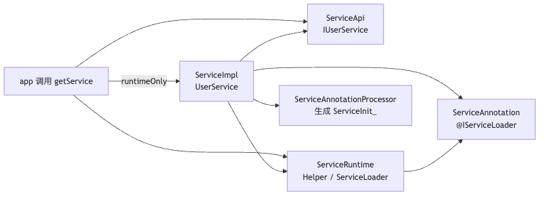

# 第 1 问：`@IServiceLoader` 与 `getService` 底层实现

> **定位**：本文记录优化前的实现（固定 `ServiceInit_`、魔法默认 key、`getAll().size` 兜底）。  
> 当前仓库已落地模块化 Init + 插件聚合 + `ServiceRecord`，请以
> [优化后设计与流程](service-loader-optimized-design.md) 为准。

记录时间：2026-09-06  
入口：`ServiceLoaderHelper.getService(IUserService::class.java)`  
示例：`UserService` 上
`@IServiceLoader(interfaces = [IUserService::class], singleton = true, defaultImpl = true)`

这套不是 JDK `java.util.ServiceLoader`，而是编译期注册 + 运行时按接口查表。

配套流程图：

| 图             | PNG                      | 源文件                      |
|---------------|--------------------------|--------------------------|
| 模块分层          | [png](q1-modules.png)    | [mmd](q1-modules.mmd)    |
| APT 生成注册表     | [png](q1-apt.png)        | [mmd](q1-apt.mmd)        |
| getService 时序 | [png](q1-getservice.png) | [mmd](q1-getservice.mmd) |
| 无默认 key 时的兜底  | [png](q1-fallback.png)   | [mmd](q1-fallback.mmd)   |

---

## 1. 组件化要解决什么

`app` 编译期只认 `IUserService`，不能 `new UserService()`，否则必须依赖实现模块。  
`ServiceImpl` 用 `runtimeOnly` 打进 APK。运行时要做的只有一件事：给我接口 Class，返回实现实例。



| 模块                           | 职责                                                        |
|------------------------------|-----------------------------------------------------------|
| `ServiceApi`                 | 只放 `IUserService`                                         |
| `ServiceImpl`                | `UserService` + `@IServiceLoader`                         |
| `ServiceRuntime`             | `ServiceLoader` / `ServiceLoaderHelper` / `SingletonPool` |
| `ServiceAnnotation`          | 注解与元数据 `ServiceImpl`                                      |
| `ServiceAnnotationProcessor` | APT 生成 `ServiceInit_`                                     |

---

## 2. 注解三个参数

`@IServiceLoader` 的 `Retention` 是 `BINARY`：运行时反射读不到，信息被 APT 写进生成类。

| 参数                                   | 对 `UserService` 的含义                                |
|--------------------------------------|----------------------------------------------------|
| `interfaces = [IUserService::class]` | 对外提供这个接口                                           |
| `singleton = true`                   | `getService` 走 `SingletonPool`，同一 Class 只 `new` 一次 |
| `defaultImpl = true`                 | 额外登记内部 key `_service_default_impl`，不传 key 也能取      |

`key` 为空时，APT 还会用实现类全名再登记一条。因此 `UserService` 在表里有 **两条** 映射，指向同一个类：

| key                                      | 来源                   |
|------------------------------------------|----------------------|
| `_service_default_impl`                  | `defaultImpl = true` |
| `com.haha.service.impl.impl.UserService` | key 为空时的兜底           |

---

## 3. 编译期：注解变成 `ServiceInit_`

`ServiceAnnotationProcessor` 用 `@AutoService(Processor::class)` 注册。`ServiceImpl` 模块 `kapt` 后会跑。

普通轮扫 `@IServiceLoader`；最后一轮 `processingOver()` 用 JavaPoet 写出
`com.haha.service.impl.generated.service.ServiceInit_`。

读 `interfaces = [IUserService::class]` 时不能直接拿 `KClass`，编译器抛 `MirroredTypesException`，
`typeMirrors` 就在异常里。然后校验实现类是非抽象子类型。

`defaultImpl` 为 true 时先 `put(DEFAULT_IMPL_KEY, ...)`；`key` 为空再 `put(null, ...)`，内部把 key
收成类名。

同一接口同一 key 登记了两个不同实现，编译期冲突（默认实现只允许一个）。

生成语句大致为：

```java
ServiceLoader.put(IUserService .class, "_service_default_impl",UserService .class, true);
ServiceLoader.

put(IUserService .class, "com.haha.service.impl.impl.UserService",UserService .class, true);
```

这里已经是 Class 字面量，运行时不再扫 dex、不再读注解。


---

## 4. 运行时：`getService` 五步

入口：

```kotlin
ServiceLoader.load(clazz)?.get(ServiceImpl.DEFAULT_IMPL_KEY)
```

未命中再 `getAll()`，仅当 size == 1 时返回那一个。


### 第 1 步：`load` 先 `lazyInit`

`lazyInit` 只跑一次，反射：

```
com.haha.service.impl.generated.service.ServiceInit_
```

的静态 `init()`。不用直接引用生成类，避免主 dex 引用过多，也让 `app` 编译期不必看见 `ServiceImpl`。

### 第 2 步：`init()` 往全局表填

`ServiceLoader.put(接口, key, 实现 Class, singleton)`  
`SERVICES[IUserService]` 下挂一个 `ServiceLoader`，`mMap` 里两条 key。

### 第 3 步：按默认 key 取

`DEFAULT_IMPL_KEY` 即 `_service_default_impl`。`UserService` 标了 `defaultImpl`，走快路径。

未标默认时的兜底：


注意：`getAll()` 按 **map 条目** 计数。`defaultImpl + 类名 key` 会得到 size ==
2，兜底会把「一个实现」误判成多个。这是当前实现的已知问题，第 4 问的改动方案会修。

### 第 4 步：`singleton = true` 走单例池

`createInstance` 若 `isSingleton`，调用 `SingletonPool.get(UserService.class)`。  
缓存按 **实现 Class**，不是按接口、也不是按 key。两个 key 指向同一 Class 也只 `new` 一次。

### 第 5 步：真正 `new`

`DefaultFactory` 使用无参构造（当前是 `Class.newInstance()`）。  
要求实现类有公开无参构造。创建成功后返回 `IUserService`，业务调用 `getUserName()` / `start()`，编译期全程不引用
`UserService`。

---

## 5. 一句话

`@IServiceLoader(..., singleton = true, defaultImpl = true)` 在编译期把
「`IUserService` 的默认实现是 `UserService`，且单例」写进 `ServiceInit_`。  
`getService(IUserService::class.java)` 第一次反射执行这份注册表，再按 `_service_default_impl` 从
`SingletonPool` 取出同一个实例。
