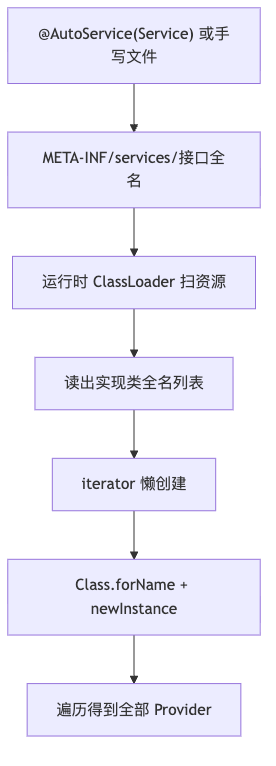

# 第 2 问：`java.util.ServiceLoader` 与 `@IServiceLoader`

记录时间：2026-09-06

先把名字分清：`java.util.ServiceLoader` 是 JDK 自带的 **SPI 运行时扫描器**；`@IServiceLoader` 是本项目的
**编译期注册注解**。  
运行时真正干活的是 `com.haha.service.impl.service.ServiceLoader`，不是 JDK 那个类。项目里两套都出现过。

配套流程图：

| 图                    | PNG                         | 源文件                         |
|----------------------|-----------------------------|-----------------------------|
| JDK SPI 流程           | [png](q2-jdk-flow.png)      | [mmd](q2-jdk-flow.mmd)      |
| `@IServiceLoader` 流程 | [png](q2-iservice-flow.png) | [mmd](q2-iservice-flow.mmd) |
| 对照                   | [png](q2-compare.png)       | [mmd](q2-compare.mmd)       |

---

## 1. `java.util.ServiceLoader` 是什么

JDK 1.6 起的标准 SPI：接口提供方只定义接口，实现方把实现类全名写进配置文件，运行时按接口扫出来再 `new`。

约定三条：

1. 有一个接口（或抽象类）。
2. 实现类有公开无参构造。
3. 资源路径为 `META-INF/services/<接口全名>`，一行一个实现类全名。多个 jar 会合并。

项目里两处用法：

- **手写 SPI**：`META-INF/services/kotlinx.coroutines.CoroutineExceptionHandler` →
  `HahaGlobalCoroutineExceptionHandler`。协程库内部 `ServiceLoader.load`。
- **`@AutoService`**：例如曾经的 `JavaService` / `AndroidService`。编译后生成
  `META-INF/services/com.haha.service.api.Service`。`@AutoService` 只负责写文件，加载仍是 JDK。APT
  自己也靠这套：`@AutoService(Processor::class)`。

要点：查找发生在运行时；`load()` 只建迭代器，第一次遍历才实例化；每次遍历默认都 `new`；没有
key、没有默认实现；Android 上要 keep `META-INF`，老 Multidex 可能扫不全。

作用：标准解耦，适合驱动、Processor、第三方扩展——谁在 classpath 谁就被发现。

---

## 2. `@IServiceLoader` 是什么

本项目注解，不是 JDK API，也不是 Loader 类。

| 参数            | 含义                           |
|---------------|------------------------------|
| `interfaces`  | 对外提供哪些接口                     |
| `key`         | 多实现时的区分键；不写则用实现类全名           |
| `singleton`   | 是否走 `SingletonPool`          |
| `defaultImpl` | 是否登记 `_service_default_impl` |

`Retention.BINARY`：只给 APT 用。调用的是 `ServiceLoaderHelper`，内部是自研 `ServiceLoader`。

作用：Android 组件化跨模块服务发现——`app` 只依赖接口，实现 `runtimeOnly`；按默认实现 / key
取服务，并可单例、编译期查冲突。

---

## 3. 定义对照

|      | `java.util.ServiceLoader` | `@IServiceLoader`                 |
|------|---------------------------|-----------------------------------|
| 是什么  | JDK 标准类                   | 本项目注解                             |
| 谁消费  | `ServiceLoader.load()`    | APT（编译期）+ 自研 `ServiceLoader`（运行时） |
| 注册介质 | `META-INF/services/<接口>`  | 生成类 `ServiceInit_`                |
| 发现时机 | 运行时扫资源                    | 编译期写死映射                           |
| 项目样例 | `@AutoService` / 协程 CEH   | `UserService`                     |

`@IServiceLoader` 本身不加载任何东西。

---

## 4. 区别逐项

**所属层级**  
JDK 是语言标准。`@IServiceLoader` 只有接了 Processor + Runtime 才生效。

**注册方式**  
JDK：配置文件发现。自研：生成代码 `put(Class, key, Class, singleton)`。

**性能**  
JDK 首次扫全部 jar 的同名 SPI 文件。自研 HashMap `O(1)`，首次成本是反射一次 `init()`。

**多实现**  
JDK 没有 key，得到迭代器里的全部 Provider。自研用 `key` / `defaultImpl`；两个默认实现编译失败。

**生命周期**  
JDK 不管单例。自研 `singleton = true` 按实现 Class 缓存。

**一个实现挂多个接口**  
JDK 要写多份 SPI 文件。自研 `interfaces` 数组，每个接口各 `put` 一次。

**校验时机**  
JDK 写错类名要到运行时。自研 APT 检查子类型、key 含冒号、默认实现冲突。

**调用 API**  
JDK：`ServiceLoader.load(Service::class.java).forEach { ... }`  
自研：`ServiceLoaderHelper.getService(IUserService::class.java)` 或 `load(接口).get(key)`。

**外部生态**  
Processor、`CoroutineExceptionHandler`、JDBC 只认 JDK SPI。组件化默认实现 / key / 单例必须走自研。

---

## 5. 怎么选

- 对接 JDK / 协程 / APT / 三方 SPI → `java.util.ServiceLoader` + `@AutoService` 或手写 META-INF。
- 组件化里 `app` 只要接口、要默认实现、要单例、要 key → `@IServiceLoader` + `ServiceLoaderHelper`。
- 不要混用同一对接口：两套注册表互不可见。

一句话：JDK 是「运行时按配置文件发现所有 Provider」；`@IServiceLoader`
是「编译期把接口→实现→key/单例/默认实现写进生成类」。名字像，机制不是一层东西。
