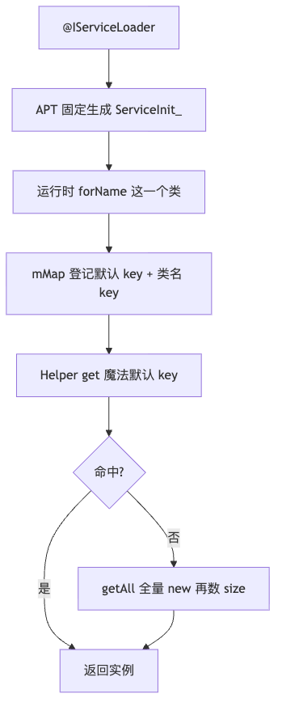
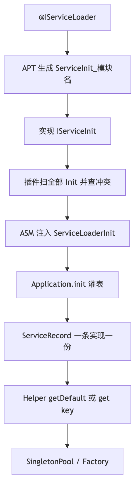
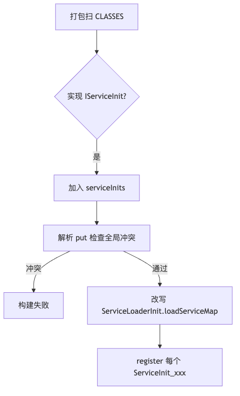
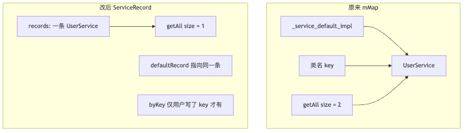

# 第 4 问：原框架与改动方案对照

记录时间：2026-09-06

第 1 问描述的是**当前仓库实现**（固定 `ServiceInit_`、魔法默认 key、`getAll().size` 兜底）。  
本文记录后续改动方案相对原框架的差异：模块化 Init、打包插件聚合、按 Class 去重的 `ServiceRecord`、更完整的
Helper。

配套流程图：

| 图      | PNG                        | 源文件                        |
|--------|----------------------------|----------------------------|
| 原来整条链路 | [png](q4-old-pipeline.png) | [mmd](q4-old-pipeline.mmd) |
| 改后整条链路 | [png](q4-new-pipeline.png) | [mmd](q4-new-pipeline.mmd) |
| 注册表结构  | [png](q4-registry.png)     | [mmd](q4-registry.mmd)     |
| 插件聚合   | [png](q4-plugin.png)       | [mmd](q4-plugin.mmd)       |

---

## 1. 定位

|               | 原来（当前实现）                   | 改动方案                                                 |
|---------------|----------------------------|------------------------------------------------------|
| 能支撑几个 impl 模块 | 只能一个（都生成同名 `ServiceInit_`） | N 个（`ServiceInit_ServiceImpl`、`ServiceInit_user`…）   |
| 注册怎么进 APK     | 运行时反射写死的那一个类               | 插件扫 `IServiceInit`，注入总入口                             |
| 业务门面          | 靠 `getAll().size` 猜唯一实现    | `getDefault` / key / `requireService` / `hasService` |

核心差别：原来是「单模块写死一个 `ServiceInit_` 的原型」；改后是「每模块一份 Init + 打包聚合 + 按 Class
去重」。

---

## 2. 整条链路

原来：编译 → 运行时反射一个类 → HashMap 双 key → Helper 猜。



改后：编译 → 打包聚合 → 启动灌表 → Helper 查默认 / key。



---

## 3. 注解协议

| 字段            | 原来                          | 改动方案                       |
|---------------|-----------------------------|----------------------------|
| `interfaces`  | 必写                          | 可空，空则推断业务接口                |
| `key`         | `Array<String>`，一个类可挂多个 key | 单个 `String`                |
| `singleton`   | 默认 `false`                  | 默认 `true`（组件服务几乎都是单例）      |
| `defaultImpl` | 只认显式 `true`                 | 显式 true，或本模块该接口只有一个实现则自动默认 |
| `priority`    | 无                           | `getAll` 排序                |
| `process`     | 无                           | `:push` 只在该进程注册            |

多 key 指向同一实例，会让原来的 `getAll()` 把同一实现数两次。

---

## 4. APT 生成物

**原来**固定生成 `com.haha.service.impl.generated.service.ServiceInit_`。  
`defaultImpl` 登记两条：`_service_default_impl` 与类名。`put` 只有 4 个参数，默认实现靠魔法 key。

**改后**按 kapt 参数 `SERVICE_MODULE_NAME` 生成 `ServiceInit_${模块}`，实现 `IServiceInit`。  
一个实现只 `put` 一次，默认用布尔参数，并带 `priority`、`process`：

```java
ServiceLoader.put(IUserService .class, "",UserService .class, true,true,0,"");
```

---

## 5. 打包期聚合

原来没有服务聚合。`lazyInit` 写死 `ServiceInit_`。两个业务模块会类名冲突；`Class.forName` 失败只打印堆栈，标志位置
true 后不再重试。

改后增加总入口 `ServiceLoaderInit`。插件（与 `ServiceRouterPlugin` 同构）在 `loadServiceMap()` 末尾插入
`register("...ServiceInit_xxx")`。  
同时解析 `put` 字节码，**全局** default / 同 key 冲突会让构建失败（单模块 APT 看不到别的模块）。



---

## 6. 注册表

**原来**每个接口一个 `HashMap<String, ServiceImpl>`，默认 key 和类名 key 平铺。  
`getAll()` 按条目计数 → `UserService` 的 size 为 2。Helper 用 size == 1 判断唯一实现会误判，且会全量
`new`。  
未知接口 `load()` 还会写入空 Loader。`load(null)` 的 NPE 创建了却不抛。

**改后**一条实现一条 `ServiceRecord`：`records` 按 Class 去重，`byKey` 只放业务 key，`defaultRecord`
表示默认。  
`getAll()` 只遍历 `records`，按 `priority` 排序。miss 不写入 `SERVICES`。表用 `ConcurrentHashMap`。



---

## 7. Helper 查找

**原来**：先 `get("_service_default_impl")`；没有则 `getAll()` 全量实例化再看 size。

**改后**：先 `getDefault()`；没有则对 Class **去重计数（不 new）**。1 个则按 Class 创建；0 或多个则警告，debug
下可抛 `ServiceNotFoundException`。  
并补齐 `getService(clazz, key)`、`requireService`、`hasService`、Kotlin `reified`。

---

## 8. 实例创建与其它

|      | 原来                                     | 改动方案                                      |
|------|----------------------------------------|-------------------------------------------|
| 创建   | `Class.newInstance()`                  | `getDeclaredConstructor().newInstance()`  |
| 单例失败 | `t!!` 变成 NPE                           | 返回 null 或抛 `ServiceCreateException`       |
| 生命周期 | 无                                      | `IApplicationAware` / `IServiceLifecycle` |
| 启动   | 第一次 `getService` 才 init                | `Application` 里 `ServiceLoader.init`      |
| 日志   | 热路径 `Log.d`                            | `Debugger` + 开关                           |
| Keep | 写死 `* implements IUserService`         | keep `IServiceInit` 与 `ServiceLoaderInit` |
| 依赖   | Runtime `api ServiceApi`，注解模块夹 ARouter | Runtime 不认识业务接口                           |

---

## 9. 新模块怎么接

1. impl 模块 `kapt { arg("SERVICE_MODULE_NAME", project.name) }`，避免都生成 `ServiceInit_Default`。
2. 宿主 apply `com.haha.servicerouter.register`。
3. `Application` 调用 `ServiceLoader.init(this, debug)`。

Debug 下找不到实现应尽早失败，避免组件化里「以为注册了其实 Init 没聚合」却一直 `null`。

---

## 10. 一句话

原来是「一个魔法 key + 一个固定生成类 + 用 `getAll` 猜」；  
改后是「每模块可扫的 Init、插件合成总表、Record 去重、启动灌表、门面按默认/key 取」。  
差别最大的三块是 **生成类可聚合、表不再重复计数、查找不再全量 new**。
