# 组件化 ServiceLoader 优化后设计与流程

记录时间：2026-09-06  
包目录：`docs/service-loader/`  
本包两篇：本文（当前实现）+ [优化前笔记](service-legacy-notes.md)（原三问合并）。

入口：`ServiceLoaderHelper.getService(IUserService::class.java)`  
示例：`UserService` 上 `@IServiceLoader(interfaces = [IUserService::class], defaultImpl = true)`

这套不是 JDK `java.util.ServiceLoader`，也不是运行时扫 Dex / 反射读注解。  
优化后是 **编译期写表 → 打包期聚合 → 运行时查表创建**。

配套流程图（PNG 可直接预览）：

| 图             | PNG                                 | 源文件                                 |
|---------------|-------------------------------------|-------------------------------------|
| 优化后整体三期       | [png](service-opt-overview.png)     | [mmd](service-opt-overview.mmd)     |
| 模块分层          | [png](service-opt-modules.png)      | [mmd](service-opt-modules.mmd)      |
| APT 生成本模块注册表  | [png](service-opt-apt.png)          | [mmd](service-opt-apt.mmd)          |
| 插件聚合与冲突检查     | [png](service-opt-plugin.png)       | [mmd](service-opt-plugin.mmd)       |
| getService 时序 | [png](service-opt-getservice.png)   | [mmd](service-opt-getservice.mmd)   |
| getService 决策 | [png](service-opt-lookup.png)       | [mmd](service-opt-lookup.mmd)       |
| 实例创建          | [png](service-opt-create.png)       | [mmd](service-opt-create.mmd)       |
| 优化前后整条链路      | [png](service-compare-pipeline.png) | [mmd](service-compare-pipeline.mmd) |
| 优化前后注册表       | [png](service-compare-registry.png) | [mmd](service-compare-registry.mmd) |
| 优化前后查找        | [png](service-compare-lookup.png)   | [mmd](service-compare-lookup.mmd)   |
| 优化前后启动灌表      | [png](service-compare-init.png)     | [mmd](service-compare-init.mmd)     |

---

## 1. 优化要解决什么

组件化里 `app` 编译期只认 `IUserService`，不能 `new UserService()`。实现类通过 `runtimeOnly` 打进
APK。运行时只做一件事：给我接口 Class，返回实现实例。

优化前是「单模块写死一个 `ServiceInit_` + 魔法默认 key + 用 `getAll()` 猜唯一实现」。这套原型能跑通单模块
demo，但撑不住多 impl 模块，也会把「一个实现登记两条 key」误判成多个实现。

优化后的核心差别：

|               | 优化前                           | 优化后                                                |
|---------------|-------------------------------|----------------------------------------------------|
| 能支撑几个 impl 模块 | 只能一个（都生成同名 `ServiceInit_`）    | N 个（`ServiceInit_ServiceImpl`、`ServiceInit_user`…） |
| 注册怎么进 APK     | 运行时反射写死的那一个类                  | 插件扫 `IServiceInit`，ASM 注入总入口                       |
| 表怎么记          | `mMap` 双 key，`getAll` 按条目计数   | 一条实现一条 `ServiceRecord`，按 Class 去重                  |
| 业务门面          | 靠 `getAll().size` 猜，会全量 `new` | `getDefault` / key / 去重计数（不 new）                   |

一句话：原来是「一个魔法 key + 一个固定生成类 + 用 `getAll` 猜」；  
现在是「每模块可扫的 Init、插件合成总表、Record 去重、启动灌表、门面按默认 / key 取」。

---

## 2. 优化后整体架构

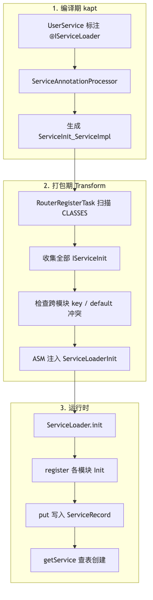

| 阶段                 | 谁干活                                     | 产物                                                        |
|--------------------|-----------------------------------------|-----------------------------------------------------------|
| 编译期（kapt）          | `ServiceAnnotationProcessor`            | 每个模块一份 `ServiceInit_模块名`                                  |
| 打包期（AGP Transform） | `RouterRegisterTask`                    | 往 `ServiceLoaderInit.loadServiceMap()` 插入 `register(...)` |
| 运行期                | `ServiceLoader` + `ServiceLoaderHelper` | 查 `SERVICES` 表，按默认实现 / key 创建实例                           |

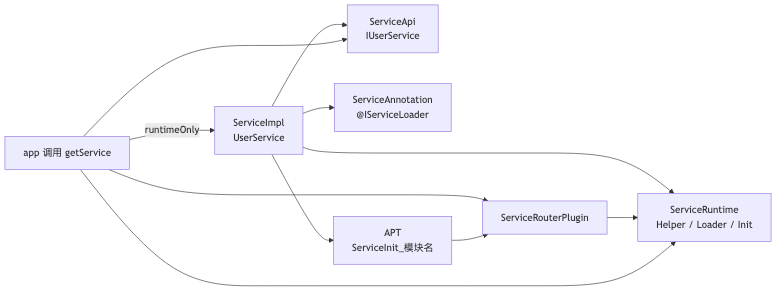

| 模块                           | 职责                                                                              |
|------------------------------|---------------------------------------------------------------------------------|
| `ServiceApi`                 | 只放 `IUserService`                                                               |
| `ServiceImpl`                | `UserService` + `@IServiceLoader`                                               |
| `ServiceRuntime`             | `ServiceLoader` / `ServiceLoaderHelper` / `SingletonPool` / `ServiceLoaderInit` |
| `ServiceAnnotation`          | `@IServiceLoader`                                                               |
| `ServiceAnnotationProcessor` | APT 生成 `ServiceInit_模块名`                                                        |
| `ServiceRouterPlugin`        | 打包期扫描 `IServiceInit` 并插桩                                                        |

业务模块只依赖接口。跨模块通信不直接 `new UserService()`。

---

## 3. 注解：编译期元数据，运行时不再读

```kotlin
@IServiceLoader(interfaces = [IUserService::class], defaultImpl = true)
class UserService : IUserService
```

`@IServiceLoader` 的 `Retention` 是 `BINARY`：只给 APT 看，运行时 `ServiceLoader` 不再反射读这个注解。

| 字段            | `UserService` 本例        | 含义                        |
|---------------|-------------------------|---------------------------|
| `interfaces`  | `[IUserService::class]` | 对外查询键是接口；为空则推断业务接口        |
| `key`         | `""`                    | 无业务区分键                    |
| `singleton`   | 默认 `true`               | 走 `SingletonPool`         |
| `defaultImpl` | `true`                  | 无 key 调用走这条实现             |
| `priority`    | `0`                     | `getAll()` 降序排序           |
| `process`     | `""`                    | 所有进程都注册；`:push` 只在该后缀进程注册 |

`defaultImpl = true` 的意义：同一接口多个实现时，`getService(IUserService)` 仍然稳定命中指定实现。  
若本模块该接口只有一个实现，APT 会在生成前自动标为默认。

---

## 4. 编译期：APT 生成本模块注册表

`ServiceImpl/build.gradle` 把模块名传给 kapt：

```
arg("SERVICE_MODULE_NAME", project.getName())  // → ServiceImpl
```

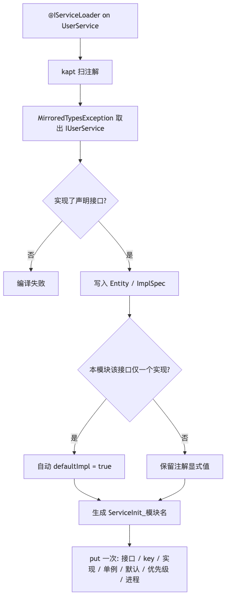

`ServiceAnnotationProcessor.process()` 分两轮：

- 未结束：扫 `@IServiceLoader`，校验、解析接口、写入 `mEntityMap`
- `processingOver()`：每个接口若本模块只有一个实现，自动 `defaultImpl = true`，再生成
  `ServiceInit_ServiceImpl`

对 `UserService`：

1. 必须是 `public`、非抽象、有 public 无参构造（Kotlin 默认构造也过）。
2. `readInterfaces()` 通过 `MirroredTypesException` 拿到 `IUserService` 的 `TypeMirror`。
3. `isConcreteSubType` 确认 `UserService` 真实现了 `IUserService`。
4. 按接口全名建 `Entity`，再加一条 `ImplSpec`。

同接口重复注册会在 **本模块内** 直接报错：同一实现写了不同 `key`、同一 `key` 两个实现、两个
`defaultImpl = true`。

生成类实现 `IServiceInit`，一个实现只 `put` 一次：

```java
public final class ServiceInit_ServiceImpl implements IServiceInit {
    @Override
    public void init() {
        ServiceLoader.put(IUserService.class, "", UserService.class, true, true, 0, "");
    }
}
```

七个参数：接口、key、实现类、singleton、defaultImpl、priority、process。  
类名规则：`ServiceInit` + `_` + 模块名，包名固定 `com.haha.service.impl.generated.service`，方便插件按路径扫描。

每个业务模块各自生成一份。app 打包前这些类是分散的，还没有总入口调用它们。

---

## 5. 打包期：插件聚合 + 全局冲突检查

`app` 应用了 `com.haha.servicerouter.register`。`RouterRegisterPlugin` 对每个 variant 注册
`RouterRegisterTask`，对全部 CLASSES（含依赖 jar / 本模块 class）做 Transform。

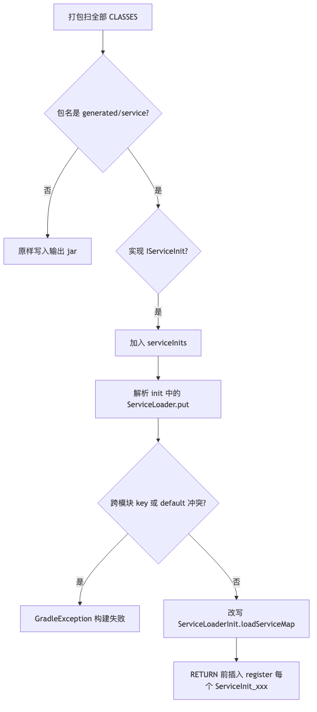

只看这个包：`com/haha/service/impl/generated/service/`。ASM 读 class：

- 实现了 `IServiceInit` → 记入 `serviceInits`
- 访问 `init()` 字节码，收集 `ServiceLoader.put(...)` 的字面量

APT 只能看到当前模块。插件在全量 class 上再查一次：

- 同一接口 + 同一非空 `key` 对应两个不同实现 → **构建失败**
- 同一接口两个 `defaultImpl = true` → **构建失败**

源码里的 `ServiceLoaderInit.loadServiceMap()` 是空占位。插件在 `RETURN` 前插入：

```text
register("com.haha.service.impl.generated.service.ServiceInit_ServiceImpl");
```

`register` 反射的是「每个模块一份 Init 类」，不是每个服务接口扫一遍：

```java
Object obj = Class.forName(className).getDeclaredConstructor().newInstance();
if(obj instanceof IServiceInit){
        ((IServiceInit)obj).

init();
}
```

即 `new ServiceInit_ServiceImpl().init()` → `ServiceLoader.put(...)`。

---

## 6. 运行时：启动灌表

`HahaApplication.initComponents()` 调用 `ServiceLoader.init(this, BuildConfig.DEBUG)`：

1. 保存 `Application`（给 `IApplicationAware` 用）
2. Debug 时挂 `LogcatLogger`
3. `lazyInit()` → `Class.forName("...ServiceLoaderInit").getMethod("init").invoke(null)`

`put` 才是真正建表。`process` 不匹配当前进程则直接跳过。  
`SERVICES` 是 `ConcurrentHashMap<Class<*>, ServiceLoader<*>>`，键是接口 Class。

`putRecord` 按实现 Class 合并：同一 `implClass` 只留一条。`UserService` 写入后：

```text
records       = { ServiceRecord(IUserService, UserService, key="", singleton=true, isDefault=true, priority=0) }
byKey         = { "_service_default_impl" → 上面这条 }
defaultRecord = 上面这条
```

业务 `key` 为空，不会进 `byKey` 的业务槽，只占默认槽。

---

## 7. `getService(IUserService.class)` 逐步拆开

业务侧通常写：

```kotlin
ServiceLoaderHelper.getService<IUserService>()
// 等价
ServiceLoaderHelper.getService(IUserService::class.java)
```

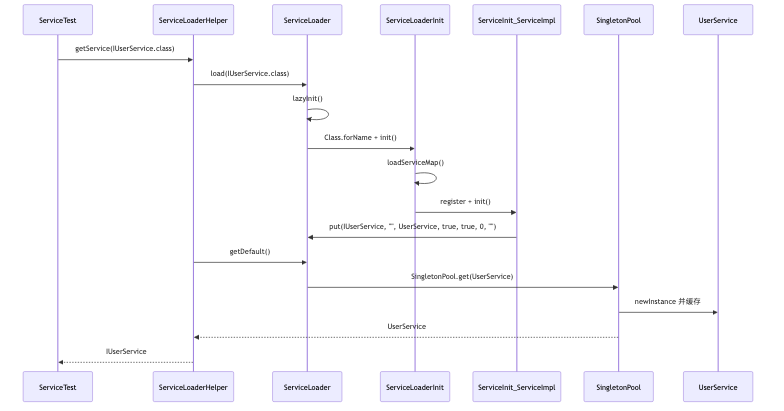

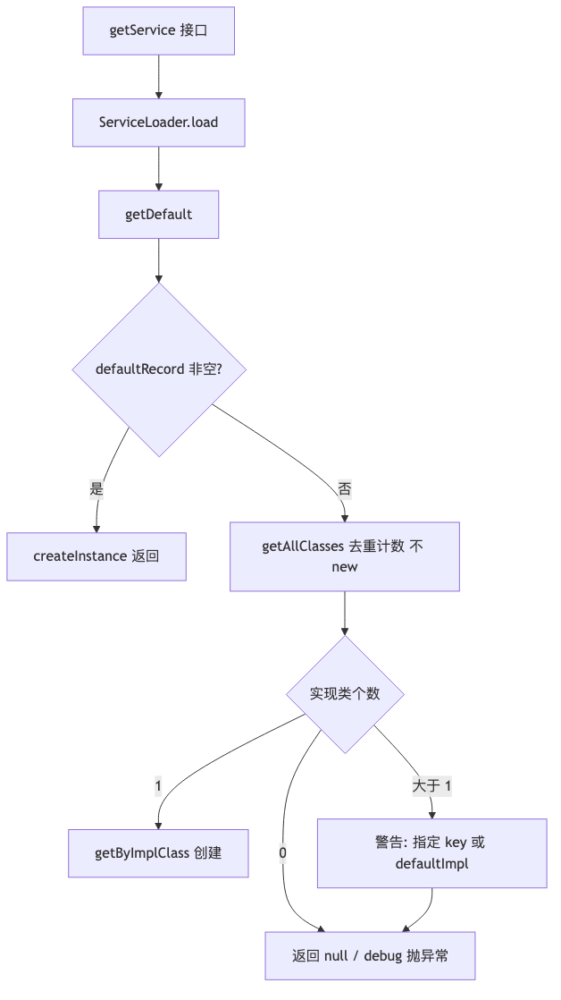

### 第 1 步：拿到该接口的 loader

`ServiceLoader.load(IUserService.class)` 先 `lazyInit()`（若 Application 忘了 init，这里补一次）。  
表里有则返回已注册 loader；没有则返回空 loader，不写入 `SERVICES`。

### 第 2 步：优先默认实现

`getDefault()` → `createInstance(defaultRecord)`。  
`UserService` 标了 `defaultImpl = true`，这里就返回，**不会再走「按实现类数量兜底」**。

### 第 3 步：没有 default 时的兜底（本例不会走到）

对 Class **去重计数，不 new**：

| `getAllClasses().size` | 行为                                             |
|------------------------|------------------------------------------------|
| 1                      | `getByImplClass` 创建那唯一实现                       |
| 0                      | 打日志，返回 null；debug 抛 `ServiceNotFoundException` |
| 大于 1                   | 打「请指定 key 或 defaultImpl」，返回 null；debug 同样抛     |

### 第 4 步：实例创建

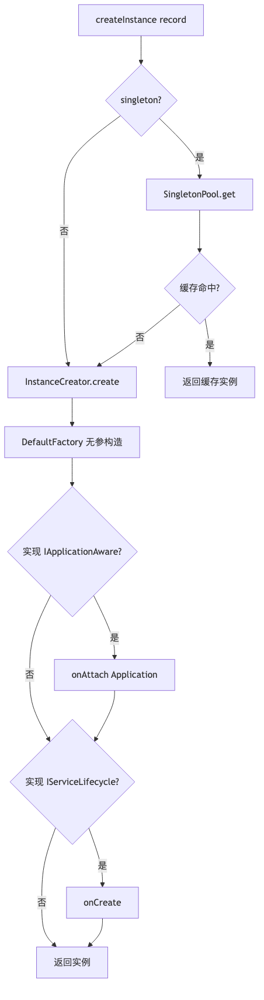

`singleton = true` 走 `SingletonPool`：双重检查，按 **实现 Class** 缓存，不是按接口、也不是按 key。  
真正 `new` 用 `DefaultFactory` 的无参构造。若实现了 `IApplicationAware` / `IServiceLifecycle`，创建后调用
`onAttach` / `onCreate`。  
`UserService` 没实现这两个接口，所以没有生命周期回调。

返回类型是 `IUserService`，调用方拿到的是接口。

带 key 的 API：`getService(clazz, key)` → `ServiceLoader.get(key)`。空 key 或 `_service_default_impl`
走默认实现。  
`getAllServices` 按 `priority` 降序创建全部实现。

---

## 8. 优化前后对比

差别最大的三块是 **生成类可聚合、表不再重复计数、查找不再全量 new**。

### 8.1 整条链路

优化前：编译 → 运行时反射一个类 → HashMap 双 key → Helper 猜。  
优化后：编译 → 打包聚合 → 启动灌表 → Helper 查默认 / key。

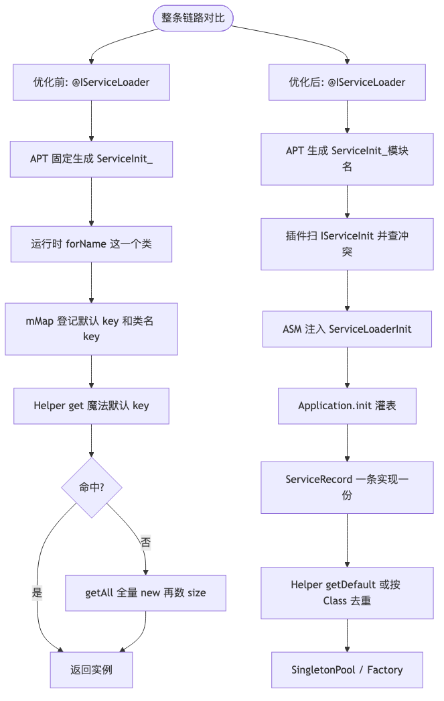

### 8.2 启动灌表

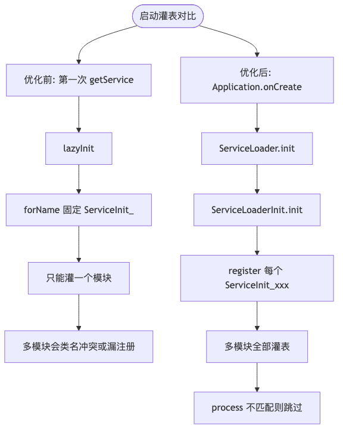

|      | 优化前                                      | 优化后                                         |
|------|------------------------------------------|---------------------------------------------|
| 何时灌表 | 第一次 `getService` 才 `lazyInit`            | `Application` 里 `ServiceLoader.init`        |
| 反射目标 | 写死 `ServiceInit_`                        | `ServiceLoaderInit` → 各模块 `ServiceInit_xxx` |
| 多模块  | 类名冲突，或 `Class.forName` 失败后标志位置 true 不再重试 | 插件注入多行 `register`                           |
| 进程   | 无                                        | `process` 不匹配则 `put` 直接跳过                   |

### 8.3 注册表

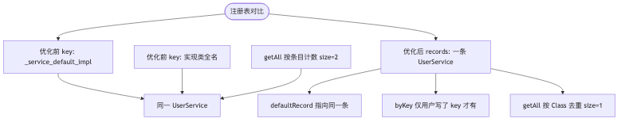

|            | 优化前                                   | 优化后                                      |
|------------|---------------------------------------|------------------------------------------|
| 结构         | 每个接口一个 `HashMap<String, ServiceImpl>` | `records` + `byKey` + `defaultRecord`    |
| 默认实现       | 再登记一条 `_service_default_impl`         | 布尔参数 `defaultImpl`，`defaultRecord` 指向同一条 |
| key 为空     | 再用实现类全名登记一条                           | 不写业务 key                                 |
| `getAll()` | 按 map 条目计数，`UserService` 的 size 为 2   | 只遍历 `records`，size 为 1                   |
| miss       | `load()` 会写入空 Loader                  | miss 不写入 `SERVICES`                      |

### 8.4 查找

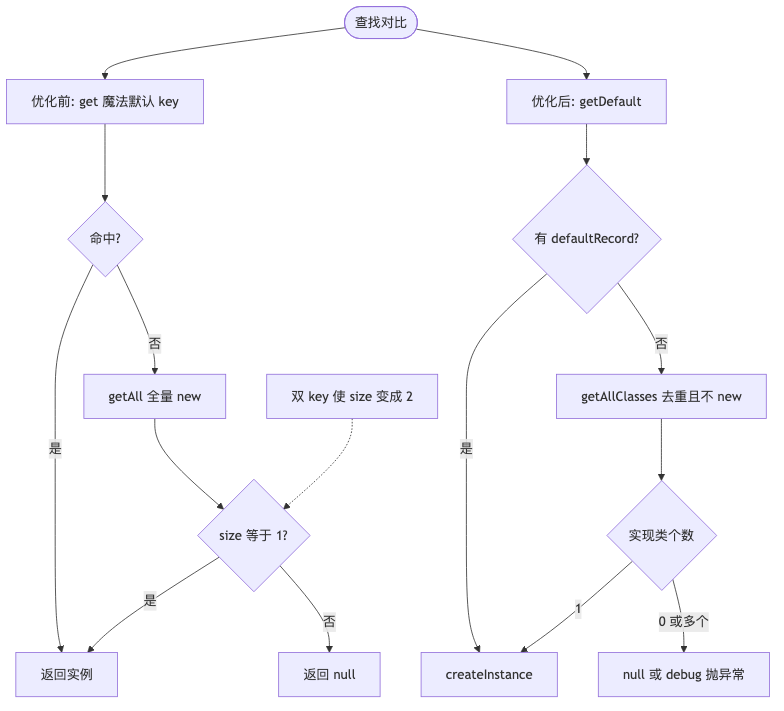

|     | 优化前                                          | 优化后                                                |
|-----|----------------------------------------------|----------------------------------------------------|
| 快路径 | `get("_service_default_impl")`               | `getDefault()`                                     |
| 兜底  | `getAll()` 全量实例化再看 size                      | `getAllClasses()` 去重计数，不 new                       |
| 误判  | `defaultImpl + 类名 key` 使 size == 2，唯一实现被当成多个 | 一条 Record，不会误判                                     |
| 失败  | 返回 null                                      | Release 返回 null；Debug 抛 `ServiceNotFoundException` |

### 8.5 注解、创建与其它

|                        | 优化前                            | 优化后                                       |
|------------------------|--------------------------------|-------------------------------------------|
| `interfaces`           | 必写                             | 可空，空则推断业务接口                               |
| `key`                  | `Array<String>`，一个类可挂多个 key    | 单个 `String`                               |
| `singleton`            | 默认 `false`                     | 默认 `true`                                 |
| `defaultImpl`          | 只认显式 `true`                    | 显式 true，或本模块该接口只有一个实现则自动默认                |
| `priority` / `process` | 无                              | `getAll` 排序 / 进程过滤                        |
| 创建                     | `Class.newInstance()`          | `getDeclaredConstructor().newInstance()`  |
| 生命周期                   | 无                              | `IApplicationAware` / `IServiceLifecycle` |
| 日志                     | 热路径 `Log.d`                    | `Debugger` + 开关                           |
| Keep                   | 写死 `* implements IUserService` | keep `IServiceInit` 与 `ServiceLoaderInit` |

---

## 9. 新模块怎么接

1. impl 模块 `kapt { arg("SERVICE_MODULE_NAME", project.name) }`，避免都生成 `ServiceInit_Default`。
2. 宿主 apply `com.haha.servicerouter.register`。
3. `Application` 调用 `ServiceLoader.init(this, debug)`。
4. 业务侧只通过 `ServiceLoaderHelper.getService<IXxx>()` 取实现。

Debug 下找不到实现应尽早失败，避免组件化里「以为注册了其实 Init 没聚合」却一直 `null`。

---

## 10. 和本包其它文档的关系

| 文档                               | 现在怎么读                                  |
|----------------------------------|----------------------------------------|
| 本文                               | **当前实现**的总结 + 优化前后对比                   |
| [优化前笔记](service-legacy-notes.md) | 原三问合并：优化前 `getService`、JDK SPI 对照、改动条目 |
